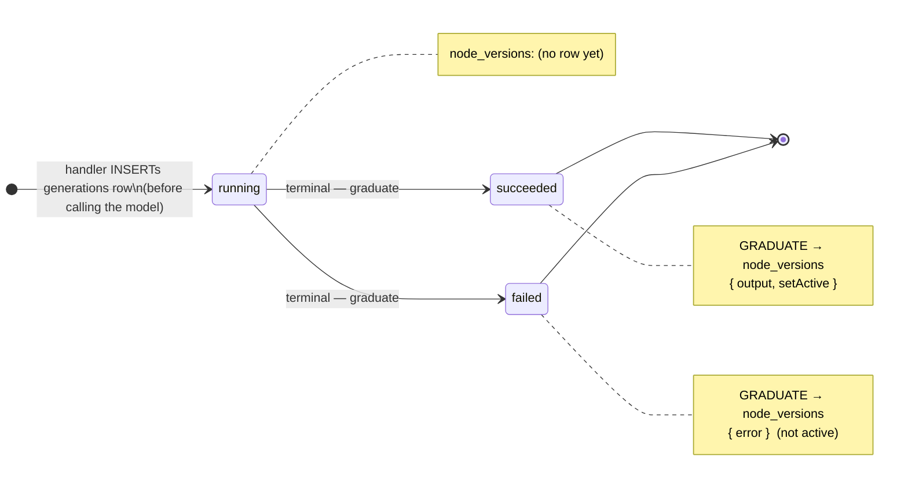
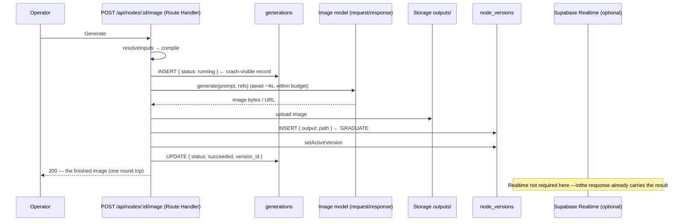
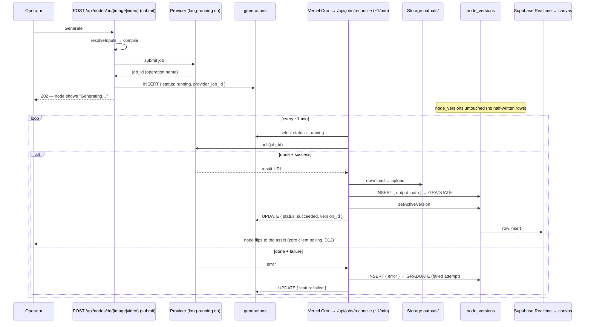
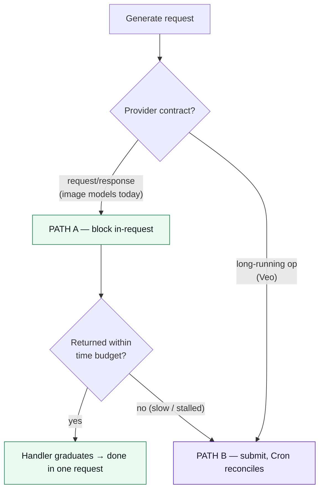

# CreativeOS — Generation Execution Flows (sync & async, image & video)

**Date:** 2026-06-18
**Status:** Living architecture-flows reference (the cross-cutting generation-execution model)
**Type:** Architecture flows
**Companions:**
[2026-05-30-creativeos-architecture.md](../superpowers/specs/2026-05-30-creativeos-architecture.md) (the reusable node spine — `resolveInputs → compile → runAction → writeVersion → setActive`),
[2026-05-30-creativeos-staging-roadmap.md](../superpowers/specs/2026-05-30-creativeos-staging-roadmap.md) (strategy + ADR log; async decisions **D12/D13/D25**, scheduler **D11**),
[2026-06-18-stage-4-video-gen-node-design.md](../superpowers/specs/2026-06-18-stage-4-video-gen-node-design.md) (the video-specific async machine — Stage 4 §5).

This document is the **one generation-execution model** that every Generate node (Image Gen,
Video Gen, and any future generator) runs through. The Stage-4 video spec describes the async
machine **for video**; this doc **generalizes it across modalities** and adds the part the video
spec doesn't need — the **synchronous fast path**. It does not restate the `generations` schema
(see Stage 4 §6) or re-argue why the table exists (see **D12/D25**); it explains **how a
generation actually flows**, and **how one mechanism covers both a 4-second image and a
4-minute video** without two code paths.

> **Why this doc exists.** The PRD models generation as a single synchronous action with an
> `error (if any)` result (PRD §11.6/§11.7) — it has no concept of an in-flight job. The roadmap
> (D12/D13/D25) adds the async machinery but frames it video-first. The gap this doc closes:
> **image gen lives on the same `generations` substrate as video** — they differ only by
> *duration*, not by being different mechanisms.

---

## 1. The one constraint that shapes everything

A generation runs inside a Next.js **Route Handler** — a **serverless function with a wall-clock
time limit** (the platform kills it after a fixed budget; roadmap **D1 watch-item**). The code
does **not** get to wait as long as it likes for a model. So every generation reduces to a single
question:

> **Does the model return a result before the serverless function is killed?**

- **Yes → synchronous path (A).** Wait in-request, return the finished result in the same response.
- **No → asynchronous path (B).** Submit the job, return immediately, finish it out-of-band later.

Modality (image vs video) is only a *proxy* for the answer. **Duration is the real variable**
(see §5). Today's image APIs are request/response and finish in-window (Path A); Veo is a
long-running operation that finishes in minutes (Path B). The moment that stops being true — a
slow image model, a batch that stalls — the *same* design reroutes it (§5), with **no schema
change**.

---

## 2. The invariant spine — always write `generations`; closing = graduating

Two tables, two jobs (this is the heart of D25):

| Table | Role | Lifespan |
|---|---|---|
| **`generations`** | the **disposable scratchpad** for in-flight churn (`queued → running`) | transient — reaped after it closes |
| **`node_versions`** | the **permanent, append-only attempt log** the product treats as *truth* (D4/D18) | forever |

The spine holds for **every** generation, fast or slow:

1. **Always write a `generations` row first** (`status: 'running'`, before calling the model).
   Nothing skips this — it is the durable record that "a generation was started," and it is what
   survives a page refresh (roadmap §3.2).
2. **Closing the row = graduating into `node_versions`.** When the job reaches a **terminal**
   state, its result is written into the permanent log — *that write is the graduation* (**D25**):
   - **succeeded →** a `node_versions` row carrying `output` (image/clip storage path) **+
     `setActive`**. A new active version appears.
   - **failed →** a `node_versions` row carrying `error`, **not** set active. A failed attempt is
     still a real attempt the log learns from (**D18**).
3. **While `running`, there is deliberately no `node_versions` row.** The append-only log only
   ever *gains finished attempts*; the half-written churn stays in `generations`. This is the
   entire reason the scratchpad exists (**D25** resolves the D12 ↔ D4/D18 tension).



**What differs between the two paths is only *who closes the row, and when*** — not whether the
row exists, and not what closing does.

| | Who graduates the row? | When | Row lifespan |
|---|---|---|---|
| **Path A — sync** | the **same Route Handler** | within the one request (seconds) | short |
| **Path B — async** | the **Cron reconciler** (a later, separate invocation) | minutes later, on a poll | long |

---

## 3. Path A — synchronous (fast image generation)

Used when the provider is **request/response** and finishes inside the function budget (today's
image models, e.g. Nano Banana). The handler does the whole loop in one request: write the row,
block on the model, graduate, return the image.



**Why still write `generations(running)` first** (instead of going straight to `node_versions`)?
Crash-safety + a single uniform shape. If the function dies *after* the model returned but
*before* graduation, a visible `running` row remains and **Cron recovers it** (§5 fallback). If
the fast path skipped the row, the slow path would need a different mechanism and you'd maintain
two. One row shape, two closers.

---

## 4. Path B — asynchronous (video; or any slow generation)

Used when the provider is a **long-running operation** with no webhook (Veo, per Stage 4 §5), or
when a Path-A call exceeds its time budget (§5 fallback). The handler can't block for the whole
job, so it splits **submit** (fast, in-request) from **reconcile** (later, by Cron).

This flow is specced in full for video in **Stage 4 §5** (submit route, reconcile route, the
mermaid sequence). The generalized shape:



The result reaches the canvas via **Supabase Realtime** (D12: *pushed, not polled*); the DB —
never the browser — is the source of truth, so a refresh mid-job is safe (§3.2).

---

## 5. The decision rule — duration-driven, provider-contract-default

The path is **not** chosen by asking "is this an image or a video." It is chosen in two layers:

**Layer 1 — provider contract (the clean default, decided per model in its adapter).**
- **Request/response API** (returns the result on the call) → **Path A**. *Image models today.*
- **Long-running-operation API** (returns a `job_id`, forces polling) → **Path B**. *Veo.*

This is structural — no guessing. The adapter for each model declares which kind it is.

**Layer 2 — time-budget fallback (the safety net for Path A).**
A Path-A call wraps its `await` in a budget comfortably under the function limit. If the model
hasn't returned in time, the handler **stops blocking and degrades to Path B**: it leaves the
`generations` row as `running` and returns "still working" — **Cron picks it up** exactly as it
would a video. The user sees "Generating…" instead of an error.



**Net effect per generator:**

| Generator | Default path | Why |
|---|---|---|
| **Image Gen** (Nano Banana etc.) | **A — synchronous** | request/response API, finishes in-window |
| **Image Gen, if a model turns slow / a batch stalls** | **A → falls back to B** | same `generations` row, Cron finishes it — **no new code or schema** |
| **Video Gen** (Veo) | **B — async** | webhook-less long-running operation (Stage 4 §5) |

This is what "image gen is on the same substrate as video" means concretely: image is Path A
*because today's image APIs are synchronous*, not because images are "small." The substrate is
duration-driven, so the slow case is a **fallback, not a rewrite**.

---

## 6. The one invariant the dual-closer design demands — idempotent graduation

Because a generation can be graduated by **either** the Route Handler (Path A) **or** Cron (Path
A timeout / Path B), graduation **must be idempotent**: running it twice must not produce two
`node_versions` rows or two active-pointer flips.

The race: a Path-A handler calls the model, gets the result, but is killed *after* the model
returned and *before* (or during) graduation. The `generations` row is still `running`, so the
next Cron tick finds it and tries to graduate it too.

**Mechanism (simple, no new infra):** the `generations.version_id` column is the **once-only
latch**. Graduation is a guarded transition — *only* the actor that flips the row out of
`running` is allowed to write the version:

```sql
-- graduate at most once: conditional close, then write the version
UPDATE generations
   SET status = 'succeeded', version_id = :new_version, updated_at = now()
 WHERE id = :gen_id AND status = 'running';   -- 0 rows ⇒ someone already closed it ⇒ stop
```

Whoever wins the conditional `UPDATE` (handler or Cron) owns the graduation; the loser sees 0
rows affected and does nothing. `setActiveVersion` is likewise idempotent (it just repoints a
pointer to the same version). **Invariant:** *one generation → at most one graduated
`node_versions` row.*

---

## 7. Mapping to the spine and the schema (reference, not restatement)

- **Node lifecycle (D3).** A generation is the `runAction → writeVersion → setActive` tail of the
  shared spine (architecture doc §1). Path A runs the tail in one request; Path B splits
  `runAction` into *submit* (handler) and *reconcile* (Cron), and `writeVersion`/`setActive` move
  into the reconciler. `resolveInputs` and `compile` are unchanged and identical for both paths.
- **`generations` table.** Defined in **Stage 4 §6** (`status`, `provider_job_id`, `params`,
  `error`, `version_id`). Image gen reuses it as-is — `provider_job_id` is simply `null` on a
  pure Path-A success that never needed an operation handle.
- **Version envelope.** The graduated row is an ordinary `node_versions` attempt (D4 envelope):
  `inputs_used`, `params_used`, `model_used`, `output` (image/clip storage path), `error`,
  `decision`. Large bytes live in Storage `outputs/`; the DB stores only the path (**D13**).
  Raw-output capture (`generated_output`, **D22**) is a *separate* concept — do not conflate.

---

## 8. What is shared vs. modality-specific (so Stage 3 image gen reuses, not reinvents)

| Concern | Shared (build once) | Image-specific | Video-specific |
|---|---|---|---|
| `generations` row + lifecycle | ✅ | — | — |
| Graduation → `node_versions` (+ idempotency latch) | ✅ | — | — |
| Storage `outputs/` + path-in-DB (D13) | ✅ | — | — |
| Realtime push (D12) | ✅ (used always for B; optional for A) | — | — |
| `compile` (pure, D3) | spine | image prompt payload | camera + action payload (Stage 4 §4) |
| Provider client | — | image model client | Gemini/Veo client (Stage 4 §8) |
| Default path | — | **A — synchronous** | **B — async** |
| Cron reconciler | ✅ (built in Stage 4) | reused only on the slow-image fallback | required |

**Guidance for the Stage-3 Image Gen spec:** build the synchronous Path A, but **write through
the `generations` row** (don't shortcut straight to `node_versions`) so the slow-image fallback
and the Stage-4 reconciler are reused, not retrofitted. The reconciler itself is Stage-4 work;
Stage 3 only needs the row + the idempotent graduation it already shares.

---

## 9. Relation to the ADR log

- **D11** — the human is the scheduler: a generation still runs only on an explicit click; this
  doc is about *executing one triggered generation*, not auto-running the graph.
- **D12 / D13** — "the table is the starter queue," no Redis/SQS/workers. Both paths here are just
  a DB row + (for B) a Cron poll + Realtime. This doc is the *flow* behind those decisions.
- **D25** — `generations` graduates into `node_versions`. This doc generalizes D25's video-first
  graduation to **both** modalities and adds the synchronous closer + the idempotency latch.

---

## 10. Open items to confirm at build time

- Image-model time budget for the Path-A `await` (how long before degrading to Cron) — set once
  the real image provider + Vercel function limit are known.
- Whether a pure Path-A success should keep the `generations` row at all after graduation, or reap
  it immediately (the video path keeps it as a job record; image may not need to).
- The exact idempotency guard in code (the conditional `UPDATE` above is the intended shape;
  confirm against the Stage-4 reconciler implementation so both share one helper).
