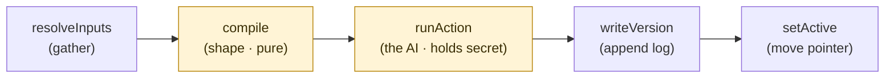
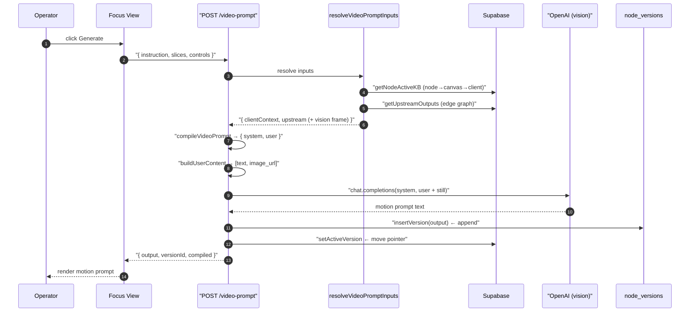
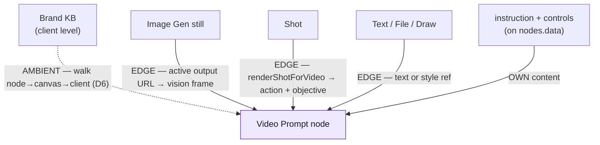
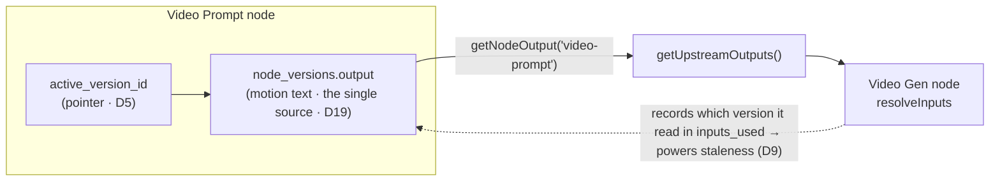

# How the Video Prompt Node Works — a walkthrough

**Date:** 2026-06-18
**Status:** Living explainer (read-back reference for how a node assembles + flows data)
**Type:** Architecture walkthrough
**Companions:**
[2026-06-18-generation-execution-flows.md](2026-06-18-generation-execution-flows.md) (sync vs async execution),
[../superpowers/specs/2026-05-30-creativeos-architecture.md](../superpowers/specs/2026-05-30-creativeos-architecture.md) (the spine + ADR refs),
[../superpowers/specs/2026-06-18-video-prompt-node-design.md](../superpowers/specs/2026-06-18-video-prompt-node-design.md) (the Video Prompt node spec, D24).

This explains, end to end, **where the Video Prompt node gets its data, how it processes it, and
how that data flows downstream** — using the real code. By the time we built this node (Script →
Text → File → Prompt → Image Gen → Video Prompt) the same skeleton repeats for every node, so this
doubles as "how *any* node works."

---

## 1. The one pattern underneath every node (the "spine")

Every node — no exceptions — runs this lifecycle (**ADR D3**):

| Step | What it does | Shared or per-node? |
|---|---|---|
| `resolveInputs` | Gather everything the node needs from *outside* itself | **shared** machinery |
| `compile` | Pure function: inputs → the exact payload to send | ⚠️ **per-node** |
| `runAction` | Call the model (holds the secret key) | ⚠️ **per-node** |
| `writeVersion` | Append an immutable record of what happened | **shared** |
| `setActive` | Point the node at its newest result | **shared** |

**Only `compile` and `runAction` change between node types.** That is the whole trick. Building a
new node is mostly "fill in two blanks" — the gather/log/pointer plumbing is identical.

> **Why this split?** `compile` is *pure* (no network, no DB) so it is unit-testable and can be
> shown to the operator as the "final compiled prompt" *before* anything runs. `runAction` is the
> only secret-holding, network step. Keep that line clean and everything else is testable. It is
> also why each successive node got faster to build: we only wrote a new `compile`, a new
> `runAction`, and the catalog/prompt that feed them.

---

## 2. The Video Prompt node, traced along the spine

One "Generate" click, following the real files:

**Entry points in code:**
- Trigger: `runGenerate()` in [video-prompt-focus-view.tsx](../../src/components/nodes/video-prompt-focus-view.tsx)
- Orchestrator: [api/nodes/[id]/video-prompt/route.ts](../../src/app/api/nodes/[id]/video-prompt/route.ts)

### Step 1 — `resolveInputs`: where the data is assembled

[resolveVideoPromptInputs](../../src/lib/nodes/resolve-inputs.ts) pulls from **three distinct
sources** (the "three input levels", **ADR D6**) — see §3 below for the diagram.

1. **Ambient client context (Brand KB).** `getNodeActiveKB(nodeId)` walks *parent foreign keys*
   — `node → canvas → client` — to find the client's active Brand KB. **No edges.** Then
   `buildParseContext(kb, slices)` renders the KB slices you toggled into a text block. This is why
   every node "just has" brand context without a wired edge.
2. **Upstream edge outputs.** `getUpstreamOutputs(nodeId)` walks the *edge graph* — every node with
   an edge pointing into this one — and reads each one's **active version output**. Then
   `mapUpstreamForVideo` converts each into what `compile` wants. This is the Video-Prompt-specific
   routing:
   - an **image-gen** upstream → its output URL becomes a `fileUrl` (a *vision* frame), `text = ""`
     so the URL never leaks into the prompt text
   - a **shot** upstream → rendered via `renderShotForVideo` (action + objective)
   - **file/draw/text** → their text (and image `fileUrl` for files/draws)
3. **Own content.** `instruction` + `controls` live *on the node itself* (`nodes.data`) and arrive
   in the request body — not "resolved" from outside.

> **Why two resolution mechanisms (parent-FK walk vs edge walk)?** Brand context is needed by
> *every* node always, so wiring an edge to it from everywhere would clutter the canvas. Instead it
> is "ambient," reached by climbing the parent hierarchy. Edges are reserved for the *variable*
> inputs you deliberately connect. `mapUpstreamForVideo` is the one place that knows "a still is
> vision, not text" — which is exactly why it is a *separate* resolver from the image-Prompt node's
> `resolvePromptInputs`: the same upstream Image Gen node means different things to different
> consumers, and the consumer's resolver decides.

### Step 2 — `compile`: shape it (pure)

[compileVideoPrompt](../../src/lib/nodes/video-prompt.ts) assembles two strings: a `system` prompt
(the motion-director template, [video-prompt-generate.ts](../../src/prompts/video-prompt-generate.ts))
and a `user` string (brand block + shot motion context + camera/speed controls + your instruction).
No network, no DB — just string assembly. That `user` string *is* the "final compiled prompt" the UI
can show before generating (**D3**).

### Step 3 — `buildUserContent`: text vs vision

[buildUserContent](../../src/lib/nodes/compose-message.ts) bridges to the OpenAI message format. If
any upstream is a vision attachment (the image-gen still, detected by `isVisionAttachment`), it
returns a *parts array* — `[{type:"text", text: compiled}, {type:"image_url", image_url:{url}}]` —
so the model literally *looks at the frame*. Otherwise it returns a plain string. This is how
"vision-grounded" actually happens.

### Step 4 — `runAction`: the AI call

The route calls `openai.chat.completions.create({ model, messages: [system, userContent] })`. This is
the *only* secret-holding, network step. For the **Video Gen node** (Stage 4 part 2) **this** is the
step that becomes async (submit → poll) — everything else on the spine stays the same.

### Step 5 — `writeVersion`: the append-only log

`insertVersion({ inputsUsed, paramsUsed, modelUsed, output })` appends a row to `node_versions`
(**ADR D4**, the uniform version envelope):
- `inputs_used` records *what it consumed* (which upstream version ids, which KB version) — this is
  what later powers staleness (D9).
- `output` is the generated motion text.
- A **failed** attempt also writes a version (with `error`) — the log learns from failures too.

It **appends**, never overwrites. The history *is* the product ("learn from every attempt").

### Step 6 — `setActive`: the pointer

`setActiveVersion(nodeId, version.id)` sets `nodes.active_version_id` to the new row (**ADR D5**).
The version log is the truth; the pointer just caches "which attempt is current." Restoring an old
version = move the pointer; nothing is mutated.

---

## 3. Where the data is assembled (the 3 sources)

Two resolution mechanisms: **ambient** (dotted — parent-FK walk, no edge) vs **explicit** (solid —
the edge graph). Plus the node's own content.

---

## 4. How the output flows downstream

The elegant part: it is the *same machinery in reverse*. When you wire `video-prompt → video-gen`
and the Video Gen node resolves *its* inputs, `getUpstreamOutputs` reads this node's **active version
output** via [getNodeOutput("video-prompt")](../../src/lib/nodes/node-output.ts) — the case added in
the build — returning the motion text.

So **downstream always reads the source node's *active* output** (**ADR D8** — an edge resolves to
the source's active version, not a frozen copy). There is exactly **one** copy of a node's output
(the active version), read live by every consumer (**ADR D19** — single source, no display cache).
Edit the motion prompt at its source and every consumer sees the change.

> **The symmetry:** §2's diagram and this one are the *same mechanism viewed from opposite ends*. A
> node **writes** its result to `node_versions` + a pointer; a downstream node **reads** that exact
> pointer back. There is no push/event system — data "flows" only because each node, when run, pulls
> its upstreams' *current active* outputs. The human clicking Generate is the scheduler (D11).
>
> The dotted arrow above is the subtle one: the downstream node also *remembers which version* it
> read (`inputs_used`). That recorded id is what later lets the UI detect "your upstream changed
> since you last generated" — **staleness is a comparison on read, never a stored flag** (D9).

---

## 5. The recurring abstractions (the pattern catalog)

These reusable pieces appear in *every* node:

| Pattern | Where | What it gives you |
|---|---|---|
| **The spine (D3)** | route handler orchestrates 5 steps | new node = fill in `compile` + `runAction` |
| **Two-source resolveInputs (D6)** | `resolve*Inputs` | ambient KB (parent walk) + edges (graph walk) |
| **Pure compile (D3)** | `compile*` in `lib/nodes/` | testable, = the visible "final prompt" |
| **Version envelope (D4)** | `insertVersion` | uniform append-only attempt log |
| **Active pointer (D5)** | `setActiveVersion` | restore/compare free; log never mutated |
| **Single-source output (D19)** | `getNodeOutput` + active version | downstream reads live; no drift |
| **Edge follows active (D8)** | `getUpstreamOutputs` | consumers see upstream's current result |
| **Staleness on read (D9)** | `inputs_used` vs upstream active id | detect "upstream changed", no triggers |
| **Catalog constant** | `*-controls.ts` | curated dropdowns, refined from evals, no code change |
| **Versioned prompt module** | `prompts/*-generate.ts` | the system prompt is data with an id + version |
| **Focus-view shell** | `*-focus-view.tsx` | version history + connected inputs + generate + eval bar |

---

## 6. Where to dig deeper

- **Ambient KB walk** — how `node → canvas → client` resolves, and how slices become the brand block.
- **`getUpstreamOutputs` / the edge graph** — how "active output" is joined; what an edge stores.
- **Version envelope + active pointer** — the event-sourcing model (append-only, restore = repoint).
- **Vision vs text** (`buildUserContent` / `isVisionAttachment`) — how an image becomes something the
  LLM "sees."
- **The focus-view state machine** — empty → skeleton → result; version loading; optimistic `parsed`.
- **The async version** — how steps 4–6 change for the Video Gen node (submit → reconcile →
  graduate), in [2026-06-18-generation-execution-flows.md](2026-06-18-generation-execution-flows.md).
