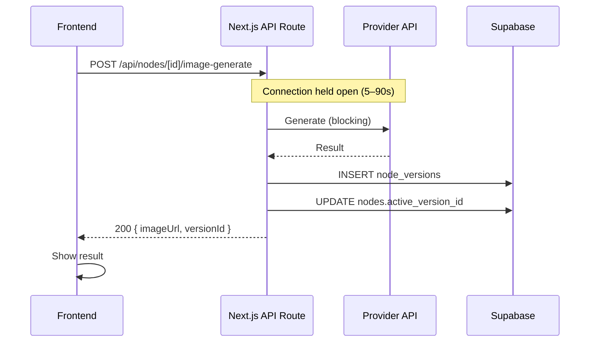
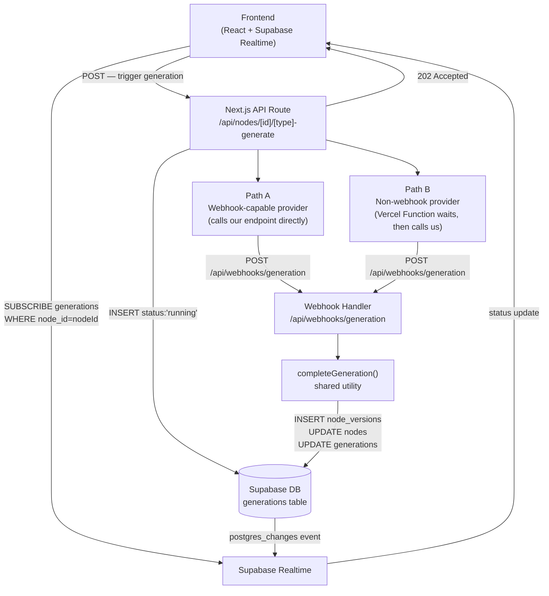
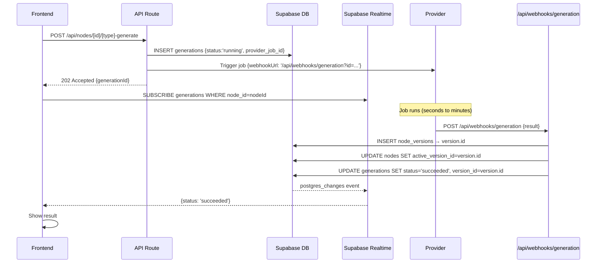
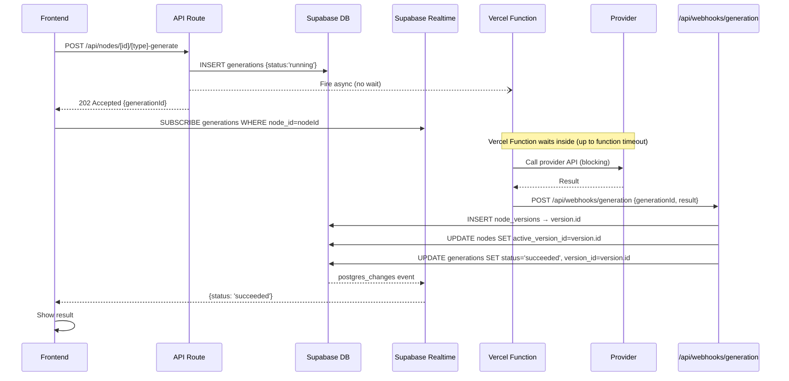
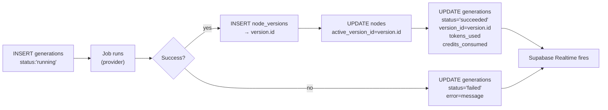
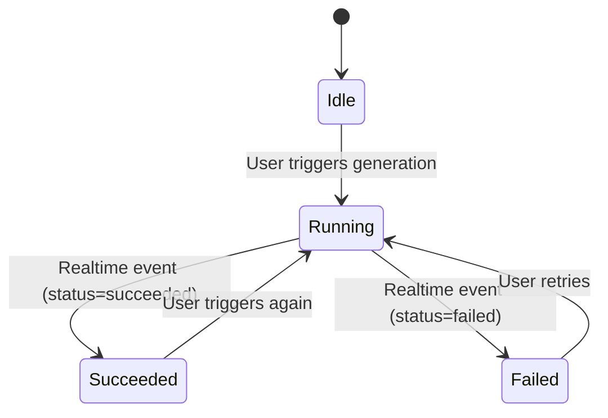

# Async Generation Architecture — Technical Document

**Project**: CreativeOS MVP
**Date**: 2026-06-20
**For**: Tech Lead Review & Approval

---

## 1. Overview

This document proposes a unified asynchronous generation pipeline for all node types
(image, video, prompt) in CreativeOS. The change introduces a new `generations` table for
job tracking and billing, Supabase Realtime for live frontend updates, and a two-path
provider model that handles both webhook-capable and non-webhook providers without polling.

**What changes:**
- All generation routes return `202 Accepted` immediately instead of waiting for the
  provider response
- A new `generations` table tracks every job with status, credits, and model metadata
- Frontend subscribes to Supabase Realtime to receive live updates on job completion
- A shared `completeGeneration()` utility handles the DB write sequence on finish

**What stays the same:**
- `node_versions` table — no schema changes, no query changes
- `nodes`, `canvases`, `edges`, `clients` — untouched
- The active version pointer pattern (`nodes.active_version_id`) — unchanged
- Eval labels (`decision`, `note`) on `node_versions` — unchanged

---

## 2. Current State

Every generation is a synchronous HTTP request. The connection stays open while the
provider processes the job.



**Problems with this pattern:**
- Video generation takes 30–90s — blocking a connection that long is not viable
- No job state visible to the frontend during processing
- No per-attempt billing record (credits, tokens, user)
- Cannot support collaborative canvas where multiple users watch the same generation

---

## 3. Proposed Architecture

### System Overview



### Path A — Webhook-Capable Provider

For providers that natively support a callback URL. The backend fires the job with a
webhook URL pointing to our endpoint, then returns immediately. The provider calls us
when the job finishes.



### Path B — Non-Webhook Provider (Vercel Function Adapter)

For providers that have no native webhook support. A Vercel Function is fired without
waiting (fire and leave from the API route's perspective). The function calls the
provider, waits inside the function, then calls our own webhook endpoint — effectively
acting as a self-hosted webhook bridge.



---

## 4. Database Schema

### New Table — `generations` (migration `0007_generations.sql`)

```sql
create table generations (
  id               uuid primary key default gen_random_uuid(),
  node_id          uuid not null references nodes(id) on delete cascade,
  type             text not null,
  -- 'image' | 'video' | 'prompt'

  status           text not null,
  -- 'running' | 'succeeded' | 'failed'

  provider_job_id  text,
  -- opaque job/operation ID returned by the provider at initiation

  model_used       text,
  -- e.g. 'openai:gpt-image-2', 'veo:veo-3.1'

  params_snapshot  jsonb,
  -- model params at the time of initiation (size, quality, aspect ratio, etc.)

  inputs_snapshot  jsonb,
  -- upstream inputs at initiation (prompt text, reference image URLs, KB slice)

  tokens_used      jsonb,
  -- filled on success: { inputTokens: number, outputTokens: number }

  credits_consumed numeric,
  -- computed on success from tokens_used

  version_id       uuid references node_versions(id),
  -- set on success only; null if the job failed (no node_versions row on failure)

  user_id          uuid,
  -- nullable; populated when auth is introduced

  error            text,
  -- job-level error message; set on failure

  meta             jsonb,
  -- raw provider response headers / metadata for debugging

  created_at       timestamptz not null default now(),
  updated_at       timestamptz not null default now()
);

create index generations_node_id_idx    on generations(node_id);
create index generations_status_idx     on generations(status);
create index generations_version_id_idx on generations(version_id);
```

### Graduation Order



**On failure**: no `node_versions` row is written; `nodes.active_version_id` is not
changed. The failed attempt is recorded only in `generations`.

### Existing Tables — No Changes

| Table | Change |
|-------|--------|
| `nodes` | None |
| `node_versions` | None |
| `canvases` | None |
| `edges` | None |
| `clients` | None |

---

## 5. API Endpoints

### Modified — Generation Initiation Routes

All generation routes are refactored from synchronous (200 with result) to async
(202 with generationId).

| Method | Path | Before | After |
|--------|------|--------|-------|
| POST | `/api/nodes/[id]/image-generate` | 200 `{imageUrl, versionId}` | 202 `{generationId}` |
| POST | `/api/nodes/[id]/video-generate` | — (new) | 202 `{generationId}` |
| POST | `/api/nodes/[id]/generate` | 200 `{output, versionId}` | 202 `{generationId}` |

**Request body** (unchanged from current):
```typescript
{
  modelId?: string;
  params?: Record<string, unknown>;
}
```

**Response** (new):
```typescript
// 202 Accepted
{ generationId: string }
```

### New — Webhook Completion Endpoint

```
POST /api/webhooks/generation
```

Called by both Path A (provider directly) and Path B (Vercel Function adapter).

**Payload**:
```typescript
{
  generationId: string;
  status: 'succeeded' | 'failed';
  output?: string;          // storage URL or text (on success)
  tokensUsed?: {
    inputTokens: number;
    outputTokens: number;
  };
  error?: string;           // error message (on failure)
  meta?: Record<string, unknown>; // provider raw data
}
```

**Idempotency**: checks `generations.status` before writing — skips if already
`succeeded` (guards against duplicate webhook delivery).

### New — Generation History

```
GET /api/nodes/[id]/generations
```

Returns all `generations` rows for the node, ordered by `created_at` descending. Used
by the frontend to show a job history panel.

---

## 6. Shared `completeGeneration()` Utility

A single TypeScript function in `src/lib/generations/complete.ts` called by both the
webhook handler and the Vercel Function adapter. This ensures the DB graduation sequence
is written exactly once.

```typescript
interface CompleteGenerationInput {
  generationId: string;
  output?: string;
  tokensUsed?: { inputTokens: number; outputTokens: number };
  error?: string;
  meta?: Record<string, unknown>;
}

async function completeGeneration(input: CompleteGenerationInput): Promise<void>
```

**On success** (output provided):
1. Upload output binary to Supabase Storage if needed → get public URL
2. Fetch `generations` row to retrieve `node_id`, `inputs_snapshot`, `params_snapshot`,
   `model_used`
3. `INSERT node_versions` → `version.id`
4. `UPDATE nodes SET active_version_id = version.id`
5. `UPDATE generations SET status='succeeded', version_id, tokens_used, credits_consumed`

**On failure** (error provided):
1. `UPDATE generations SET status='failed', error`
2. No `node_versions` row
3. No `active_version_id` change

---

## 7. Provider Integration Patterns

### Path A — Webhook-Capable Provider

```typescript
// Inside /api/nodes/[id]/[type]-generate route
const generation = await insertGeneration({
  nodeId, type, status: 'running',
  modelUsed: modelId,
  paramsSnapshot: validatedParams,
  inputsSnapshot: resolvedInputs,
});

const job = await provider.createJob({
  ...inputs,
  webhookUrl: `${process.env.APP_URL}/api/webhooks/generation?id=${generation.id}`,
});

await updateGenerationJobId(generation.id, job.providerId);
return apiOk({ generationId: generation.id }, 202);
```

### Path B — Non-Webhook Provider (Vercel Function)

```typescript
// Inside /api/nodes/[id]/[type]-generate route
const generation = await insertGeneration({ nodeId, type, status: 'running', ... });

// Fire and leave — do not await
fetch(`${process.env.APP_URL}/api/functions/generation-runner`, {
  method: 'POST',
  body: JSON.stringify({ generationId: generation.id, inputs }),
});

return apiOk({ generationId: generation.id }, 202);

// ------------------------------------
// Vercel Function: /api/functions/generation-runner
// (long-running, up to Vercel timeout limit)
const result = await provider.runAndWait(inputs);

await fetch(`${process.env.APP_URL}/api/webhooks/generation`, {
  method: 'POST',
  body: JSON.stringify({
    generationId,
    status: result.ok ? 'succeeded' : 'failed',
    output: result.url,
    tokensUsed: result.usage,
    error: result.error,
  }),
});
```

---

## 8. Frontend Changes

### Supabase Realtime Subscription

Added to each node focus view (e.g. `image-gen-focus-view.tsx`). Subscribed on open,
unsubscribed on close.

```typescript
const channel = supabase
  .channel(`generation:${nodeId}`)
  .on('postgres_changes', {
    event: 'UPDATE',
    schema: 'public',
    table: 'generations',
    filter: `node_id=eq.${nodeId}`,
  }, (payload) => {
    const gen = payload.new as GenerationRow;
    if (gen.status === 'succeeded') {
      // re-fetch versions, show new image/output
    }
    if (gen.status === 'failed') {
      // show error toast / error state
    }
  })
  .subscribe();

// On unmount:
supabase.removeChannel(channel);
```

### UI State Machine



| State | UI |
|-------|-----|
| `Idle` | Generate button enabled, previous result shown |
| `Running` | Loading skeleton, generate button disabled |
| `Succeeded` | New result shown, version history updated |
| `Failed` | Error message shown, retry available |

---

## 9. Error Handling

| Scenario | Handling |
|----------|---------|
| Provider job fails | Webhook/Function calls endpoint with `status='failed'`; error stored in `generations.error` |
| Vercel Function timeout | Configure `maxDuration` per function; on timeout, a cleanup cron can mark stale `running` generations as `failed` |
| Webhook delivery failure | Provider retries where supported; `generationId` as idempotency key prevents double-writes |
| Storage upload fails | Caught inside `completeGeneration()`, marks generation `failed` |
| Duplicate webhook call | Guard: check `generations.status !== 'running'` before writing; skip if already resolved |
| DB write fails mid-sequence | Transaction wraps steps 2–4 of graduation; partial writes roll back |

---

## 10. Implementation Phases

### Phase 1 — Database (no UI impact)

- [ ] Write `supabase/migrations/0007_generations.sql`
- [ ] Add `GenerationRow` type to `src/lib/db/types.ts`
- [ ] Add `src/lib/db/generations.ts`:
  `insertGeneration()`, `updateGenerationJobId()`, `listGenerations(nodeId)`

### Phase 2 — Backend Core

- [ ] Implement `src/lib/generations/complete.ts` — `completeGeneration()` utility
- [ ] Implement `POST /api/webhooks/generation` handler
- [ ] Refactor `POST /api/nodes/[id]/image-generate` → async (202 pattern)

### Phase 3 — Video Generation

- [ ] Implement `POST /api/nodes/[id]/video-generate` initiation route
- [ ] Implement Vercel Function runner for non-webhook video providers
- [ ] Wire to `completeGeneration()`

### Phase 4 — Frontend Realtime

- [ ] Add Supabase Realtime subscription in `image-gen-focus-view.tsx`
- [ ] Add loading skeleton for `running` state
- [ ] Handle `succeeded` / `failed` state transitions
- [ ] Add `GET /api/nodes/[id]/generations` and job history panel

### Phase 5 — Prompt Generation

- [ ] Refactor `POST /api/nodes/[id]/generate` (prompt node) to async pattern
- [ ] Ensures all generation types have billing tracking from day one of auth rollout

---

## 11. Key Decisions & Trade-offs

| Decision | Choice | Trade-off |
|----------|--------|-----------|
| Async for ALL generation types | Yes | Slightly more complex initiation; enables collaborative canvas and consistent billing |
| Single webhook endpoint for both paths | Yes | One place to maintain completion logic; both provider types produce identical DB outcome |
| `node_versions` unchanged | Yes | Zero risk to existing queries and eval flows; some data redundancy accepted short-term |
| No polling | Yes | Requires provider webhook support OR Vercel Function timeout budget |
| Supabase Realtime for frontend | Yes | Already in stack; no extra infra; Realtime is sufficient for per-node granularity |
| `version_id` nullable on failure | Yes | Failure is a job-level event in `generations` only — `node_versions` stays clean |
