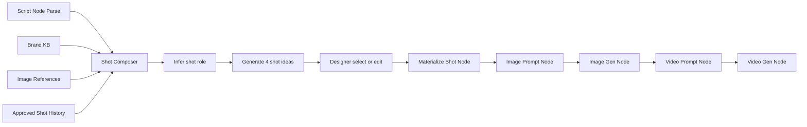
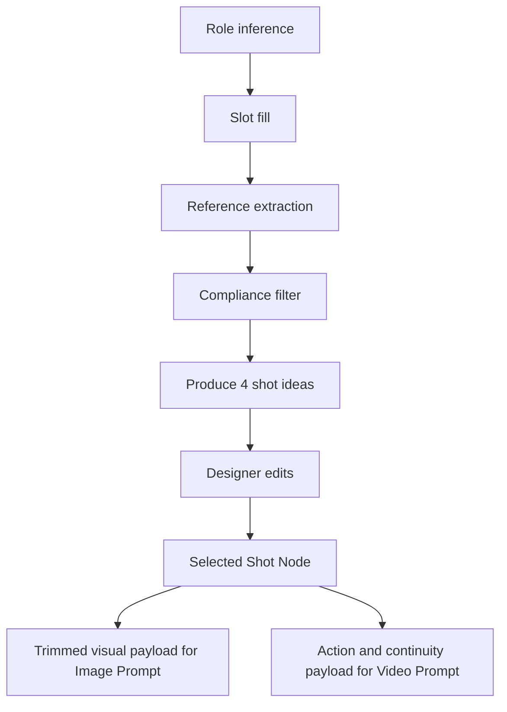

# Shot Composer for D2C Reel Production

## Executive summary

The idea is sound, and the external evidence supports it. The strongest public guidance from Shopify and TikTok does not describe winning D2C creative as a sequence of one-off bespoke shots. Instead, it describes a repeatable system: planned shot lists, recurring image types such as hero, lifestyle, detail, bundle, and packaging shots, and short form ads built around a predictable structure of hook, body, and close. TikTok also pushes brands toward high creative variation, not a single “perfect” asset, with official guidance recommending many unique creatives for TikTok Shop campaigns and emphasizing strong hooks in the first 3 to 6 seconds, product visibility, vertical framing, and sound-on storytelling. That is exactly the operating logic behind a Shot Composer. citeturn3view3turn19view2turn3view9turn20view2turn12view0turn20view3

Your current product direction already points toward the right unit of work. The uploaded CreativeOS PRD defines the reel as `1 script → N shots → N images → N clips → 1 reel`, treats the Shot node as the generation unit, trims Shot-to-image context to visual description plus production medium, and keeps versioning attached to actual model runs. The uploaded Prakriti Sattva script guide also shows that the studio is already using recurring shot families such as ingredient macros, application shots, texture shots, product heroes, bundles, and closure holds, plus repeated QC rules such as readable labels and no medical-style visuals. The gap is not “more prompting.” The gap is a compositional layer between parsed script and materialized Shot node that expands a thin shot seed into several production-ready options. fileciteturn0file1 fileciteturn0file0

The most important product recommendation is therefore to insert a **Shot Composer** step between script parse and shot materialization. In practical terms, that means: parse the script, infer each shot role, generate four descriptive ideas per role, let the designer select or edit one, and only then create the Shot node that flows into image and video prompting. For MVP, this should be template-based and grounded in Brand KB, image references, and optionally previously approved shots. It should not start as freeform generation with no role system. fileciteturn0file1 citeturn3view3turn3view6turn12view1

One nuance matters for rigor: public official sources are strong on **creative structure and impact**, but weak on exact public **shot-type frequency distributions** across winning ads. Shopify and TikTok say what kinds of visuals and structures matter, and TikTok quantifies hook strength, product-on-screen impact, and the need for creative variation, but they do not publish a canonical “application shots appear in X% of top ads” benchmark. So the frequency guidance in this report should be read as a **design synthesis**, not an industry census. citeturn3view3turn3view9turn12view0turn12view4turn19view0

## Market evidence and why the idea makes sense

Shopify’s current product photography guidance is explicit that ecommerce uses recurring visual types, not improvised imagery. Its official taxonomy includes white background, lifestyle, flat lay, detail and close-up, scale, group and packaging, and 360-degree photography. Shopify also says successful product pages usually combine several of these styles, because different shot types serve different jobs such as context, inspection, trust, and bundle understanding. In other words, the market already works with repeatable visual blocks. citeturn19view0turn19view1turn19view2turn19view3

Shopify’s workflow guidance reinforces the same point from a production angle. It recommends creating a detailed shot list before a shoot and explicitly calls out hero images, multiple angles, close-ups, social content, lifestyle context, and size comparisons. It also highlights how The Cleanest Lab uses a consistent product-page formula, front of product, back of product, and product styled on a bathroom counter, while social images shift to more playful model interaction. That is close to the system you are describing: repeatable shot roles, modulated by channel and campaign. citeturn3view3turn3view4turn3view5

TikTok’s official creative guidance makes the same case from the ad side. The platform describes trends as “storytelling templates,” recommends a hook, body, and close structure, says 90% of ad recall impact is captured within the first six seconds, and reports that ads with the product on screen drive a 65% increase in brand affinity and a 25% uplift in recall. TikTok’s Creative Codes also call for vertical 9:16 production, a strong hook in the first 3 to 6 seconds, sound-on design, and native, real-life creative. This is not random shot generation. It is role-based creative composition with platform-native constraints. citeturn3view6turn3view8turn3view9turn20view2turn20view3turn20view4

TikTok’s commerce guidance adds the strongest operational proof for a Shot Composer. Its TikTok Shop playbook recommends 30 to 300 unique creatives for GMV Max campaigns, depending on scale, and says the system should be allowed to pull top-performing videos and images featuring the product. That means the platform is optimized for **large banks of variation**, which is exactly what a composer that emits four shot ideas per role is built to support. The same official materials show that TikTok-first creative is seen as more credible, and that brands should ideate around audience, trend, moments, product showcase, and creator-native expression. citeturn12view0turn12view1turn20view2

Official case studies and brand examples reinforce the pattern. Shopify uses DedCool for white-background product shots, Allbirds for lifestyle context, hardgraft for detail confidence, Beardbrand for bundle imagery, and The Cleanest Lab for channel-specific formula. TikTok’s DTC and TikTok Shop materials highlight how Vegamour scaled creator content, lowered CPA by 43%, and increased site sessions by 143%, while ColourPop used bundles and campaign moments such as new arrivals and Valentine’s pushes to lift GMV by 160% and hit 3x revenue goal during a Valentine’s campaign. These are not proof that any single shot role always wins, but they are strong evidence that D2C performance depends on structured creative systems, product-in-use storytelling, and lots of controlled variation. citeturn19view0turn3view3turn11view0turn12view2

Your own uploaded materials line up closely with this external evidence. The Prakriti Sattva guide repeatedly uses ingredient macros, cream and oil textures, application shots to forearm, cheek, scalp, or palms, bundle shots, gift arrangement shots, tutorial/process sequences, and final still holds with readable labels. The campaign overview in the same document also shows a content mix of product, educational, testimonial, seasonal/campaign, and brand story content, which maps directly to different shot families. The PRD’s current Script node and Shot node model therefore makes sense, but the present shot descriptions are often too thin for design iteration by themselves. fileciteturn0file0 fileciteturn0file1

## Shot taxonomy for D2C reels

The most useful taxonomy is not based on camera jargon alone. It should be based on the **job the shot is doing** in a D2C reel. Shopify supports hero, context, detail, bundle, and packaging image roles. TikTok supports hook, value delivery, and close, plus real-life, product-visible, native vertical execution. In your uploaded script corpus, those abstract roles show up as concrete beauty and wellness shots such as ingredient hero, spoon texture, cheek application, scalp massage, range still, and final logo hold. citeturn19view0turn3view3turn3view9turn20view2 fileciteturn0file0

| Shot type | Primary job | Best used when | Recommended frequency in a 20 to 30 second beauty reel | Prompt-ready core fields |
|---|---|---|---|---|
| Hook or intro | Stop scroll and establish premise fast | Every reel | 1 opening shot | subject, tension, surface, lighting, motion, first-text compatibility |
| Product hero | Show the SKU clearly and beautifully | Product, seasonal, bundle, and testimonial reels | 1 to 2 | SKU, label visibility, surface, props, framing, final hold |
| Texture or detail | Prove sensorial quality and material truth | Beauty, skincare, haircare, premium tactile products | 1 to 2 | texture behavior, macro level, tool, residue, light catch |
| Application | Show believable use and fit into routine | Beauty, personal care, haircare, ritual ads | 1 to 2 | body area, hand type, amount, motion, absorption, realism |
| Ingredient | Provide formulation proof and explanatory context | Ingredient-led, educational, heritage, clean beauty | 0 to 2 | ingredient form, vessel, surface, freshness, relation to product |
| Tutorial or process | Make use simple and concrete | Education, objection handling, routine building | 0 to 2 | step order, hand action, tool, pace, cleanliness, legibility |
| Lifestyle or ritual | Build aspiration, situation, and emotional world | Brand, seasonal, gifting, routine content | 0 to 1 | environment, time of day, props, human presence, ambience |
| Social proof | Convey trust or result without risky claims | Testimonial and objection-handling content | 0 to 1 | review cue, realistic use, calm result cue, no before-after |
| Bundle or range | Show togetherness, cross-sell, gifting, routine completeness | Kits, seasonal ranges, gift sets | 0 to 1 | assortment, spacing, hierarchy, surface, campaign prop |
| Closure | End cleanly with product, logo, CTA, or memorable still | Every conversion-oriented reel | 1 final shot | final arrangement, readable label, CTA safe zone, hold time |

**Table note.** The roles above synthesize Shopify’s shot-type taxonomy and shot-list planning guidance, TikTok’s hook-body-close and product-on-screen guidance, and the repeated shot families in your uploaded scripts. The frequency column is a recommended design distribution, not a public benchmark. citeturn19view0turn3view3turn3view9turn12view4turn20view2 fileciteturn0file0

Two specific implications follow from this taxonomy. First, a Shot Composer should ask for a **shot role** before it asks for style, because role determines what information needs to be present. Second, many shot descriptions should be generated as **role-specific expansions** of a thin seed line, not treated as already complete. A line like “Fingertip traces a line of cream on forearm” is a usable seed for an application role, but not yet a production-ready shot idea. fileciteturn0file0 citeturn3view3turn19view1turn20view2

## Template library and example outputs

The best-practice template should be a **slot structure**, not a giant frozen prompt. Shopify’s guidance says to define goals, angles, compositions, props, lighting, and inspiration in the shot list. TikTok’s guidance adds hook timing, product visibility, vertical composition, native feel, and sound-aware structure. Your sample scripts add brand-specific constraints such as label readability, slow movement, shallow depth of field, and no medical-style visuals. The table below translates that into prompt-ready shot templates for D2C reel production. citeturn3view3turn19view0turn20view2 fileciteturn0file0

| Shot type | Required slots | Avoid list | Typical duration | Camera and framing | Lighting | Motion | Props |
|---|---|---|---|---|---|---|---|
| Hook or intro | tension, hero subject, surface or backdrop, motion cue, text-safe zone | generic beauty stills, crowded frame, slow reveal with no tension | 1 to 3 seconds for fast ads, 3 to 5 for luxury reels | bold macro or graphic medium close | one strong directional source | one memorable action | minimal, iconic |
| Product hero | SKU, label priority, surface, brand prop, hold requirement | obscured label, too many props, shallow focus on wrong plane | 3 to 6 seconds | medium product close or locked still | clean side or window light | subtle push or none | restrained brand props |
| Texture or detail | material behavior, tool or contact point, macro intensity, residue rule | fake texture, over-retouched gloss, impossible viscosity | 2 to 5 seconds | macro or extreme macro | edge light or side light | lift, smear, curl, drip, dissolve | spoon, fingertip, dropper |
| Application | user hand or body area, amount, motion, realism, finish | exaggerated transformation, medical cues, unreal skin | 3 to 6 seconds | macro body detail or cropped ritual frame | soft natural side light | single believable action | towel, basin, jar edge |
| Ingredient | ingredient identity, form, vessel or surface, relation to formula | grocery clutter, scientific lab clichés, too many ingredients per frame | 2 to 4 seconds | macro or top-down editorial | soft side or top light | still, fall, pour, drift | brass bowl, stone, linen |
| Tutorial or process | step number, tool, action, cleanliness, pacing | rushed montage, messy surfaces, unclear sequencing | 3 to 6 seconds per step | overhead or side instructional | even, readable light | mix, apply, massage, rinse | bowls, spoons, brush, towel |
| Lifestyle or ritual | setting, time of day, emotional cue, product presence | generic stock-home look, irrelevant decor, product too small | 3 to 6 seconds | medium environmental close | time-specific natural light | hand placement, walking, pause | candle, window, robe, flowers |
| Social proof | human cue, product cue, calm believable benefit cue | before-after splits, overclaim copy, dermatologist theater unless true | 3 to 5 seconds | intimate crop or hand-held feel | natural honest light | restrained gesture | review card, mirror, shelf |
| Bundle or range | assortment, hierarchy, grouping logic, campaign context | clutter, equal emphasis on everything, missing hero product | 4 to 8 seconds | top-down or medium still life | broad soft light | gentle reveal or still hold | ribbons, seasonal botanicals |
| Closure | final product or logo arrangement, CTA safe area, readable label | weak end card, ambiguous product, no resting frame | 4 to 8 seconds | locked medium or centered still | even readable light | none, very subtle breathe | logo card, tagline surface |

**Table note.** These defaults are synthesized heuristics, not platform rules. They are meant to become editable presets inside the Shot Composer. citeturn3view3turn19view0turn20view2 fileciteturn0file0turn0file1

### Variant bank for the core visual roles

The point of a Shot Composer is not to output one line. It is to output **several descriptive options** that all satisfy the same role, so the designer chooses a direction instead of inventing one. The variant bank below shows what that should look like at template level. These are prompt-ready examples with placeholders, not final prompts. They are deliberately more descriptive than the one-line shot seeds in your current corpus. citeturn3view3turn3view6turn20view2 fileciteturn0file0

| Shot type | Variant A | Variant B | Variant C | Variant D |
|---|---|---|---|---|
| Hook or intro | **Object interruption**: A single {ingredient or product cue} lands on {surface} in crisp side light, creating immediate contrast and a clean text-safe area above. | **Unexpected material**: {Texture cue} fills the frame before the camera reveals it belongs to {product}, shifting from abstraction to product story. | **Motion hook**: {Drop, fall, pour, or lift} begins mid-action against a simplified backdrop, with the product revealed only after the eye is caught. | **Question hook**: A highly specific, tactile visual for {problem or desire} appears first, before any product explanation, to create curiosity. |
| Product hero | **Editorial still**: {SKU} rests on {surface} with one restrained brand prop, label front-on, light held for clarity and luxury. | **Reveal to hold**: The camera glides into {SKU} from a partial crop and resolves into a readable, calm final hold. | **Contextual hero**: {SKU} appears in its most believable environment, but spacing and light keep the label as the focal plane. | **Seasonal hero**: {SKU} is arranged with a small seasonal prop system that signals occasion without overpowering the pack. |
| Texture or detail | **Spoon lift**: A tool lifts {product texture} slowly so the camera can watch weight, stretch, and sheen. | **Absorption detail**: {Product} thins across {skin or hair} until only a believable finish remains. | **Drop behavior**: A single drop of {oil or serum} hangs or lands in a way that reveals color and viscosity. | **Split texture**: The frame starts on raw {ingredient texture} and dissolves into finished {product texture} to connect formula and sensorial result. |
| Application | **Single stroke**: A realistic hand applies one measured amount of {product} to {body area} in a single continuous motion. | **Jar-to-skin continuity**: The frame begins with open product texture, then the hand carries a small amount toward skin. | **Routine detail**: {Product} is applied in a ritual setting with towel, steam, or vanity cues, but the body action remains the focus. | **Result-safe usage**: The action emphasizes comfort, spread, or finish without implying medical transformation. |
| Ingredient | **Hero ingredient portrait**: A single {ingredient} sits in a minimal vessel or directly on {surface}, lit to emphasize form and provenance. | **Ingredient in sequence**: One ingredient follows another under a shared visual treatment, suitable for an expandable shot group. | **Ingredient-to-product relation**: The ingredient occupies foreground or prior frame, then yields to the product hero. | **Material action**: Seeds scatter, petals fall, or oil pours to keep the ingredient shot from feeling static. |
| Tutorial or process | **Clean step**: Step {n} shows exactly one action with tool, hand position, and finish clearly visible. | **Overhead ritual**: The camera looks directly down at bowl, tool, and product for maximum legibility. | **Before-use prep**: The shot explains warming, mixing, or scooping before application begins. | **Process-to-finish**: The frame captures action and then resolves to the prepared product or the finished placement. |

| Shot type | Variant A | Variant B | Variant C | Variant D |
|---|---|---|---|---|
| Lifestyle or ritual | **Morning ritual**: Product appears in a believable start-of-day setting with restrained human presence and calm natural light. | **Seasonal pause**: The environment encodes a calendar moment, such as summer window light or winter candle warmth. | **Gift or occasion**: Product sits inside a social context, desk, bath ledge, travel bag, or gift arrangement, without losing prominence. | **Quiet self-care**: Small gestures, folded linen, dim ambient cues, and unhurried movement frame the product as a ritual object. |
| Social proof | **Review embodiment**: A human shot quietly enacts the type of experience a review describes, without text baked into the frame. | **Credibility close**: Real hands, real skin texture, and plain light make the product feel trusted rather than cinematic. | **Objection handling**: Show the product being used in the precise context that causes skepticism, such as powder shampoo becoming a paste. | **Community shelf**: Clean product presentation with subtle signs of repeated use or everyday placement, suggesting real-world acceptance. |
| Bundle or range | **Assortment compare**: Multiple SKUs appear together with clear hierarchy so the viewer understands difference and complementarity. | **Gift set tableau**: Products are grouped inside a gifting or seasonal frame, using props to imply occasion. | **Routine stack**: The arrangement tells a sequence, for example face, body, hands, feet, or cleanse, apply, seal. | **Variant family**: Similar products sit under shared lighting and surface treatment so differences read clearly. |
| Closure | **Centered still hold**: Product or range resolves into a quiet, readable frame that can carry logo or CTA safely. | **Logo-over-object**: A symbolic last image such as candle, petal, or marble field holds long enough for the logo to land. | **Label lock**: Camera settles into an unmoving label view for brand retention and purchase memory. | **Occasion close**: The last frame ties product and campaign moment together, such as holiday, spring, or gift season. |

### Concrete application example using Rose Body Butter

Below is how a Shot Composer should render four concrete options for a single role. This is the standard you want the product to hit: same role, same product, clearly different ideas, each descriptive enough that a designer can evaluate and iterate immediately. The role is **Application**, the sample product is **Rose Body Butter**, and the brand world is calm, premium, tactile beauty. The structural defaults are grounded in Shopify’s in-use and detail guidance, TikTok’s product-visible storytelling, and your uploaded Rose Body Butter scripts. citeturn19view2turn19view1turn12view4turn20view2 fileciteturn0file0

| Option | Best for | Descriptive shot idea |
|---|---|---|
| Forearm glide | Sensory proof | A mature hand enters from the lower right and spreads a measured ribbon of Rose Body Butter across the inner forearm in one slow stroke. The frame is macro but not clinical, focused on natural skin texture and the cream thinning into a satin finish. Pale marble sits soft in the background, with warm side light catching the spread without making the skin look glossy or artificial. |
| Post-shower calm | Routine framing | A damp forearm rests beside a folded cotton towel on a pale stone counter. Two fingertips lift a small amount of Rose Body Butter from just outside frame and press it gently into the skin in slow circular motion. The camera holds close enough to show absorption and comfort, while soft bathroom haze and warm window light make the scene feel private and believable. |
| Shoulder press | Comfort and elegance | The shot crops tightly to shoulder curve, collarbone edge, hand, and product. A small amount of Rose Body Butter is pressed into the upper shoulder with restrained movement, emphasizing relief and softness rather than sensuality. The light is diffused and creamy, revealing the product’s finish and keeping the overall composition quiet and premium. |
| Jar-to-skin continuity | Product plus use in one shot | The open jar sits blurred in the near foreground while a hand carries a small scoop of Rose Body Butter toward the forearm deeper in frame. Focus racks from whipped texture to skin contact as the butter is smoothed on in a single continuous action. One dried rose petal and pale stone surface echo the product story without cluttering the frame. |

## Product design and implementation

The Shot Composer fits naturally between the Script node and the Shot node. That placement follows the logic already present in your PRD: parse the finished script, treat each shot as the unit of generation, then fan out into image and video work. The design change is simply that “fan out shots” should become “compose shot ideas, then materialize selected shots.” This preserves the existing architecture while fixing the thin-shot problem. fileciteturn0file1



The data model should distinguish between a **Shot Idea** and a **Shot Node**. A Shot Idea is a candidate composition generated by the composer. A Shot Node is the selected production unit that moves downstream into prompting and generation. Keeping those separate preserves optionality and keeps the canvas clean. It also aligns with your PRD’s versioning model, where only model runs create versions and manual text edits fold into the active output. fileciteturn0file1

| Entity | Purpose | Created when | Editable fields | Version rule | Downstream use |
|---|---|---|---|---|---|
| Shot intent | Captures role, purpose, and source line | On parse or manual idea entry | role, purpose, duration target | no separate version needed | feeds composer |
| Shot idea | One generated composition option | When composer runs | title, description, slots, avoid list | version only when composer runs again | selectable candidate |
| Selected shot idea | Marks chosen option | On user select | same as shot idea | no new version for simple edits | becomes node payload |
| Shot node | First-class production object on canvas | On materialize or fan-out | visual description, duration, continuity notes | follows existing node rules | feeds image and video prompts |

For MVP, the input set should stay minimal and structured: **Brand KB slices**, **one idea line or parsed script line**, **shot role**, **optional image references**, and optionally **a small set of previously approved shots** as style patterns, not as content to copy. The output should be four descriptive shot ideas plus one optional “more like this” regeneration. The system does not need automated learning on day one. It needs a reliable, fast ideation surface. fileciteturn0file1 citeturn3view3turn12view1

A practical MVP scope would include eight to ten role templates, the slot matrix above, four ideas per run, image-reference grounding, manual edit before materialization, and support for **shot groups**. Shot groups matter because your sample corpus already contains expandable sequences such as `SHOT 1-10` ingredient runs. The composer should therefore detect “single shot” versus “expandable sequence,” then ask whether to create one grouped concept or expand into many child ideas. fileciteturn0file0

A reasonable MVP acceptance checklist is below.

| Acceptance criterion | Pass condition |
|---|---|
| Role recognition | Composer can classify a thin shot seed into one primary role and one optional secondary role |
| Idea usefulness | At least one of the four generated ideas is considered workable without rewriting from scratch |
| Reference grounding | When image references are attached, ideas reflect the right palette, surface, props, or composition cues |
| Node cleanliness | Only selected ideas become Shot nodes, unselected ideas stay off-canvas |
| Prompt readiness | Selected Shot node has enough descriptive detail to feed Prompt and Gen nodes immediately |
| Compliance safety | Generated ideas avoid medical-style visuals, unreal transformations, and text baked into image concepts |

## Implementation guidance

The most robust prompting pattern is **role first, slots second, prose third**. In other words: identify whether the idea is hook, application, ingredient, hero, and so on; fill the role’s required slots; then render four prose variants that differ in camera, motion, context, or prop logic. This is superior to a single monolithic prompt because it enforces comparability across options and prevents the model from drifting into generic brand mood language. That recommendation is consistent with Shopify’s shot-list planning discipline, TikTok’s structured creative guidance, and your PRD’s move to keep Shot-to-image input narrowly visual. citeturn3view3turn3view9turn20view2 fileciteturn0file1

A useful prompt pattern for the composer is:

```text
System goal:
Produce four production-ready shot ideas for a {shot_role} in a vertical D2C beauty reel.

Inputs:
- Product and idea
- Brand KB slices
- Shot role
- Shot seed
- Image references
- Previously approved shot patterns
- Compliance rules

Instructions:
- Keep all four ideas within the same role
- Vary composition, motion, prop logic, and framing
- Be concrete about surface, light, hand movement, body area, and finish
- Avoid text overlays, impossible material behavior, unsafe medical implications, and generic luxury filler
- Output structured slots first, then descriptive prose
```

Image references should influence **specific visual dimensions**, not the whole concept indiscriminately. In practice, the safest reference extraction schema is: palette, surface, vessel, prop system, framing pattern, depth of field, and mood. Previous approved shots should be treated similarly. They are style anchors and proof that a pattern worked, not templates to duplicate literally. This keeps the system from collapsing into repetitive near-copies, which is a real risk when the platform itself rewards large numbers of variations. citeturn12view0turn12view1

Your PRD’s context-trimming rule should be preserved and extended. The composer can see more context than the image prompt should. A good logic split is: the composer can use script objective, on-screen text intent, and seasonal context to understand what the shot is trying to do; the **image prompt** should still receive mainly visual description plus production medium; the **video prompt** can receive the approved still plus action or continuity notes. This follows the existing Shot-to-image trimming in the PRD and should materially reduce over-branded, repetitive outputs. fileciteturn0file1

Shot groups need a specific representation. If the script says “SHOT 1-10, each ingredient in its own bowl,” the composer should not flatten that into a single vague idea. It should output a **group object** with shared treatment plus child items, then allow expansion into ten sibling Shot Ideas or ten Shot Nodes. That approach respects the actual script semantics in your uploaded corpus and makes downstream generation much cleaner. fileciteturn0file0

Versioning should follow the existing product rule. A Shot Composer run is a versioned model attempt. Manual edits to a generated Shot Idea should not create a new version row until the user asks the model to regenerate or produce more ideas. That keeps the system aligned with the rest of CreativeOS. A simple lineage model is enough for MVP: `source script shot → composer run → shot idea → selected shot node → prompt versions → generation attempts`. fileciteturn0file1

Compliance should be encoded at template level, not left to final review only. Your uploaded script guide repeatedly prohibits medical-style visuals and unrealistic before-and-after cues, and softens or removes high-risk language such as cure, heal, treat, repair, and prevent. In a Shot Composer, that becomes a per-role avoid list: no medical theater for application shots, no dramatic transformation visuals for social-proof shots, no baked-in text in hero frames, no pseudo-clinical close-ups unless the brand truly supports that mode. fileciteturn0file0



## Metrics, risks, and roadmap

The right MVP metrics are not just generation metrics. They should measure whether the composer reduces creative labor and improves idea quality before generation. That means looking at how often designers select one of the four ideas, how much they edit before materialization, whether generation succeeds more often on the first pass, and whether the resulting ads perform better in actual distribution. TikTok’s own guidance strongly suggests that better hooks, stronger product visibility, and more creative variation matter downstream, so these are not merely UX niceties. citeturn3view9turn20view2turn12view0

| Metric | Definition | Why it matters |
|---|---|---|
| Time to first usable shot | Minutes from parsed script line to selected Shot Node | Direct measure of designer time saved |
| Selection rate | Share of composer runs where one of the four ideas is selected without full rewrite | Core usefulness signal |
| Edit distance before materialization | How much text the designer changes before creating the Shot Node | Indicates whether outputs are too thin or too generic |
| First-pass generation success | Share of selected Shot Nodes that yield a usable image or video on first generation run | Measures whether better ideation improves downstream quality |
| Diversity score | Semantic distance across the four proposed ideas | Prevents four near-duplicates |
| Asset approval rate | Percent of generated attempts approved per selected Shot Node | Tests quality of the whole flow |
| Ad performance delta | CTR, hold rate, thumb-stop rate, CVR, or CPA difference for assets created with versus without composer | Business outcome measure |

The main risks are predictable. The first is **template rigidity**, where every output starts to look the same. The second is **brand overfitting**, where the Brand KB floods every shot with the same premium adjectives. The third is **unsafe implication drift**, especially in beauty and wellness where application and testimonial content can become too clinical. The fourth is **history misuse**, where previously approved shots are copied too literally instead of abstracted into reusable patterns. These risks are manageable if role templates are slot-based, ideas are forced to diversify, compliance rules are encoded upfront, and history is mined for structure rather than replicated as text. citeturn12view0turn12view1turn20view2 fileciteturn0file0turn0file1

A sensible roadmap is staged:

| Phase | Capability | What changes |
|---|---|---|
| MVP | Fixed template library, role inference, 4 ideas, image references, manual selection | Fastest path to value |
| Learning phase | Learn from approved shots and rejected edits | Composer begins ranking and remixing patterns that actually worked |
| Variation phase | Automatic controlled variation by role, angle, prop system, or motion style | Scales creative banks for paid testing |
| Optimization phase | Feed downstream performance back into template ranking | Highest-performing shot ideas move up by channel, product, and audience |

The bottom line is simple. A Shot Composer is not an extra flourish. It is the missing production layer between a thin script seed and a generation-ready asset spec. The official platform guidance, the D2C examples, and your own uploaded materials all point in the same direction: D2C reel production works best when creative is built from repeatable shot roles, adapted to campaign goals, and expanded into multiple concrete options before generation. citeturn19view0turn3view3turn3view9turn12view0turn12view4 fileciteturn0file0turn0file1