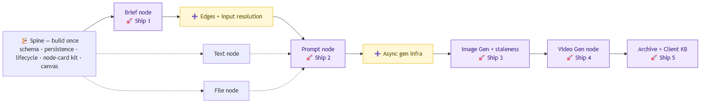
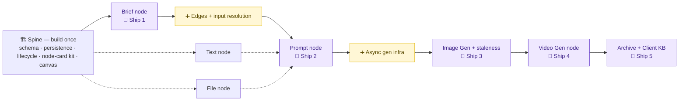

# CreativeOS — Task List (modularized + sequenced)

**Date:** 2026-06-02
**Status:** Working task breakdown — sequence + modules locked; **owners TBD** (split next)
**Sources:** [architecture](docs/superpowers/specs/2026-05-30-creativeos-architecture.md) · [staging roadmap](docs/superpowers/specs/2026-05-30-creativeos-staging-roadmap.md)

This doc turns the architecture + roadmap into concrete buildable units. It does **not**
decide who builds what — the split goes in §4, left blank on purpose.

---

## 0. The one idea that makes everything modular

Two spine modules define plug-in points:

- **Lifecycle engine** exposes `registerNodeType(type, { compile, runAction })` + `runNode(id)`.
- **Node-card UI kit** exposes `<NodeCard>` with header/body/controls/history slots.

Once those exist, **every node type is the same four-slot plugin**:

```
compile  ·  runAction  ·  UI body  ·  eval
```

Brief, Text, File, Prompt, Image Gen, Video Gen all share that shape — only the fillings
differ. That uniformity is why the work below modularizes cleanly.

---

## 1. Task grid (feature × dimension)

The raw tasks, in build order. Blank cells = that dimension doesn't exist for that feature.

| Feature | Prompt | Frontend | Backend | Eval |
|---|---|---|---|---|
| **Foundation (spine)** | — | canvas persistence (load/save, debounce, UUIDs); node-card + version-history shell | Supabase setup; schema (clients·canvases·nodes·node_versions + active FK); storage buckets; shared lifecycle (`resolveInputs`/`writeVersion`/`setActive`) | — |
| **Brief node** | extraction schema + parse instruction | upload/paste UI (.md/.txt); show parsed result; history panel | parse Route Handler (holds key → LLM → writeVersion) | sample briefs + expected fields; compare parses across versions |
| **Text node** | — (no AI) | type-text UI | store in `node.data` | — |
| **File node** | optional extraction prompt (if "use LLM") | file upload + show extracted content | file storage + optional extract runAction | check extraction on 2–3 file types |
| **Edges + input resolution** | — | connect/draw edges on canvas (React Flow) | edges table; `resolveInputs` (walk edges, follow active pointer); cycle-prevention check; client-context toggle | spot-check resolved inputs |
| **Prompt node** | compile: client ctx + upstream + inline + instruction → final prompt | 3 input levels UI; instruction box; **visible final-compiled-prompt panel** | generate runAction (LLM text) → writeVersion | judge generated-prompt quality; compare instructions; golden examples |
| **Image Gen node** | master-controls schema + image compile (controls + refs → final image prompt) | controls UI; compiled-prompt panel; attempts gallery; approve/reject + set-active | generations table + Supabase Realtime; image runAction; attempt snapshot + active-pointer write; stale-downstream detection | **the core eval loop**: judge images, compare attempts, rubric |
| **Video Gen node** | video compile (prompt + image → video payload) | video controls; job-status UI (queued/running/done) | async job state machine (submit→poll→resolve); video runAction; realtime status | judge video quality; compare attempts |
| **Archive + Client KB** | how KB gets injected into prompts (selection → context) | archive review UI; client-KB selection UX | relational archive-bundle assembly (the big query); selection-list resolution | retrospective: review exactly how each output was made |

---

## 2. Modules (cohesive units + their contracts)

A module's boundary is its **interface** — that's what lets it be built/tested against a
mock of its neighbor.

| # | Module | What's in it | Interface / contract | Depends on |
|---|---|---|---|---|
| **M1** | Schema + Storage | tables (clients·canvases·nodes·node_versions + active FK), buckets | the DDL + TS row types (`Node`, `NodeVersion`…) + bucket names | — |
| **M2** | Persistence (data-access) | typed read/write fns over M1 | `loadCanvas` · `saveNode` · `insertVersion` · `setActive` · `listVersions` (nothing else writes raw SQL) | M1 |
| **M3** | Canvas shell | React Flow setup, persist viewport/positions, debounced save | renders `nodes[]` from data, hosts node bodies by `type`, calls M2 to save | M2 |
| **M4** | **Lifecycle engine** | shared `resolveInputs→compile→runAction→writeVersion→setActive` orchestrator | `registerNodeType(type,{compile,runAction})` + `runNode(id)` — **the plug interface** | M2 |
| **M5** | Node-card UI kit | card shell, header/body/controls slots, **version-history + approve/reject panel**, run button | `<NodeCard>` + `useNodeRun()` — **the UI plug** | M2 |
| **M6** | Brief node | parse schema+prompt, upload/paste UI, parse route handler, eval briefs | fills M4/M5 slots | M4, M5, M3 |
| **M7** | Text node | type/store text (no AI) | fills slots (compile/runAction = no-ops) | M4, M5 |
| **M8** | File node | upload, optional LLM extract | fills slots | M4, M5 |
| **M9** | Edges + resolution | edges CRUD, connect-UX on canvas, **extends `resolveInputs` to walk edges**, cycle check | edges in M2; `resolveInputs` upgrade in M4; connect UX in M3 | M2, M3, M4 |
| **M10** | Prompt node | compile (3 input levels + instruction), generate runAction, eval | fills slots | M4, M5, M9 |
| **M11** | Image Gen node | controls schema, image compile, attempts/approve UI, image runAction | fills slots + uses M13 | M10, M13 |
| **M12** | Video Gen node | video compile, status UI, video runAction | fills slots + uses M13 | M11, M13 |
| **M13** | Async gen infra | generations table + Realtime + job state machine | `submitGeneration()` + status subscription | M2 |
| **M14** | Staleness | derived-on-read comparison | `isStale(node)` | M9 |
| **M15** | Archive + Client KB | bundle query, KB selection→context | `assembleBundle(canvasId)` + selection resolution | all node types |

---

## 3. The repeatable unit: one node at a time

The cleanest way to think about this is **"what does it take to stand up one node?"** —
then repeat. Every node is the **same template**, five areas:

| Area | For a node, this is… |
|---|---|
| **Prompting** | the `compile` (inputs → payload) + the instruction/schema + iterating on quality |
| **UI (design)** | the controls/inputs the user touches; how output is shown |
| **Front-end (impl)** | the React node body, wired into the canvas + state |
| **Back-end** | `runAction` (model call / route handler) + resolution + persistence |
| **Eval** | sample inputs + how you judge "is this good" + compare attempts |

Nodes are **not fundamentally different** — they differ only in *which area is heaviest*:

| Node | Heaviest area |
|---|---|
| Brief | Back-end (it drags the spine in) |
| Text / File | almost nothing (degenerate) |
| Prompt | **Prompting** (context engineering) |
| Image | **Eval** (judging attempts) + async |
| Video | Back-end (async job machine) |

### The catch: three "riders"

Three nodes can't be built in isolation — standing them up *forces* a one-time piece of
shared machinery **first**. These are what you must get done before you can "just do the node":

1. **Brief → forces the SPINE** (M1–M5: schema · persistence · lifecycle engine · node-card
   kit · canvas). The first node is expensive because it builds the substrate every later
   node reuses for free.
2. **Prompt → forces EDGES + input resolution** (M9) — first node that consumes *other* nodes.
3. **Image → forces ASYNC gen infra** (M13) — first node whose model call is long-running.

Everything else is genuinely "fill the five areas → ship → next node." **Sequential plan:
build the spine, then walk the nodes in order, paying a rider only at Brief, Prompt, and Image.**

---

## 4. Build sequence (waves)

Items in the same wave are independent of each other — they can run in parallel.

- **Wave 0 — foundation chain:** M1 → M2  *(small, sequential, gates everything)*
- **Wave 1 — spine fan-out (parallel):** M3 ∥ M4 ∥ M5
- **Wave 2:** M6 (Brief) → 🚀 **Ship 1 — persistent canvas + Brief**
- **Wave 3 — parallel:** M9 (edges/resolution) ∥ M7 (Text) ∥ M8 (File); then M10 (Prompt) → 🚀 **Ship 2 — connections + Prompt**
- **Wave 4 — parallel:** M13 (async infra) ∥ M11 (Image) → M14 (staleness) → 🚀 **Ship 3 — image loop**
- **Wave 5:** M12 (Video, on M13's full job machine) → 🚀 **Ship 4 — full reel pipeline**
- **Wave 6:** M15 (Archive + KB) → 🚀 **Ship 5 — archive + reusable KB**

> Widest parallel moments (best for splitting): **Wave 1** (M3∥M4∥M5) and **Wave 3** (M9∥M7∥M8).
> Narrow points: **Wave 0** (M1→M2) and the single-module ship gates.

The diagram shows only the **sequence** (the precise dependencies live in the §2 table).
One horizontal spine; the two yellow boxes are the "riders" each forced by the next node;
Text/File hang off as nearly-free siblings.



<sub>Rendered from the Mermaid source below. Regenerate after edits:
`npx -p @mermaid-js/mermaid-cli mmdc -i sequence.mmd -o docs/assets/creativeos-sequence.png -b white -s 2`</sub>



---

## 5. Ownership / split — TBD

Fill this in when deciding the split (by module is the recommended granularity).

| # | Module | Owner | Notes |
|---|---|---|---|
| M1 | Schema + Storage | | |
| M2 | Persistence | | |
| M3 | Canvas shell | | |
| M4 | Lifecycle engine | | |
| M5 | Node-card UI kit | | |
| M6 | Brief node | | |
| M7 | Text node | | |
| M8 | File node | | |
| M9 | Edges + resolution | | |
| M10 | Prompt node | | |
| M11 | Image Gen node | | |
| M12 | Video Gen node | | |
| M13 | Async gen infra | | |
| M14 | Staleness | | |
| M15 | Archive + Client KB | | |
