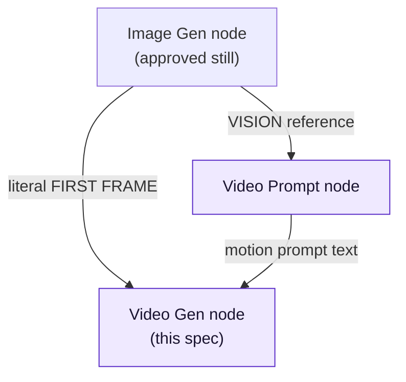
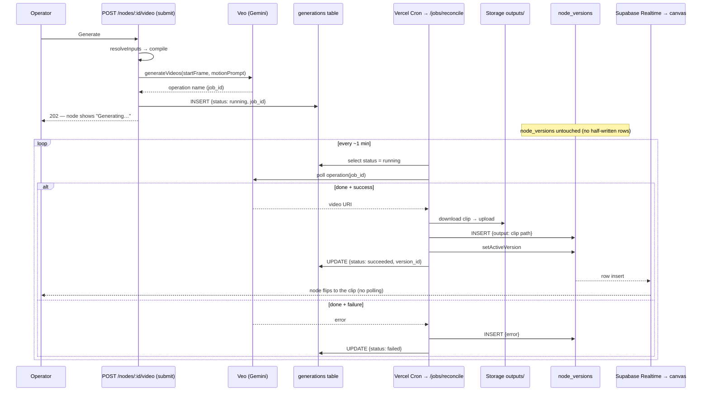

# Stage 4 (part 2 of 2) — Video Gen node (Veo, image-to-video)

**Date:** 2026-06-18
**Status:** Approved (design). Not yet built. **Depends on the Video Prompt node** (part 1).
**Type:** Stage build spec (one node of Stage 4)
**Companions:** `2026-06-18-video-prompt-node-design.md` (part 1 — the node that feeds this one),
`2026-05-30-creativeos-staging-roadmap.md` (strategy + ADR log; this is Stage 4, ADRs **D24/D25**),
`2026-05-30-creativeos-architecture.md` (the reusable spine this spec reuses).

This spec designs the **Video Gen node**: the reel pipeline's final asset step
(`1 script → N shots → N images → N clips → 1 reel`). It animates an approved Image Gen
still into an ~8-second clip via **Veo (Google Gemini API)**. It is the first node whose
`runAction` is **genuinely async** — the only part of the spine that the synchronous
request/response pattern can't carry — so most of this spec is about the async job machine
(roadmap D12/D13). Everything else is reuse of the existing node lifecycle (D3).

---

## 1. Context — what already exists (don't rebuild)

The codebase is already cut for this node; this spec mostly *fills in the type-specific
steps* of the established lifecycle.

- **Topology — established by the Video Prompt node (part 1), consumed here.** Post-**D24** the
  connection map is owned by the **Video Prompt spec §2** (and PRD §9.2/§10): part 1 adds the
  `video-prompt` node type and its edges. From *this* Video Gen node's side, the inbound edges are
  `image-gen → video-gen` (the **start frame** — already in `VALID_CONNECTIONS`) and
  `video-prompt → video-gen` (the **motion prompt** — added by part 1); `video-gen → []` stays
  terminal (nothing flows out of a clip). `prompt → video-gen` is retained only as the **inline
  fallback** path (PRD §10 — type motion text directly when no Video Prompt node is wired). So this
  spec introduces **no connection rules of its own** — it consumes the edges part 1 establishes.
  *(Earlier drafts said "topology is fixed, no change needed"; that described the pre-D24 code,
  which still lacks the `video-prompt` type — the build rewires it in part 1, step 3.)*
- **The node lifecycle (D3) is a clean template.** `src/app/api/nodes/[id]/generate/route.ts`
  is the reference: `resolveInputs → compile → runAction → insertVersion → setActiveVersion`.
  The Video node is "the same five steps, with an async `runAction`."
- **The version envelope already fits.** `node_versions.output` is documented to hold "a
  storage reference for image/video," and `decision` ('approved'|'rejected'|null) already
  exists for the approve/reject loop. No envelope change.
- **`generations` table does not exist yet.** D12 designed it on paper; migrations stop at
  0006 and none create it. The only "generation"-named thing in the schema is
  `node_versions.generated_output` (D22, the eval-flywheel raw-output capture) — a **different
  concept**; do not conflate. The async job table is greenfield.
- **Only an OpenAI client exists today** (`src/lib/openai/server.ts`). Veo is Google, so a
  new provider client is required.

---

## 2. Scope (locked)

**In:**
- **Image-to-video.** The connected Image Gen node's *approved* active still is the first
  frame; a motion prompt animates it. The pipeline spine (1 shot image → 1 clip).
- **Controls:** a **negative prompt** and a **motion hint** (mirrors the descriptive-control
  pattern in `src/lib/nodes/shot-controls.ts`).
- **Async job machine:** submit → reconcile → resolve, tracked durably in the DB, pushed to
  the UI via Supabase Realtime.
- **Approve/reject** review loop (reuses `node_versions.decision`).
- **New Gemini/Veo provider client.**

**Out (explicit no's, deferred):**
- Native audio (Veo 3) — first clips are silent plates, scored later in edit. **Note:** Veo
  *defaults to generating audio*, so "silent" is an active choice — the request config (or a
  `negative`/no-audio instruction) must suppress it; confirm the exact knob at build time.
- Honoring the Shot's per-shot `duration`, and locking aspect to 9:16 — use Veo defaults for
  the first slice.
- Video-to-video / clip extension.
- Retry/backoff policy beyond "it failed → it's a failed attempt; re-run manually."
- Text-to-video (no start frame) — every Video node here starts from an image.

### Decision: the motion prompt comes from a dedicated Video Prompt node
A Veo motion prompt could come from (A) inline text + a camera control on the Video node,
(B) a **video mode** on the existing Prompt node (`target: 'image' | 'video'`), or (C) a
dedicated **Video Prompt** node type. **Chosen: C** — its own design spec
(`2026-06-18-video-prompt-node-design.md`), built **first**, as the prerequisite to this node.
Rationale: a good Veo motion prompt is an *iterated, controlled, vision-grounded* artifact, not
a throwaway line — it benefits from curated master controls (camera move / motion speed, mapped
from the Veo 3.1 guide structure), versioned attempts to compare, the visible compiled prompt
(D3), the eval flywheel (D22), and **vision-reading the approved frame** to ground the motion in
what's actually on screen (the message composer already supports image vision —
[compose-message.ts](../../../src/lib/nodes/compose-message.ts)). C was chosen over B (a mode on the
image Prompt node) for **canvas legibility** — designers read a node literally labelled "Video
Prompt" more easily than a hidden mode toggle — at the cost of some duplicated machinery and new
connection rules. **Inline text on this Video node remains the fallback** (`instruction` field)
for quick tests when no Video Prompt node is wired.

**Consequence for this node:** the Video Gen node consumes the **Video Prompt node's output**
(motion text) via a `video-prompt → video-gen` edge, *and* the Image Gen node's approved still
as the start frame — a small **diamond**: `image-gen` feeds **both** the Video Prompt node (as a
vision reference) and this Video Gen node (as the literal first frame). See the Video Prompt spec
for why a chain can't work (the prompt node's output is text, so the image would never reach Veo).



---

## 3. Node data shape

```ts
// src/lib/canvas-nodes.ts — new member of AppNode (type "video-gen")
export type VideoGenNodeData = {
  title?: string;
  // The ACTION half of the prompt: what moves / secondary motion ("condensation beads on
  // the glass; steam drifts left"). Does NOT re-describe the scene — the start frame carries
  // subject/setting/style (Veo image-to-video guidance, §0 below).
  instruction?: string;
  controls?: {
    negative?: string;             // e.g. "no text, no warping, no morphing faces"
    // The CINEMATOGRAPHY half: a single camera move, rendered as a standalone clause
    // (Veo parses camera direction better when separated from subject action).
    camera?: "auto" | "static" | "push-in" | "pull-back" | "orbit" | "pan" | "handheld" | "crane";
  };
  parsed?: unknown;                // DISPLAY ONLY — the active clip ref, hydrated from the
                                   // active version on canvas load (D19); never persisted.
};
```

Add `Node<VideoGenNodeData, "video-gen">` to the `AppNode` union. Own content/params live on
the node (D19); the clip itself is output and lives in the version log + Storage. The control
key is **`camera`** (a curated camera-move catalog, mirroring `shot-controls.ts`), not a vague
"motion" — the verified Veo guidance is that *camera movement* is the lever to name explicitly.

---

## 4. `compile` — the type-specific pure function (D3)

`resolveInputs` (reusing the shared walker) gathers for a Video node:

| Input | Source | Becomes |
|---|---|---|
| ambient client ctx | `node → canvas → client` KB (opt-in slices) | brand guard-rails in the motion prompt |
| upstream **Image Gen** active output | edge → `image-gen.active_version_id.output` (path) | **start frame** (must be `decision: 'approved'`) |
| upstream **Prompt** text and/or inline `instruction` | edge → `prompt.active` output + `data.instruction` | **action description** (what moves) |
| upstream **File/Draw** refs (optional) | edges | extra reference images |

**Grounding (verified against Veo 3.1 docs):** the full text-to-video formula is
`[Cinematography] + [Subject] + [Action] + [Context] + [Style & Ambiance]`, but **for
image-to-video it collapses** — the start frame supplies *Subject / Context / Style*, so the
prompt carries only **Cinematography (camera) + Action (what moves)**. The model parses camera
direction best as a **standalone clause**, separated from the subject action. `compile`
therefore assembles, in order: a camera clause (from `controls.camera`) as its own sentence,
then the action text (from `instruction` / upstream Prompt) — and deliberately does **not**
re-describe the scene. Sources: [Google Cloud Veo 3.1 guide](https://cloud.google.com/blog/products/ai-machine-learning/ultimate-prompting-guide-for-veo-3-1),
[DeepMind Veo prompt guide](https://deepmind.google/models/veo/prompt-guide/).

`compile(inputs, params)` is a **pure, side-effect-free** function → a Veo request payload.
Its compiled prompt string is the **visible "final compiled prompt"** the PRD requires the
operator sees *before* generating:

```
startFrame:   <image-gen.active output storage path>   // required; must be approved
prompt:       <camera clause from controls.camera>.    // standalone sentence
              <action text from instruction / upstream Prompt>   // what moves; no scene re-description
negative:     <controls.negative>
config:       { audio: off, /* Veo defaults: ~8s, provider default aspect */ }
```

If no connected Image Gen node has an **approved** active version, `compile` fails closed and
the node surfaces "Connect & approve an image first" — never submits a job.

---

## 5. `runAction` — submit → reconcile (the one new piece)

Veo's Gemini API is **poll-based**: `generateVideos` returns a long-running **operation**
object you poll until done; **there is no webhook callback.** A Vercel serverless function
cannot block for the minutes a job takes (roadmap D1 watch-item). So `runAction` splits into a
fast submit and a separate server-side reconciler. (Verify the exact Veo operation/poll/
download calls against current Gemini docs at build time.)

### 5a. Submit — `POST /api/nodes/:id/video`
1. `resolveInputs` → `compile`.
2. Call Veo `generateVideos` (new Gemini client) → receive the **operation name**.
3. Insert a **`generations` row** `{ node_id, status: 'running', provider_job_id: <operation>,
   params }`. **No `node_versions` row yet** — nothing has finished.
4. Respond immediately with the generations id. The node renders "Generating…".

### 5b. Reconcile — Vercel Cron → `GET /api/jobs/reconcile` (~1/min)
1. Select `generations` rows where `status = 'running'`.
2. For each, poll its Veo operation.
3. **On `done` + success:** download the clip → upload to Storage `outputs/` → **graduate**:
   insert a `node_versions` row (`output = { kind:'video', path, durationSec }`), then
   `setActiveVersion`. Set the generations row `status='succeeded'`, `version_id=<new>`.
4. **On `done` + failure:** graduate to a `node_versions` row with `error` set (a failed
   attempt is still a version — the log learns from failures, per the existing generate route).
   Set the generations row `status='failed'`, `error`.

### 5c. Push — Supabase Realtime
The open canvas subscribes (to `node_versions` for the canvas, and/or `generations`). When a
job graduates, the node flips from "Generating…" to the clip with **zero client polling**
(D12: "pushed via Realtime, not polling"). The browser may keep a lightweight status read as a
fallback, but it is never the source of truth — the DB is (survives page refresh, roadmap §3.2).



### Why a `generations` table that *graduates into* `node_versions` (resolves the parked D12 vs D4/D18 tension)
Async introduces states the synchronous log never had: `queued`, `running`, abandoned, failed,
retried. If that churn flows through `node_versions` (e.g. a `status` column + an in-place
`UPDATE` of `output` on resolve), the **append-only attempt log the whole product treats as
truth (D4/D18) fills with half-written "running" rows.** Keeping in-flight churn in a
disposable `generations` scratchpad means `node_versions` only ever *gains finished attempts*
(success **or** error — both real learning signal). This is also what D12 literally specified,
and Veo's webhook-less poll API is exactly why a server-side reconciler must exist. The trade
is one extra table + a join; worth it for a tool whose thesis is "the version log is the
product."

---

## 6. Schema delta

One new table; no change to `nodes`, `node_versions`, or `edges`.

```sql
-- supabase/migrations/0007_generations.sql
create table generations (
  id               uuid primary key default gen_random_uuid(),
  node_id          uuid not null references nodes(id) on delete cascade,
  status           text not null default 'queued',   -- queued|running|succeeded|failed
  provider_job_id  text,                              -- Veo operation name
  params           jsonb not null default '{}',       -- compiled request + controls snapshot
  error            text,
  version_id       uuid references node_versions(id) on delete set null,  -- set on graduation
  created_at       timestamptz default now(),
  updated_at       timestamptz default now()
);
create index generations_status_idx  on generations (status);
create index generations_node_id_idx on generations (node_id);
```

Clip bytes live in Storage bucket `outputs/` (D13); the DB stores only the path. Enable
Supabase Realtime on `node_versions` (and optionally `generations`) for the canvas channel.

---

## 7. Version envelope for a clip (pure reuse)

The graduated clip is an ordinary `node_versions` row:

| Field | Value |
|---|---|
| `inputs_used` | `{ imageGen: {nodeId, versionId}, prompt: {nodeId, versionId}, kbVersionId }` |
| `params_used` | `{ instruction, controls, veoOperation, model }` |
| `model_used` | `google:veo-3.x` |
| `output` | `{ kind: "video", path: "outputs/…", durationSec }` |
| `decision` | null → 'approved' \| 'rejected' (review loop) |
| `error` | set instead of `output` on a failed job |

Re-running appends another attempt; `decision` drives approve/reject; restore = repoint the
active pointer. As a **terminal node**, nothing downstream can go stale (D9 is moot here).

---

## 8. New provider client

`src/lib/google/server.ts` — a thin Gemini client holding the `GEMINI_API_KEY` (to be added),
mirroring `src/lib/openai/server.ts`. `runAction` (submit + reconcile) is the **only** code
that knows the provider is Google rather than OpenAI; `compile` and the version machinery stay
provider-agnostic.

---

## 9. Build order (for the implementation plan)

1. Migration `0007_generations.sql` + Storage `outputs/` bucket + Realtime enablement.
2. `VideoGenNodeData` type + `AppNode` union member + DB-row mappers.
3. Gemini provider client (`lib/google/server.ts`).
4. `compile` (pure, unit-tested) — start frame + motion prompt + negative + controls.
5. Submit route `POST /api/nodes/:id/video` (compile → Veo submit → insert generations row).
6. Reconcile route `GET /api/jobs/reconcile` + Vercel Cron entry (poll → download → graduate).
7. Realtime subscription on the canvas; node UI states: idle → Generating… → clip + approve/reject.
8. Video node component + focus view (clip player, compiled-prompt preview, controls, attempts).

---

## 10. Open items to confirm at build time

- Exact Veo model id + the Gemini `generateVideos` / operation-poll / file-download call shapes
  (check current docs; the async *shape* is settled, the SDK surface is not).
- Vercel Cron minimum interval and function time budget for the download+upload step.
- Whether the reconcile route also needs an on-canvas-load trigger as a belt-and-suspenders
  fallback to the Cron (low concurrency makes this optional).
```
