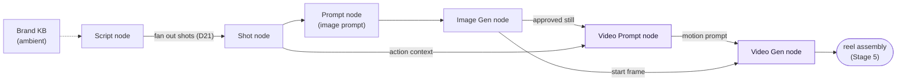
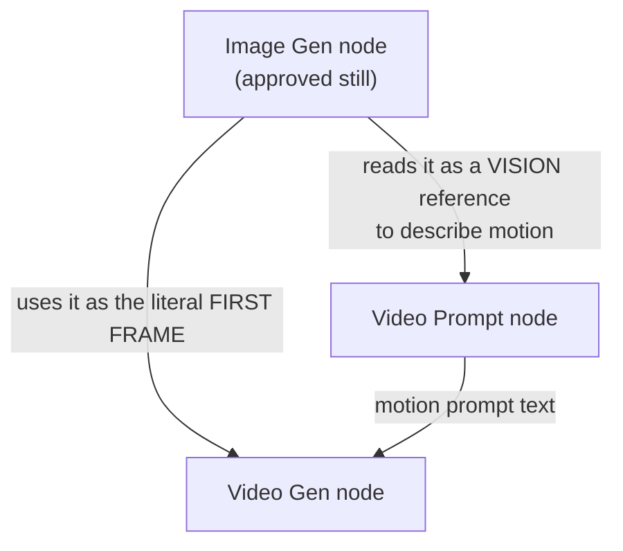
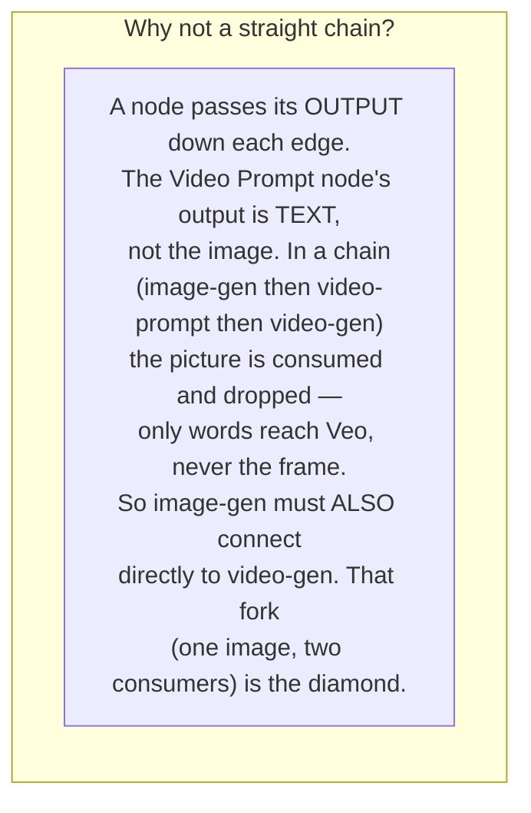
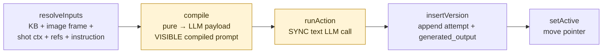
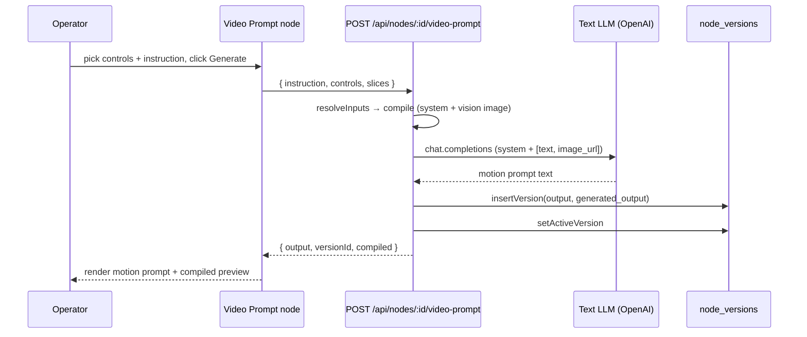
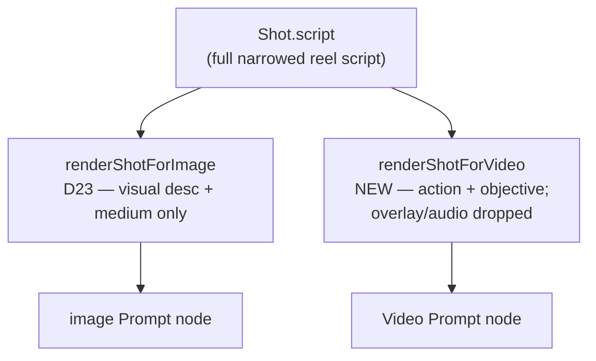

# Stage 4 (part 1 of 2) — Video Prompt node

**Date:** 2026-06-18
**Status:** Approved (design). Not yet built. **Prerequisite for the Video Gen node.**
**Type:** Stage build spec (one node of Stage 4)
**Companions:** `2026-06-18-stage-4-video-gen-node-design.md` (the node this one feeds),
`2026-05-30-creativeos-architecture.md` (the reusable spine), `2026-05-30-creativeos-staging-roadmap.md`
(ADR log — this node is **D24**).

Stage 4 decomposes into two nodes, mirroring how the image side split into **Prompt (Stage 2)
→ Image Gen (Stage 3)**:

1. **Video Prompt node** — *this spec*. A synchronous text-LLM node that writes a **Veo-ready
   motion prompt**, grounded by vision-reading the approved frame, steered by master controls
   structured from the Veo 3.1 guide. Built **first**.
2. **Video Gen node** — its own spec. The async Veo job that turns (approved image + motion
   prompt) into a clip.

> **Why a dedicated node and not a mode on the image Prompt node?** See **ADR D24**. Short
> version: a good motion prompt is an *iterated, controlled, vision-grounded* artifact that
> earns its own master-controls catalog and its own canvas-legible node; the image Prompt node
> is hard-tuned for static frames (lens/lighting). Trade accepted: some duplicated machinery +
> new connection rules, bought back as canvas clarity.

---

## 1. Where it sits — the reel pipeline



`1 script → N shots → N images → N clips → 1 reel` (D21). This node is the **N images → N
motion-prompts** step that precedes **N clips**. The two purple nodes are new in Stage 4; the
Video Prompt node is this spec.

---

## 2. The diamond — why the image fans out to two nodes

The approved Image Gen still is needed in **two different ways**, so it forks to two consumers
and they rejoin at the Video Gen node — a diamond, not a chain.





**Consequence — new `VALID_CONNECTIONS` edges** (`src/lib/canvas-nodes.ts`):

| New edge | Carries |
|---|---|
| `image-gen → video-prompt` | the approved still, as a **vision** attachment |
| `shot → video-prompt` | the beat's **action/objective** context (via `renderShotForVideo`, §6) |
| `file → video-prompt`, `draw → video-prompt` | optional **image style refs** |
| `text → video-prompt` | optional notes/constraints |
| `video-prompt → video-gen` | the generated **motion prompt** text |

`image-gen → video-gen` (the start-frame edge) already exists in the map.

---

## 3. The node lifecycle — synchronous (the key contrast with the Video Gen node)

This node calls a **text LLM synchronously**: the result returns inside the HTTP request,
exactly like the existing `src/app/api/nodes/[id]/generate/route.ts`. It needs **none** of the
async machinery (no `generations` table, no Cron, no Realtime) — all of that lives one node
downstream.





Only `compile` and `runAction` are type-specific (yellow); everything else is shared spine
(D3). The eval flywheel (`generated_output`, **D22**) and approve-via-edit (**D18**) come for
free because this is an ordinary version-writing node.

---

## 4. Node data shape

```ts
// src/lib/canvas-nodes.ts — new member of AppNode (type "video-prompt")
export type VideoPromptNodeData = {
  title?: string;
  instruction?: string;       // operator steer ("emphasize the pour; let steam rise")
  controls?: VideoControls;   // camera move + motion speed (§5)
  kbSlices?: KBSliceKey[];    // ambient brand tone, like the Prompt node
  parsed?: unknown;           // DISPLAY ONLY — active motion prompt, hydrated from the active
                              // version on canvas load (D19); never persisted.
};
```

Add `Node<VideoPromptNodeData, "video-prompt">` to the `AppNode` union.

---

## 5. `compile` + the master-controls catalog

### resolveInputs (this node's subscription)
| Input | Source | Becomes |
|---|---|---|
| ambient client ctx | `node → canvas → client` KB (opt-in slices) | brand tone guard-rails |
| upstream **Image Gen** still | edge → `image-gen.active.output` (path) | a **vision** part (`image_url`) the LLM looks at |
| upstream **Shot** context | edge → `renderShotForVideo(shot.script)` | the beat's action/objective |
| upstream **File/Draw** refs | edges | optional style images |
| operator `instruction` | `nodes.data` | a steer |

### compile (pure)
Produces the LLM payload + the **visible final compiled prompt** (D3). A new system prompt
`video-prompt-generate` (`src/prompts/video-prompt-generate.ts`) is a **"motion director"**
template encoding the verified Veo 3.1 structure — *Cinematography + Action, camera rendered as
a standalone clause, no scene re-description* (the start frame already carries subject/setting/
style). User content = controls prose + shot context + the vision image, assembled via the
existing `buildUserContent` ([compose-message.ts](../../src/lib/nodes/compose-message.ts)),
which already emits `image_url` vision parts.

### VideoControls — `src/lib/nodes/video-controls.ts` (mirrors `shot-controls.ts`)
A curated, pre-rendered catalog. Lens/lighting **drop out** (the frame fixed those); the Veo
lever is *camera movement* + *motion energy*.

```ts
export type VideoControlKey = "camera" | "speed";
export type VideoControls = Record<VideoControlKey, string>;
```

| Control | Options (value → injected prose) |
|---|---|
| **camera** | auto · static (`a locked-off static frame`) · push-in (`a slow push-in toward the subject`) · pull-back (`a smooth pull-back revealing the scene`) · orbit (`a gentle orbit around the subject`) · pan (`a steady pan across the frame`) · tilt (`a deliberate vertical tilt`) · handheld (`subtle handheld movement`) · crane (`a rising crane move`) |
| **speed** | auto · subtle · moderate · dynamic |

Like `shot-controls.ts`, the option lists are a **data constant** refined later from eval
results — a data change, not an architecture change.

---

## 6. `renderShotForVideo` — the motion-relevant slice of the shot (mirrors D23)

**D23** trims a Shot to *visually-actionable* fields for an **image** prompt and explicitly
drops the objective/action copy. A **motion** prompt wants a slightly different slice: the
start frame already supplies the visuals, so what the motion prompt needs from the shot is the
**action / movement intent** — *what should happen across the 8 seconds*. So a sibling renderer
keeps the shot's **action + strategic objective** (the motion driver) and still drops overlay
copy (on-screen text, caption, CTA) and audio boilerplate.

It sits behind the same `renderShotContext(script, mode)` switch as `renderShotForImage`
(D23) — a third rendering target, not a new resolution path.



---

## 7. Output, versioning, review

The motion prompt is an ordinary `node_versions` row — `output` = the prompt text,
`generated_output` = the raw model text (D22), `inputs_used` records the consumed image-gen +
shot version ids (powers staleness, D9). Manual edits fold into the active version's `output`
(D18). Re-running appends an attempt; restore repoints the pointer. The Video Gen node consumes
this node's **active** output.

---

## 8. New files / touch-points

| File | Purpose |
|---|---|
| `src/lib/canvas-nodes.ts` | `VideoPromptNodeData` + union member + `VALID_CONNECTIONS` edges (§2) |
| `src/prompts/video-prompt-generate.ts` | the "motion director" system prompt (versioned, cites Veo guide) |
| `src/lib/nodes/video-controls.ts` | the camera/speed catalog (§5) |
| `src/lib/nodes/render-shot-for-video.ts` | `renderShotForVideo` + wire into `renderShotContext` (§6) |
| `src/app/api/nodes/[id]/video-prompt/route.ts` | the synchronous generate route (clone of `generate`) |
| node component + focus view | controls UI, vision-frame preview, compiled-prompt preview, attempts list |

`isVisionAttachment` ([compose-message.ts:27](../../src/lib/nodes/compose-message.ts#L27))
currently whitelists `file`/`draw`; extend it to also pass an `image-gen` upstream as a vision
part (one condition) so the LLM can read the approved still.

---

## 9. Scope cuts (explicit no's)

- No video *style*-reference reading (a text LLM reads images, not clips). Image refs only.
- No audio direction (audio is cut from the Video Gen slice entirely).
- No automatic regeneration when the upstream frame changes — staleness is *marked*, not
  auto-run (D9/D11; the human re-triggers).

---

## 10. Build order (for the implementation plan)

1. `VideoControls` catalog + `renderShotForVideo` (pure, unit-tested).
2. `video-prompt-generate` system prompt.
3. `VideoPromptNodeData` + union + `VALID_CONNECTIONS` edges + `isVisionAttachment` extension.
4. `compile` (pure, unit-tested) — assembles system + vision + controls prose.
5. `POST /api/nodes/:id/video-prompt` (clone the synchronous `generate` route).
6. Node component + focus view.
7. Hand off to the **Video Gen node** spec (the async half).
