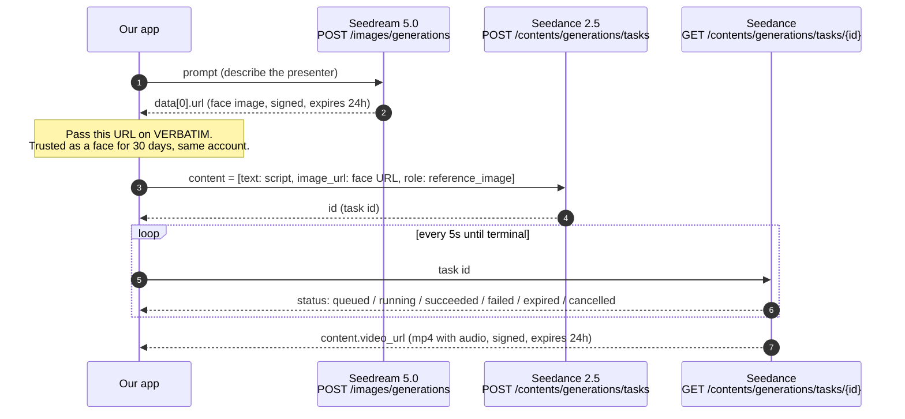
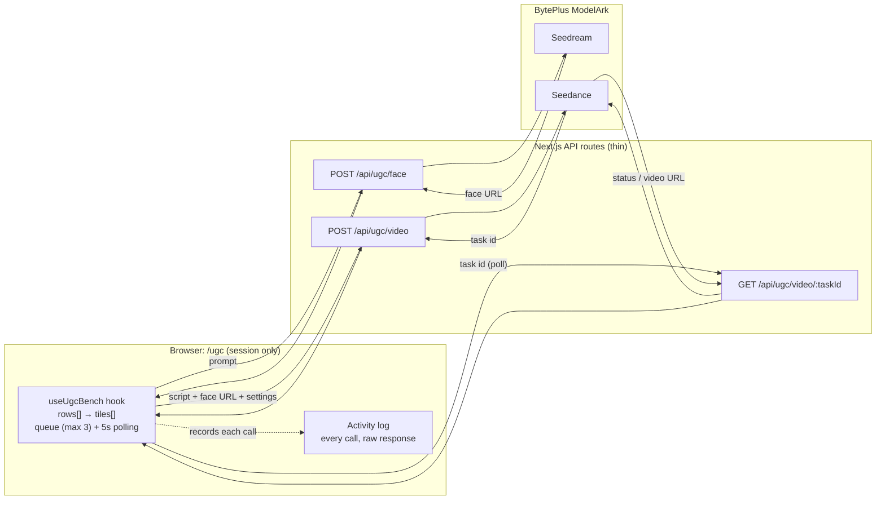

# Seedream → Seedance: handoff for productisation

**Date:** 2026-09-22 · **Branch:** `worktree-video-gen-experiments` · **Audience:** the developer
taking human-presenter UGC video into the product.
**Read with:** [2026-09-18 spike findings](2026-09-18-seedance-human-reference-findings.md) ·
[UGC bench design](2026-09-21-ugc-bench-design.md)

## 1. What this is

We wanted to know whether we can generate UGC-style video with a **human presenter** on
BytePlus ModelArk, given that Seedance rejects uploaded photos of real people. Two pieces of
work answer that. This document explains what they show about the APIs, and what has to
change to make it a product feature.

| Piece | What it is | Status |
|---|---|---|
| **Spike** (2026-09-18) | One-off probe: Seedream face → Seedance video | Answered: **yes, it works** |
| **UGC bench** `/ugc` (2026-09-21) | Test page: several faces × several scripts, run one at a time or all at once | Built, session only, not in the product |
| **Product Seedance provider** | `src/lib/video-gen/providers/seedance.ts`, already in the canvas video-gen node | **Already shipped** before this work |

So **Seedance is not new to the product.** What's new is **Seedream** (the image model), plus
the **trust chain** that lets a Seedream face pass Seedance's real-face check. The bench is a
reference implementation of that chain. It is not code to copy into the product as-is.

## 2. The chain in one picture



Everything talks to one base URL, `https://ark.ap-southeast.bytepluses.com/api/v3`, with
`Authorization: Bearer <ModelArk API key>`.

## 3. The API contracts, as we actually use them

Only fields we have **seen or sent** are listed. Anything else is in the vendor reference
([create task](https://docs.byteplus.com/en/docs/ModelArk/1520757)).

### 3.1 Seedream — make the face (synchronous, ~7–60 s)

```http
POST /images/generations
{ "model": "seedream-5-0-260128", "prompt": "<presenter description>",
  "size": "2K", "response_format": "url", "watermark": false }
```
- **Success:** `data[0].url`, a signed image URL on `*.volces.com` that **expires in 24 h**.
- **Failure:** `error: { code, message }`, e.g. a moderation rejection. HTTP may still be
  200-range, so check `error`, not only the status.
- **The model id matters.** `seedream-5-0-260128` is the **only** Seedream model whose face
  output Seedance trusts. `dola-seedream-5-0-pro-260628` (pro) is **not** trusted. Take ids
  from `GET /api/v3/models`, not from the docs; the docs name a "5.0 lite" id that doesn't exist.

Bench code: `generateImage()` in `src/lib/ugc/client.ts`.

### 3.2 Seedance — create the video task (asynchronous)

```http
POST /contents/generations/tasks
{ "model": "dreamina-seedance-2-5-260628",
  "content": [
    { "type": "text", "text": "<scene, action and dialogue>" },
    { "type": "image_url", "image_url": { "url": "<Seedream URL>" }, "role": "reference_image" }
  ],
  "resolution": "720p", "ratio": "9:16", "duration": 5 }
```
- **Success:** `id`, the task id (e.g. `cgt-20260922003419-sg3kx`).
- **Settings go in the request body.** The vendor calls body parameters the
  *conventional (recommended)* method, with strict validation that errors on bad values.
  Appending `--resolution 720p --duration 5 …` to the prompt is the *legacy* method, where
  invalid values are silently ignored. **The bench uses the legacy method**
  (`src/lib/ugc/prompt.ts`), because the spike wrongly concluded it was the only one. The
  product provider already uses body parameters, and that is the one to follow.
- **Frames and references are mutually exclusive.** A request uses either `first_frame` /
  `last_frame` images or `reference_image` images, never both. The product enforces this in
  `buildSeedanceContent()` and in the client rules in `client-models.ts`.
- **Audio.** `generate_audio` defaults to `true`, so Seedance invents voice, effects and
  music from the prompt. Put dialogue in **double quotes**; the vendor recommends it for
  better speech.
- **Language.** Seedance 2.5 prompts support English plus Spanish, Indonesian, Portuguese,
  Japanese, Malay, Thai, Arabic, Vietnamese and Korean. **Hindi is not listed**, so
  Hinglish dialogue (like the CHUPPS brief) is unsupported territory. The bench run is how
  we find out what it actually does.

Bench code: `createVideoTask()` in `src/lib/ugc/client.ts`, and `src/app/api/ugc/video/route.ts`.

### 3.3 Seedance — poll the task

```http
GET /contents/generations/tasks/{id}
```
- `status` moves through non-terminal states to one of `succeeded | failed | expired | cancelled`.
- **On success:** `content.video_url`, an mp4 (h264 + AAC in the spike) that **expires in
  24 h** and allows at most **100 downloads**.
- **On failure:** `error: { code, message }`, surfaced verbatim. The product translates one
  well-known code, `InputImageSensitiveContentDetected.PrivacyInformation` (a real-person
  reference was rejected), in `seedance.ts`.
- A spike clip took about 80–100 s end to end. The task itself expires after 48 h by default
  (`execution_expires_after`).

Bench code: `getVideoTask()` in `src/lib/ugc/client.ts`, and `src/app/api/ugc/video/[taskId]/route.ts`.

## 4. The rules that shape any product design

These come from the vendor's "trusted outputs" policy
([docs](https://docs.byteplus.com/en/docs/ModelArk/2608626)) and from the spike.

1. **Seedance rejects uploaded real faces** (2.0 and 2.5 series). The accepted sources are:
   Seedream 5.0 text-to-image output, Seedance 2.x video output, and those videos' last
   frames, for 30 days, from the same account, on ModelArk. Preset digital characters
   (`asset://<id>`) and identity-verified real people are separate routes, and we haven't
   tested either.
2. **Only the original, unmodified output is trusted.** Re-encoding, cropping or overlaying
   the image loses trust. **We have not tested** whether a byte-identical copy served from
   our own GCS keeps trust. Assume it does not until someone tests it.
3. **There are two clocks, and the shorter one is what limits you.** The *trust* lasts 30 days,
   but the *URL* expires in 24 h. After a day we still have the image in our own storage, but
   the vendor URL that Seedance trusts is dead. Whether a trusted output can be referenced
   after 24 h some other way (the API accepts "asset IDs" in places) is **an open question**.
4. **Output URLs are not storage.** Anything worth keeping must be copied to our bucket
   within 24 h. The product already does this for video in `completeGeneration()`.

**What this means for the product:** the canvas today stores every generated image in GCS
and passes GCS URLs to video-gen. **Following that pattern, a Seedream face would be
rejected by Seedance**, because the GCS copy is not the trusted original. A Seedream image
node has to keep the **vendor URL, with its creation time,** alongside the stored copy, and
the video-gen node has to send the vendor URL while it's still valid.

## 5. How data flows in the bench

The bench is deliberately small: it runs in the browser, keeps state only in memory, and has
no database and no Trigger.dev. That's why it works on localhost, where the product's async
video path doesn't complete.



**State model** (`src/lib/ugc/board.ts`):
- A `FaceRow` holds `facePrompt`, `faceStatus` (`empty` / `generating` / `ready` / `rejected`)
  and `faceUrl` (the vendor URL, passed on verbatim).
- Each row has its own `ScriptTile`s. A tile holds `script`, `status` (`draft` / `queued` /
  `generating` / `done` / `rejected`), `videoUrl`, `error` and `ranScript` (the exact text
  the video was made from).
- *New face* never overwrites: `duplicateRow()` copies the prompt and scripts into a new row,
  so faces can be compared.

**Code map**

| Layer | File | Responsibility |
|---|---|---|
| Vendor client | `src/lib/ugc/client.ts` | ModelArk calls; returns errors instead of throwing; logs rejections server-side as `[ugc] …` |
| Constants | `src/lib/ugc/constants.ts` | Model ids, settings options, queue and poll limits |
| Prompt | `src/lib/ugc/prompt.ts` | Legacy `--flags` builder (see §3.2; swap for body parameters) |
| Board model | `src/lib/ugc/board.ts` (+ tests) | Pure row/tile helpers: `duplicateRow`, `runnableTiles` |
| Starter data | `src/lib/ugc/starter.ts` | Board pre-filled from the CHUPPS brief |
| Browser fetch | `src/lib/ugc/request.ts` | Records every call for the activity log; detects an expired login |
| State | `src/hooks/use-ugc-bench.ts` | Rows, 3-wide queue, polling, log |
| Routes | `src/app/api/ugc/{face,video,video/[taskId]}/route.ts` | Thin wrappers around the client |
| UI | `src/components/ugc/*`, `src/app/ugc/page.tsx` | Settings bar, face column, script tiles, activity log |

## 6. Taking it into the product

The product already has everything the bench skips.

| Concern | Bench | Product (where it lives) |
|---|---|---|
| Video provider | Own client | `src/lib/video-gen/providers/seedance.ts`, registry id `seedance:seedance-2-5` |
| Async execution | Browser polling | Trigger.dev `trigger/video-generate.ts`, then `POST /api/webhooks/generation`, then `completeGeneration()` in `src/lib/generations/complete.ts` |
| Job record | none | `generations` table (`src/lib/db/generations.ts`), graduates into `node_versions` |
| Live status | React state | Supabase Realtime, `src/hooks/use-video-gen-status.ts` |
| Storage | none (links expire) | `uploadVideoGen` / `uploadImageGen` in `src/lib/storage/index.ts` (GCS) |
| Image provider | Own `generateImage()` | `src/lib/image-gen/`: registry, `providers/{openai,gemini}.ts`, synchronous route `src/app/api/nodes/[id]/image-generate/route.ts` |
| Cost | none | `src/lib/video-gen/cost.ts` (has Seedance rates); `src/lib/image-gen/cost.ts` is token-based and needs a per-image branch for Seedream |

**Suggested order:**
1. **Add Seedream as an image-gen provider.** It's synchronous, so it fits the existing
   image-generate route with no Trigger task. Extend `ImageProvider` in
   `src/lib/image-gen/types.ts`, add `providers/seedream.ts`, and register it. Follow
   `docs/superpowers/guides/image-gen-model-management.md`.
2. **Keep the trusted vendor URL.** When Seedream succeeds, store the vendor URL and its
   creation time on the version, next to the GCS copy (§4, point 3).
3. **Teach video-gen to prefer it.** When a reference image came from Seedream and its
   vendor URL is less than 24 h old, send that URL to Seedance instead of the GCS copy.
   Otherwise, send the GCS URL and let the existing real-person error translation explain
   the rejection.
4. **Env var name.** Use **`BYTEPLUS_API_KEY`**, the product's name, now also in
   `.env.example`. The bench reads it first and falls back to the old experiment name
   `BYTE_PLUS_API_KEY`. Drop that fallback when the bench is retired.
5. **Decide what happens after 24 h:** regenerate the face, or use something longer-lived
   (asset IDs or digital characters). This needs a product decision, not only a code change.

**Don't carry over from the bench:**
- The `--flags` prompt builder.
- Browser-side orchestration and polling.
- Session-only state.
- Its own ModelArk client. The product provider already has retries for transient poll
  failures and error translation.

## 7. Known and unknown

**Verified:**
- The Seedream → Seedance `reference_image` chain works end to end: 720×1280, about 5 s,
  h264 + AAC, identity preserved (spike).
- Seedream through the bench client returns an image (2026-09-21).
- A Seedance task created through the bench started and was polled (2026-09-22; the result
  wasn't seen because the dev server was stopped).

**Not verified. Check before relying on it:**
- Whether a byte-identical re-hosted copy keeps trusted status.
- Whether a trusted output can be referenced after its URL expires.
- How Hinglish dialogue comes out.
- Lip-sync against a supplied audio track (`reference_audio`).
- Cost per clip. The only data point is 108,900 completion tokens for a 5 s 720p clip.
- The preset digital character route (`asset://`).

**Account prerequisite (vendor):** Seedance 2.x must be activated on the account, which
needs a balance above USD 30, an AI Savings Plan, or a Seedance resource pack.

**Out of scope, and why:** OmniHuman, BytePlus's photo + audio talking-head model, runs on a
different service (`cv.byteplusapi.com`) with AccessKey/SecretKey HMAC signing, not the
ModelArk key. It was dropped from this round on cost.
