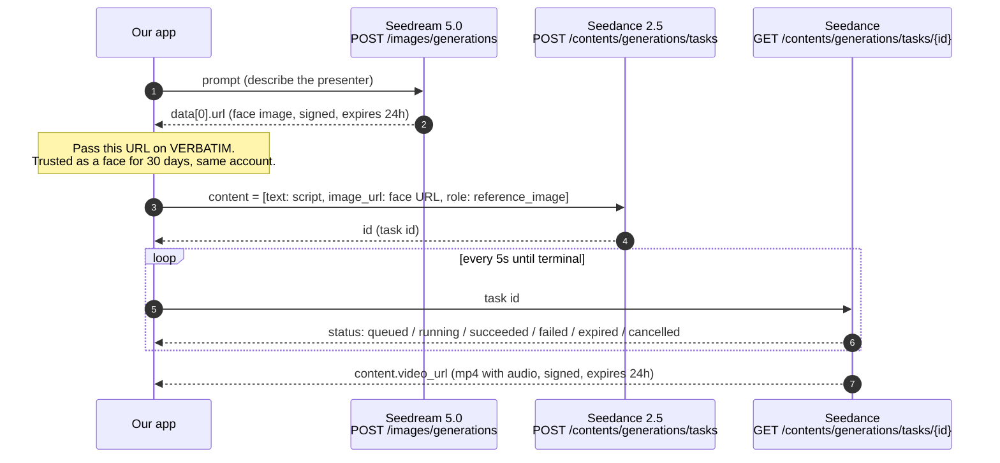
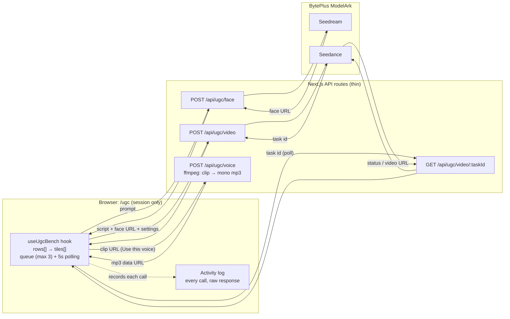

# Seedream → Seedance: handoff for productisation

**Date:** 2026-09-22 · **Branch:** `worktree-video-gen-experiments` · **Audience:** the developer
taking human-presenter UGC video into the product.
**Read with:** [2026-09-18 spike findings](2026-09-18-seedance-human-reference-findings.md) ·
[UGC bench design](2026-09-21-ugc-bench-design.md)

## 0. Status — read this first (updated 2026-09-24)

**Where the work stands, and where to pick it up.**

| Thread | State |
|---|---|
| Seedream → Seedance chain | **Verified**, three times (spike 2026-09-18, bench, probes 2026-09-24) |
| `/ugc` bench, Seedance tab | Built, on `origin/staging`. Voice anchor added 2026-09-22 |
| `/ugc` bench, Gemini Omni tab | Built 2026-09-23, **probed live** (§3.5). Photo upload allowed there |
| **The 24-hour trusted-URL problem** | **GONE — see §0.1.** A GCS copy works. §6.2 is deleted |
| Canvas integration (§6) | **Not started — this is the next piece of work**, now smaller |
| Voice anchor | **IN SCOPE** (2026-09-24). Built in the bench, never exercised — §6.4 is a port |
| System-prompt audit for UGC | **Done 2026-09-24 — see §10.** Two rewrites + one wiring fix |
| OmniHuman 1.5 (BytePlus Vision AI) | **Paused** at an account permission wall (§8) |
| ElevenLabs | **Explicitly later** — not integrated, nothing in `src/` references it (§8) |

**To take this into the canvas, start at §0.1, then §6.** §3 is the API reference you will
need, §4 the rules that constrain the design (**two of which are now disproved**), §10 the
prompt audit, and §9 the product questions — **two of the five are now answered, one is moot**.

## 0.1 What changed on 2026-09-24 (read before §4 and §6)

Three probes were run against the live API. They cost about **$2.57** in total and between
them they **deleted a whole section of the planned build**. Probe scripts were throwaway and
are not in the repo.

**Artefacts** (clips, reference faces and comparison sheets) are on the machine that ran them,
at `~/Desktop/ugc-probes-2026-09-24/` — **not in the repo**, since they are several MB of mp4.
Move them somewhere shared if they should outlive that machine. Every vendor URL from these
runs has expired; the local copies are the only surviving record.

### Finding 1 — a byte-identical copy on OUR OWN GCS keeps working ✅

**This is the important one.** §4 point 2 said to assume a re-hosted copy loses trusted status.
That assumption is **wrong**.

A fresh Seedream face was downloaded, uploaded byte-identically to
`storage.googleapis.com/creativeos-assets/…`, and sent to Seedance as the *only*
`reference_image`. The task was **accepted (HTTP 200) and succeeded in 135 s**, and the face in
the output is unmistakably the same man as the reference.

**The likely reason is that provenance was never the gate.** Line up everything known:

| Reference | Result |
|---|---|
| A real person's uploaded photo | **Rejected** (spike 2026-09-18) |
| Seedream face at the vendor URL | Accepted (spike, and §0.1 finding 2) |
| Seedream face at our own GCS URL | **Accepted** (2026-09-24) |

That fits a **real-likeness detector**, not a URL allowlist. The vendor's "trusted outputs"
policy appears to govern *permission to depict a real person*; an AI-generated face never trips
it, wherever it is hosted.

**Consequences — this is what a reader should act on:**
- **§6.2 is deleted.** No vendor URL on the version row, no `vendorGeneratedAt`, no freshness
  branch at video-generate time, no expiry UI.
- **The face is stored in GCS and passed as a GCS URL, exactly like every other canvas image.**
  There is no special case in the image pipeline at all.
- **The 24-hour clock does not apply to us.** A reel can be built over days or weeks.
- The `seedance-images.ts` re-encode "landmine" (§4, §6.2) **is not a landmine.** Re-encoding a
  reference does not cost anything we depend on.
- The last-frame refresh chain and the `asset://` route **do not need investigating.** They
  existed only to work around this problem.

**Caveat to carry, not to build on:** this behaviour is undocumented and inferred from three
data points. The vendor could tighten it. Recommendation: **store the vendor URL in
`paramsUsed` anyway** (a free string, alongside the `tokensUsed` / dimensions already there) as
insurance, and build **none** of the freshness machinery on top of it. If BytePlus ever starts
enforcing provenance, that field is what lets us react.

Artefacts: `trust-face.jpg`, `trust-probe.mp4`, `trust-compare.png`.
A probe object was left in the live bucket at `probe/ugc-trust/1790189477012-face.jpg` —
**delete it when convenient.**

### Finding 2 — mixed trusted + untrusted references are fine ✅

One Seedance task carrying **two** `reference_image` parts: the face as the verbatim vendor URL,
and a product still downloaded and re-sent as a base64 data URL (a copy). Accepted, succeeded in
141 s, and the clip shows the man holding the correct shoe and turning it to camera.

So a UGC shot can combine **a generated presenter and the client's own product photography**,
and the product image needs no special handling. (Given finding 1, neither does the face — but
this probe is what proved the *combination* is not rejected wholesale.)

**One real defect observed.** The product image was generated with an explicit "no text, no
logo", and by the third second **Seedance had invented lettering on the shoe's side panel.**
Any UGC prompt record must therefore keep the product-preservation language from `SPINE`
(`src/prompts/video-prompt-shared.ts`) even though it drops the first-frame framing. See §10.

Artefact: `ugc-mixed-refs-probe.mp4`.

### Finding 3 — Seedream `seed` is NOT deterministic ❌

Tested because a reproducible face would have solved the (then-live) expiry problem. It does not.

`seed` is **accepted without error** — no rejection, nothing echoed back — but two calls with the
same seed and identical prompt returned **two different men**: different face shape, hairline,
jaw and beard density. A no-seed control pair also differed, which rules out the API merely
caching identical prompts, so this is genuine non-determinism rather than a measurement artefact.

**A presenter's face cannot be recreated once lost.** Finding 1 makes that harmless (nothing is
ever lost), but it matters for any future feature that assumes a face can be regenerated.

Worth knowing: what *does* stay consistent across runs is the **casting** — a specific enough
prompt reliably returns the same type of person, just not the same individual.

Artefacts: `seed-A-seed.jpg`, `seed-B-seed.jpg`, `seed-D1-noseed.jpg`, `seed-D2-noseed.jpg`,
`seed-sheet.png`.

### Finding 4 — generation is slower than recorded ⏱

Both 5 s / 720p clips took **135 s and 141 s**, against the 80–100 s in §3.3. The two-reference
clip was the slower one. **Budget the Trigger.dev timeout against ~150 s, not ~100 s.**

### Decisions taken by the operator, 2026-09-24

**1 — One presenter per reel.** A reel stars one person; the per-shot choice is only *whether
this shot is AI-presenter UGC*, not *who*. Given finding 1 this costs nothing to maintain — one
Seedream Image Gen node is wired into each shot's Video Gen node, and there is no clock to race.

**2 — A consistent voice is in scope** (§9 question 3, answered). The voice anchor — extract the
audio of the first clip the operator likes, send it back as `reference_audio` on every later
generation — is part of the feature, not a later nicety. The whole loop already exists in the
bench, so §6.4 is a **port**, not a design. It is Seedance-only: Omni accepts no audio input.

**3 — ElevenLabs is explicitly later.** Nothing in `src/` references them today. Their TTS
would be a sensible controlled-voice source and their lip-sync is app-only; either way it is a
separate piece of work and not part of this one.

These still need ADR numbers (the log had reached D147 at last count).

## 1. What this is

We wanted to know whether we can generate UGC-style video with a **human presenter** on
BytePlus ModelArk, given that Seedance rejects uploaded photos of real people. Two pieces of
work answer that. This document explains what they show about the APIs, and what has to
change to make it a product feature.

| Piece | What it is | Status |
|---|---|---|
| **Spike** (2026-09-18) | One-off probe: Seedream face → Seedance video | Answered: **yes, it works** |
| **UGC bench** `/ugc` (2026-09-21) | Test page: several faces × several scripts, run one at a time or all at once | Built, session only, not in the product |
| **Product Seedance provider** | `src/lib/video-gen/providers/seedance.ts`, already in the canvas video-gen node | **Already shipped** before this work |

So **Seedance is not new to the product.** What's new is **Seedream** (the image model), plus
the **trust chain** that lets a Seedream face pass Seedance's real-face check. The bench is a
reference implementation of that chain. It is not code to copy into the product as-is.

## 2. The chain in one picture



Everything talks to one base URL, `https://ark.ap-southeast.bytepluses.com/api/v3`, with
`Authorization: Bearer <ModelArk API key>`.

## 3. The API contracts, as we actually use them

Only fields we have **seen or sent** are listed. Anything else is in the vendor reference
([create task](https://docs.byteplus.com/en/docs/ModelArk/1520757)).

### 3.1 Seedream — make the face (synchronous, ~7–60 s)

```http
POST /images/generations
{ "model": "seedream-5-0-260128", "prompt": "<presenter description>",
  "size": "2K", "response_format": "url", "watermark": false }
```
- **Success:** `data[0].url`, a signed image URL on `*.volces.com` that **expires in 24 h**.
- **Failure:** `error: { code, message }`, e.g. a moderation rejection. HTTP may still be
  200-range, so check `error`, not only the status.
- **The model id matters.** `seedream-5-0-260128` is the **only** Seedream model whose face
  output Seedance trusts. `dola-seedream-5-0-pro-260628` (pro) is **not** trusted. Take ids
  from `GET /api/v3/models`, not from the docs; the docs name a "5.0 lite" id that doesn't exist.

Bench code: `generateImage()` in `src/lib/ugc/client.ts`.

### 3.2 Seedance — create the video task (asynchronous)

```http
POST /contents/generations/tasks
{ "model": "dreamina-seedance-2-5-260628",
  "content": [
    { "type": "text", "text": "<scene, action and dialogue>" },
    { "type": "image_url", "image_url": { "url": "<Seedream URL>" }, "role": "reference_image" }
  ],
  "resolution": "720p", "ratio": "9:16", "duration": 5 }
```
- **Success:** `id`, the task id (e.g. `cgt-20260922003419-sg3kx`).
- **Settings go in the request body.** The vendor calls body parameters the
  *conventional (recommended)* method, with strict validation that errors on bad values.
  Appending `--resolution 720p --duration 5 …` to the prompt is the *legacy* method, where
  invalid values are silently ignored. **The bench uses the legacy method**
  (`src/lib/ugc/prompt.ts`), because the spike wrongly concluded it was the only one. The
  product provider already uses body parameters, and that is the one to follow.
- **Frames and references are mutually exclusive.** A request uses either `first_frame` /
  `last_frame` images or `reference_image` images, never both. The product enforces this in
  `buildSeedanceContent()` and in the client rules in `client-models.ts`.
- **Audio.** `generate_audio` defaults to `true`, so Seedance invents voice, effects and
  music from the prompt. Put dialogue in **double quotes**; the vendor recommends it for
  better speech.
- **Language.** Seedance 2.5 prompts support English plus Spanish, Indonesian, Portuguese,
  Japanese, Malay, Thai, Arabic, Vietnamese and Korean. **Hindi is not listed**, so
  Hinglish dialogue (like the CHUPPS brief) is unsupported territory. The bench run is how
  we find out what it actually does.

Bench code: `createVideoTask()` in `src/lib/ugc/client.ts`, and `src/app/api/ugc/video/route.ts`.

### 3.3 Seedance — poll the task

```http
GET /contents/generations/tasks/{id}
```
- `status` moves through non-terminal states to one of `succeeded | failed | expired | cancelled`.
- **On success:** `content.video_url`, an mp4 (h264 + AAC in the spike) that **expires in
  24 h** and allows at most **100 downloads**.
- **On failure:** `error: { code, message }`, surfaced verbatim. The product translates one
  well-known code, `InputImageSensitiveContentDetected.PrivacyInformation` (a real-person
  reference was rejected), in `seedance.ts`.
- A spike clip took about 80–100 s end to end. **Corrected 2026-09-24:** two 5 s / 720p clips
  took **135 s and 141 s** (§0.1, finding 4). Budget timeouts against ~150 s. The task itself
  expires after 48 h by default (`execution_expires_after`).

Bench code: `getVideoTask()` in `src/lib/ugc/client.ts`, and `src/app/api/ugc/video/[taskId]/route.ts`.

### 3.4 Voice consistency: `reference_audio` (added to the bench 2026-09-22)

Seedance invents a new voice for every clip. To keep one voice per presenter, the bench
extracts the audio of a clip the user liked and sends it back with every later generation:

```json
{ "type": "audio_url", "audio_url": { "url": "data:audio/mp3;base64,…" }, "role": "reference_audio" }
```
- **Limits (2.5):** wav or mp3, each clip 2–30 s, at most 10 clips totalling 30 s, ≤ 15 MB.
  The URL can be public, base64, or `asset://`. 2.0 needs an image or video alongside it;
  2.5 accepts audio alone.
- **It references timbre, not words.** The model speaks the prompt's new dialogue in that
  voice. The prompt should bind inputs by order (`@Image 1` = face, `@Audio 1` = voice) and
  say *voice timbre only*, or the anchor clip's music and sound effects come along too.
- **Vendor-stated weakness:** the generated voice can "differ significantly" from the
  reference. The mitigation is to describe the voice in words as well, and keep each line's
  tone close to the reference.
- **Cost:** audio isn't in the token formula (`(input video s + output video s) × W × H ×
  24 / 1024`), so a voice reference is essentially free. A reference *video*, by contrast,
  adds its duration to the billed tokens (at the lower "with video" rate, subject to a minimum).
- **An mp4 can't be `reference_audio`.** The bench extracts the audio server-side with
  ffmpeg (`src/lib/ugc/voice.ts`). A video can instead go in as `reference_video` (voice
  plus everything else; set `omni_reference_task_type: "reference"`), but that costs more.
- **Voice source.** The bench only uses its own Seedance output, so there's no question of
  rights in the voice. Real recorded voices are neither explicitly allowed nor explicitly
  blocked for `reference_audio`, and we haven't tested one. Cloning a real person's voice
  should go through the vendor's authorised real-person asset route.

### 3.5 The second engine: Gemini Omni 1.1 Flash (probed 2026-09-23)

The bench's second tab runs the same faces and scripts through Google. What the live probe
established, against `POST https://generativelanguage.googleapis.com/v1beta/interactions`:

- **It accepts a Seedream face as a plain reference.** There is no trusted-output concept
  outside BytePlus, so no 24 h race and no "original URL only" rule.
- **It is synchronous.** One call returned a finished 5 s clip in **26 s** — no task id, no
  polling. Seedance takes 80–100 s through a poll loop.
- **Output:** h264 + AAC, at the requested 9:16 (360×640 at the 360p tier).
- **Request shape is unforgiving** and is already encoded in the product provider
  (`src/lib/video-gen/providers/gemini-omni.ts`, D217): images first and text LAST,
  `store: true` required by `delivery: "uri"`, `video_config` takes `task` and nothing else.
- **Its file URI needs the API key to download**, so anything user-facing needs a proxy or a
  server-side copy. The bench proxies it (`/api/ugc/omni/file`).
- **No audio input at all.** Google's docs: *"Uploading audio references is unsupported in the
  current version of the API"* and *"Voice editing is not supported"*. Its soundtrack cannot be
  disabled either. This matches the product's own D208.
- **Uploaded photos are allowed** by the API shape (the bench offers it on this tab only), but
  Google's safety filter refuses likenesses of real people, as it does for Veo.

**Cost and speed, verified rates** (`src/lib/video-gen/cost.ts`, and ModelArk's pricing page):

| Engine | 720p per second | A 5 s clip | Time | Voice control |
|---|---|---|---|---|
| Veo 3.1 Lite | $0.05 | $0.25 | — | none |
| **Gemini Omni 1.1 Flash** | $0.10 (360p: $0.03) | **$0.50** (360p: $0.15) | **~26 s** | none |
| **Seedance 2.5** | $0.231 | **$1.16** | ~90 s | `reference_audio` |
| Veo 3.1 Quality | $0.40 | $2.00 | — | none |

Seedance bills `(input video s + output video s) × W × H × 24 / 1024` tokens at $10.70/M
(480p/720p, no video input) — so **audio references are free**, while a *video* reference adds
its own duration to the bill at the lower "with video" rate, subject to a minimum.

**The trade is simple: Omni is ~2–8× cheaper and ~3× faster; Seedance is the only one with any
voice control.**

## 4. The rules that shape any product design

These come from the vendor's "trusted outputs" policy
([docs](https://docs.byteplus.com/en/docs/ModelArk/2608626)) and from the spike.

1. **Seedance rejects uploaded real faces** (2.0 and 2.5 series). The accepted sources are:
   Seedream 5.0 text-to-image output, Seedance 2.x video output, and those videos' last
   frames, for 30 days, from the same account, on ModelArk. Preset digital characters
   (`asset://<id>`) and identity-verified real people are separate routes, and we haven't
   tested either.
2. ~~**Only the original, unmodified output is trusted.**~~ **DISPROVED 2026-09-24 — see §0.1,
   finding 1.** A byte-identical copy served from our own GCS was accepted and produced a
   correct clip. The evidence points to a real-likeness detector rather than a provenance
   check, so an AI-generated face works from any host. The `seedance-images.ts` re-encode
   warning that used to live here **no longer applies**.
   *(The vendor still documents the original-output rule. We simply do not appear to be
   subject to it, because nothing we send is a real person's likeness.)*
3. ~~**There are two clocks.**~~ **MOOT 2026-09-24 — see §0.1, finding 1.** The 24 h URL
   expiry does not constrain us: we store the image and pass our own URL. The `asset://`
   question that used to be open here does not need answering.
4. **Output URLs are not storage.** Anything worth keeping must be copied to our bucket
   within 24 h. The product already does this for video in `completeGeneration()`.

**What this means for the product — REVISED 2026-09-24.** This paragraph used to say a GCS
copy would be rejected and that the vendor URL had to be kept and raced against a 24 h clock.
**That was wrong** (§0.1, finding 1). The canvas stores every generated image in GCS and passes
GCS URLs to video-gen, and **a Seedream face works exactly the same way**. There is no special
case. Keep the vendor URL in `paramsUsed` as cheap insurance, and build nothing on it.

## 5. How data flows in the bench

The bench is deliberately small: it runs in the browser, keeps state only in memory, and has
no database and no Trigger.dev. That's why it works on localhost, where the product's async
video path doesn't complete.



**State model** (`src/lib/ugc/board.ts`):
- A `FaceRow` holds `facePrompt`, `faceStatus` (`empty` / `generating` / `ready` / `rejected`)
  and `faceUrl` (the vendor URL, passed on verbatim), plus an optional `voice` (`RowVoice`:
  the mp3 data URL, its length, and which clip it came from) and a `voiceNote` description.
- Each row has its own `ScriptTile`s. A tile holds `script`, `status` (`draft` / `queued` /
  `generating` / `done` / `rejected`), `videoUrl`, `error`, `ranScript` (the exact text the
  video was made from) and `ranWithVoice` (so runs with and without the voice can be told apart).
- *New face* never overwrites: `duplicateRow()` copies the prompt and scripts into a new row,
  so faces can be compared.

**Code map**

| Layer | File | Responsibility |
|---|---|---|
| Vendor client | `src/lib/ugc/client.ts` | ModelArk calls (incl. the optional `reference_audio` part); returns errors instead of throwing; logs rejections server-side as `[ugc] …` |
| Constants | `src/lib/ugc/constants.ts` | Model ids, settings options, queue and poll limits |
| Prompt | `src/lib/ugc/prompt.ts` | Legacy `--flags` builder (see §3.2; swap for body parameters) |
| Board model | `src/lib/ugc/board.ts` (+ tests) | Pure row/tile helpers: `duplicateRow`, `runnableTiles` |
| Starter data | `src/lib/ugc/starter.ts` | Board pre-filled from the CHUPPS brief |
| Voice | `src/lib/ugc/voice.ts` (+ tests) | ffmpeg extraction: any audio/video → mono mp3, ≤30s, with its duration |
| Browser fetch | `src/lib/ugc/request.ts` (+ tests) | Records every call for the activity log; detects an expired login; shortens data URLs so the log stays pasteable |
| State | `src/hooks/use-ugc-bench.ts` | Rows, 3-wide queue, polling, log |
| Routes | `src/app/api/ugc/{face,video,video/[taskId],voice}/route.ts` | Thin wrappers around the client; `voice` downloads a clip (BytePlus hosts only) and extracts its audio |
| UI | `src/components/ugc/*`, `src/app/ugc/page.tsx` | Settings bar, face column, script tiles, voice strip (under the tiles — the voice is a Seedance input), activity log |
| Build config | `next.config.ts` | `serverExternalPackages` + `outputFileTracingIncludes` so the ffmpeg binary ships with the voice route |

## 6. Taking it into the canvas — the next piece of work

The bench answered *whether* this works. This section is *how it becomes a canvas feature*.
The product already owns every mechanism the bench faked; almost nothing here is new plumbing.

| Concern | Bench | Product (where it already lives) |
|---|---|---|
| Video provider | own client | `src/lib/video-gen/providers/seedance.ts`, id `seedance:seedance-2-5` — **already shipped** |
| Second engine | own Omni client | `src/lib/video-gen/providers/gemini-omni.ts` — **already shipped** |
| Async execution | browser polling | `trigger/video-generate.ts` -> `POST /api/webhooks/generation` -> `completeGeneration()` |
| Job record | none | `generations` table (`src/lib/db/generations.ts`), graduating into `node_versions` |
| Live status | React state | Supabase Realtime, `src/hooks/use-video-gen-status.ts` |
| Storage | none (links expire) | `uploadImageGen` / `uploadVideoGen` in `src/lib/storage/index.ts` (GCS) |
| Image provider | own `generateImage()` | `src/lib/image-gen/`: registry + `providers/{openai,gemini}.ts`, sync route `src/app/api/nodes/[id]/image-generate/route.ts` |
| Cost | none | `src/lib/video-gen/cost.ts` (Seedance + Omni rates present); `src/lib/image-gen/cost.ts` is token-based and needs a per-image branch for Seedream |

**REVISED 2026-09-24 — the new work is now four things, and none of them is the hard one:**
1. **a Seedream image provider** (§6.1, unchanged),
2. **a `shotKind` switch** that marks a shot as AI-presenter UGC and selects the right prompt
   records and engines (§6.3 — replaces the old "what is a presenter" question, now answered),
3. **the voice anchor, ported from the bench** (§6.4 — in scope as of 2026-09-24; it is a port
   of working code, not a design),
4. **the prompt work** (§10 — two rewrites and one wiring fix).

~~a way to keep the vendor URL usable~~ — **deleted.** §0.1 finding 1 removed it.

### 6.1 Step one — Seedream as an image-gen provider

Synchronous, so it needs no Trigger task and fits the existing image-generate route.

- Extend `ImageProvider` in `src/lib/image-gen/types.ts` (today `"openai" | "gemini"`).
- Add `src/lib/image-gen/providers/seedream.ts` implementing `MediaGenModelSpec.generate`,
  and register it in `src/lib/image-gen/registry.ts` + `client-models.ts`.
- Follow `docs/superpowers/guides/image-gen-model-management.md`.
- **The model id is load-bearing:** only `seedream-5-0-260128` (the non-pro "5.0 lite")
  produces faces Seedance will trust. Keep it in one constant, the way the Seedance provider
  keeps `VENDOR_MODEL`. Take ids from `GET /api/v3/models`, never from the docs (§3.1).
- Cost: Seedream is priced per image (about $0.035), not per token, so `image-gen/cost.ts`
  needs a per-image branch rather than a token calculation.
- Reuse the existing key: **`BYTEPLUS_API_KEY`**, the same one Seedance uses.

### 6.2 ~~Step two — keep the trusted URL~~ — DELETED 2026-09-24

**This section described the hardest part of the feature. It no longer exists.**

The premise was that Seedance trusts a face only as the vendor's own original URL, expiring in
24 h. §0.1 finding 1 disproved that: a byte-identical GCS copy was accepted and produced a
correct clip. There is no freshness branch, no dual-URL version row, no expiry UI, and no
`seedance-images.ts` landmine.

**The single line that replaces this whole section:** a Seedream face is stored and passed like
any other canvas image. Keep the vendor URL in `paramsUsed` as insurance (§0.1) and build
nothing on it.

*Kept as a stub rather than removed so that anyone who read the 2026-09-22 version, or any plan
written against it, finds out why it went away.*

### 6.3 Step two — the `shotKind` switch (was "what a presenter is")

**Answered 2026-09-24.** A presenter is **an ordinary Image Gen node running Seedream**, wired
into each shot's Video Gen node. No new node type, no new table, no client-level cast entity.
**One presenter per reel** (operator decision, §0.1).

Why not a dedicated presenter entity that shots resolve to automatically: this codebase is built
on explicit wiring (`VALID_CONNECTIONS`, `imageRoles`, `assignImageRoles`), and **D101
specifically removed** an implicit default that "silently fed unticked references to the model".
A presenter picked up without a visible wire would reintroduce exactly that class of bug.
One-per-reel is a shape the canvas has, not an entity the system owns.

Two things already work in our favour:
- `"image-gen": [… "video-gen" …]` is **already a legal edge**, so one Seedream node fanning out
  to five Video Gen nodes needs no schema change.
- `autoAssignImageRoles` **already defaults** an unassigned image to `reference` on models that
  take references — which is what a face is on Seedance. It lands in the right slot.

**The switch itself.** `shotKind?: "product" | "ugc-presenter"` on `ShotNodeData`, defaulting to
`"product"`. It follows D236's precedent (choose once upstream, read downstream — never a second
copy). Seeding it from the parsed script's `ai_production_type` is a reasonable default; that
field is free text transcribed from the script, so it can suggest but must not *drive* routing.

Setting it to `ugc-presenter` does three things down the lane:
1. **Narrows the engine** to `seedance | gemini-omni` — the only two that take a face reference.
   Veo and Kling stop being offerable for that shot.
2. **Selects the prompt records** — `videoPromptFor` gains the kind as a second argument and
   stays exhaustive (see §10), so this is **two** new records, not eight.
3. **Changes what the image lane is for** — the connected Image Gen node stops being "the first
   frame of this shot" and becomes "the presenter's face", which selects Seedream and the
   portrait prompt writer.

**Still open:** whether `shotKind` is genuinely per-shot or is really a reel-level property that
shots inherit from the Script node. The operator's framing on 2026-09-24 was *"it depends what
kind of video it is"*, which sounds reel-shaped, but a mixed reel (product shots plus a
presenter piece to camera) is plausible and the per-shot field supports both. Left per-shot
deliberately; revisit if reels turn out to be uniform in practice.

### 6.4 Step three — voice consistency (IN SCOPE, operator decision 2026-09-24)

**No longer optional.** Seedance invents a fresh voice for every clip, so a reel would be one
face speaking in several different voices. The voice anchor is the fix, and the whole loop is
already written in the bench — this is a port, not a design.

What exists, and what each piece does:

| Piece | File | What it does |
|---|---|---|
| Extraction | `src/lib/ugc/voice.ts` | `ffmpeg-static` with `-vn -ac 1 -ar 24000 -b:a 96k -t 30` → a mono mp3. Floors at 2 s and caps at 30 s, reading the **output** duration off ffmpeg's last `time=` line so the cap is reflected |
| Route | `src/app/api/ugc/voice/route.ts` | Downloads the clip behind a **host allowlist** (`volces.com` / `bytepluses.com` / `byteplus.com`) so it cannot become a general URL fetcher; 80 MB cap |
| State | `src/lib/ugc/board.ts` | `RowVoice = { dataUrl, seconds, source, videoUrl }`; `duplicateRow` carries it, so "new face, same voice" is one click |
| Request | `src/lib/ugc/client.ts` | Appends `{ type: "audio_url", audio_url: {url}, role: "reference_audio" }` |
| Prompt | `src/lib/ugc/prompt.ts` | Binds inputs by upload order and says **timbre only**, so the anchor clip's music and effects don't ride along |

**The port is two changes.** The bench passes the mp3 as a base64 data URL because it has
nowhere to host it; the product has GCS. So: **store the mp3 in GCS beside the presenter**, and
**add the audio part to `buildSeedanceContent()`** — next to the existing frames-XOR-references
rule, noting that audio is a *third* part type which does **not** participate in that
exclusion. A Vercel build also needs `ffmpeg-static` traced into the route (see the bench's
`next.config.ts`).

**Cost: free.** Audio sits outside Seedance's token formula. A reference *video* would instead
add its own duration to the bill, which is why extraction beats sending the clip.

**Still unproven (§7):** the anchor shipped 2026-09-22 and **no generation has used it**. The
vendor warns the generated voice can "differ significantly" from the reference, which is why
the prompt also carries a written voice description. The first real run is also the first
measurement of how well it holds.

### 6.5 Optional, once the basics land

- **Engine choice:** Omni and Seedance are both registered providers already, so offering both
  on a node is a picker question rather than an integration one (§3.5 for the trade-offs).
  Note this interacts with voice: **Omni accepts no audio input at all**, so a shot that needs
  a consistent voice is a Seedance shot.

### 6.6 Do not carry over from the bench

- The `--flags` prompt builder (the legacy method — §3.2).
- Browser-side orchestration, polling and session-only state.
- Its own ModelArk client: the product provider already retries transient poll failures and
  translates the real-person rejection.

## 7. Known and unknown

**Verified:**
- The Seedream → Seedance `reference_image` chain works end to end: 720×1280, about 5 s,
  h264 + AAC, identity preserved (spike).
- Seedream through the bench client returns an image (2026-09-21).
- Gemini Omni accepts a Seedream face as a reference and returned a 5 s 9:16 h264+AAC clip in
  26 s, synchronously (2026-09-23, §3.5).
- The BytePlus Vision AI signature V4 implementation is correct; the account is what is denied
  (2026-09-23, §8).
- A Seedance task created through the bench started and was polled (2026-09-22; the result
  wasn't seen because the dev server was stopped).

**Moved to verified on 2026-09-24 (§0.1):**
- ~~Whether a byte-identical re-hosted copy keeps trusted status.~~ **It does** — finding 1.
- ~~Whether a trusted output can be referenced after its URL expires.~~ **Moot** — we never need
  to; we host our own copy.
- **New:** a trusted vendor URL and an untrusted copy can travel in the **same** `content`
  array — finding 2.
- **New:** Seedream `seed` is accepted but **not deterministic** — finding 3.
- **New:** Seedance **invents branding** on a product that was specified as unbranded — finding 2.

**Not verified. Check before relying on it:**
- How Hinglish dialogue comes out.
- **Whether Seedance accepts the bench's `reference_audio` at all**, and how well it holds a
  voice across clips. The voice anchor shipped 2026-09-22 but no generation has used it yet.
- Whether a real recorded voice (rather than Seedance's own output) is accepted as
  `reference_audio`; the face ban is stated for images and videos only.
- Whether the ffmpeg binary traces correctly into the Vercel function (no production build run).
- Cost per clip. The only data point is 108,900 completion tokens for a 5 s 720p clip.
- The preset digital character route (`asset://`).

**Account prerequisite (vendor):** Seedance 2.x must be activated on the account, which
needs a balance above USD 30, an AI Savings Plan, or a Seedance resource pack.

**Out of scope, and why:** OmniHuman, BytePlus's photo + audio talking-head model, runs on a
different service (`cv.byteplusapi.com`) with AccessKey/SecretKey HMAC signing, not the
ModelArk key. It was dropped from this round on cost.

## 8. Paused threads (2026-09-23)

**OmniHuman 1.5 — blocked on account permission, not on code.**
It is BytePlus *Vision AI* (`cv.byteplusapi.com`), not ModelArk, and every call must be signed
with an Access Key pair instead of the ModelArk bearer key. The signer is written and tested
(`src/lib/ugc/omnihuman/sign.ts`, BytePlus signature V4, `Service=cv`, `Region=ap-singapore-1`).

A free probe — querying a made-up task id, so no generation and no cost — established exactly
where it stops:
- a deliberately wrong secret returns `SignatureDoesNotMatch` at the gateway, so **the signing
  is correct**;
- the real credentials return `code 50400 "Access Denied"` from the service, for **all three**
  service keys (`realman_avatar_picture_omni15_cv`, the 1.0 quick-mode key, and the
  create-role key).

So the account cannot reach the OmniHuman service. The fix is in the console: activate
OmniHuman under Vision AI (some avatar products need an application rather than a click), and
if the key belongs to an IAM user, grant that user permission for the `cv` service. Re-run the
probe; "task not found" means it is open. Its pricing is also still unknown.

One unknown remains even after that: OmniHuman wants `image_url` and `audio_url` as **URLs**. A
Seedream face is already public; audio is not, so the bench would need storage — the product
would not, since it has GCS.

**ElevenLabs — voice only.** Their TTS is a proper API and is the sensible source for a
controlled, consistent voice (audio tags, stability, speed, IPA pronunciation, dictionaries).
Their **Avatars / lip-sync is app-only** — *"API access: Not available at launch"* — and their
video catalogue (which includes Seedance, Veo, Omni and OmniHuman 1.5) exposes only some
generation models by `model_id`, with Creatify Aurora the one lip-sync model that has an API.
So ElevenLabs is useful to this app as a voice vendor, and useful to a person as a zero-code
way to preview OmniHuman quality before we integrate it.

**Lip-sync as a separate step** (video + audio -> re-synced video) is a real product category
if we ever want ElevenLabs voices on Omni footage: Sync.so, Hedra, HeyGen, Creatify Aurora,
OmniHuman. Unpriced and unevaluated.

## 9. Product questions to answer before the data model is fixed

These are decisions for the product, not for whoever writes the code.

1. ~~**What is a presenter on the canvas?**~~ **ANSWERED 2026-09-24.** An ordinary Image Gen
   node running Seedream, one per reel, explicitly wired. Not a client-level cast entity. See
   §6.3. *(A reusable cast across canvases was considered and deferred — it can be added later
   without invalidating this, since the node is the thing either way.)*
2. ~~**What happens when the trusted URL expires after 24 h?**~~ **MOOT 2026-09-24.** Nothing
   expires; see §0.1 finding 1. Note that had this stayed live it would have been severe:
   one presenter per reel means one clock for the whole reel, and finding 3 proved a face
   **cannot** be regenerated, so an expired presenter would have been unrecoverable.
3. ~~**Is a consistent voice part of the feature?**~~ **ANSWERED 2026-09-24 — YES, in scope.**
   The voice anchor is the feature: extract the audio of the first clip the operator likes and
   send it back as `reference_audio` on every later generation of that presenter. The whole
   loop already exists in the bench (§6.4, now promoted out of "optional").
   **ElevenLabs is NOT part of this work** — explicitly later. Their TTS is a proper API and
   would be the sensible source of a controlled voice, but nothing in `src/` references them
   today and integrating them is a separate decision (§8).
4. **Which engine is the default**, given Omni is roughly 2–8x cheaper and faster while
   Seedance is the only one with voice control and longer clips (30 s vs 10 s)?
5. **Do we need real people at all?** If yes, the only sanctioned route is BytePlus's
   real-person asset library (consent, verification, Advanced Creation Rights, AK/SK), which is
   a much larger piece of work than anything in §6.

## 10. System-prompt audit for UGC (2026-09-24)

Every prompt in the shot lane was read against the UGC case. **"UGC" exists nowhere in the
product today** — `grep -i "ugc\|presenter\|testimonial"` over `src` returns exactly one file,
the bench's own `src/hooks/use-ugc-bench.ts`. This is a genuinely new axis, not an extension of
an existing mode.

### The one thing that already exists and is right

`VO_PERFORMANCE_RULES` (`src/prompts/video-prompt-shared.ts`, D267) already distinguishes *"a
line spoken by someone ON SCREEN"* from *"a NARRATOR line"*, and instructs the writer to keep
that person's face visible and readable toward camera while they speak, with one simple action
and nothing covering the mouth. **That is presenter behaviour, already written.**

**But only the three multishot records import it.** None of the four single-shot records
(Veo, Kling, Omni, Seedance) do. So a single-shot node has no on-screen-speaker concept at all.
**This is a pre-existing gap, not UGC scope — worth fixing either way.**

### What needs to change

| Prompt | What it assumes today | Why UGC breaks it |
|---|---|---|
| `video-prompt-seedance.ts` | *"A still image (**the first frame**) is provided"* + PRESERVATION: *"Do not invent new objects, **people**, settings, or styles that are not in the frame"* | **The worst mismatch.** UGC sends the face as `reference_image`, not a first frame — and the model *must* invent the setting, the product interaction and the performance around it. This record forbids exactly what UGC requires. Also says "roughly 8 seconds"; the bench and probes ran 5 s. |
| `video-prompt-shared.ts` → `SPINE` | Same first-frame + preservation contract, camera-led, *"secondary motion: steam drifts, fabric sways"* | Shared by Veo/Kling/Omni. UGC's primary motion is a person talking and handling a product, not ambient secondary motion. **The UGC lane needs its own spine — do not edit this one**, it is correct for product shots. |
| `video-prompt-shared.ts` → `VO_PERFORMANCE_RULES` | Correct, and already written | Simply isn't reachable from any single-shot record. Wire it in. |
| `prompt-generate.ts` | *"image-generation prompts for **Nano Banana**"*; v6 SETTING: *"Transcribe what is stated; do not complete it"*; plain neutral backdrop when unstated | Writes scene prompts for Gemini, not **portrait prompts for Seedream**. The v6 transcribe-don't-invent rule actively prevents composing a presenter who isn't in the brief. The usable hook is *"Use the casting descriptor verbatim (age range, skin tone, styling cues)"* — that is where a presenter description enters. |
| `shot-compose.ts` | *"a shot composer for **premium, slow, tactile D2C beauty reels**"*; ideas about *"surface, light, hand/body action, finish"* | Wrong genre outright. UGC is fast, handheld, spoken-to-camera, someone *using* the thing. Needs a UGC role set, or it stays silent in this lane. **Optional** — not on the critical path. |
| `multishot-prompt-seedance.ts` | Already has `VO_PERFORMANCE_RULES`; built around the cut ladder | Closest to correct already. Still assumes product-preservation framing rather than presenter-identity preservation. |
| `script-parse.ts` → `ai_production_type` | *"the production approach **stated in the script**"* — free text, rendered as `Medium: …` by `node-output.ts` | **Not a switch.** It is transcription, so it varies with whatever the designer typed. It can *default* `shotKind` but must not drive routing. |

### Net work

- **Two new records** — `video-prompt-ugc-seedance`, `video-prompt-ugc-omni` — behind the
  `shotKind` argument to `videoPromptFor` (§6.3). Keep that switch **exhaustive with no
  `default`**: D243 added that guard precisely because a silent fallthrough once handed Gemini
  Omni a prompt headed "for Veo 3.1".
- **One portrait writer** for Seedream faces.
- **One wiring fix** — `VO_PERFORMANCE_RULES` into the single-shot records.
- **Carry product-preservation language into the UGC records** even though they drop the
  first-frame framing. §0.1 finding 2 observed Seedance inventing branding on a shoe that was
  explicitly generated without any. A UGC prompt that says nothing about preservation will put
  invented logos on the client's product.

