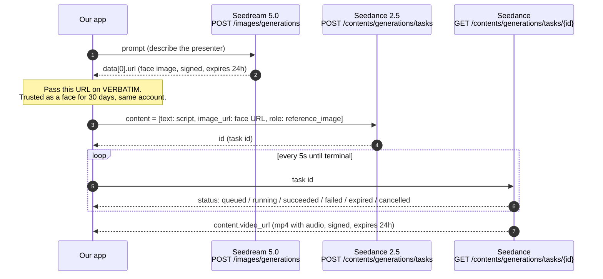
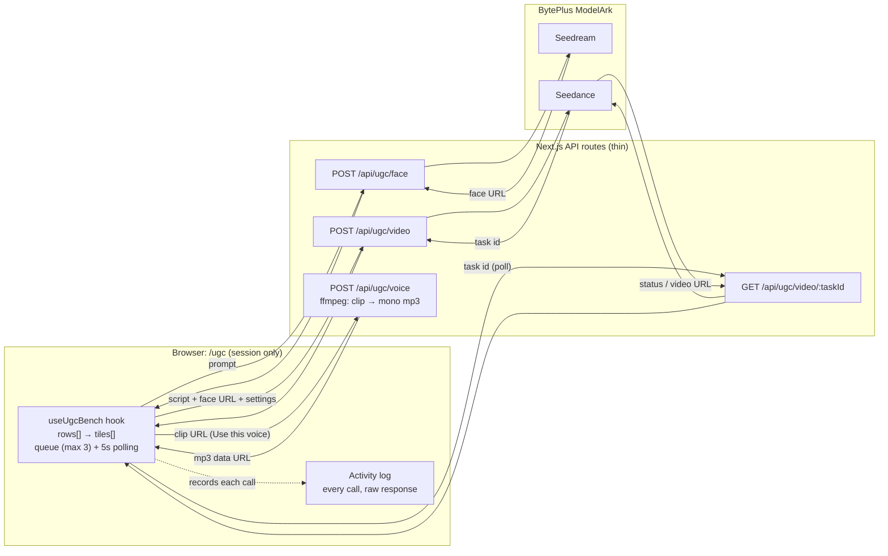

# Seedream → Seedance: handoff for productisation

**Date:** 2026-09-22 · **Branch:** `worktree-video-gen-experiments` · **Audience:** the developer
taking human-presenter UGC video into the product.
**Read with:** [2026-09-18 spike findings](2026-09-18-seedance-human-reference-findings.md) ·
[UGC bench design](2026-09-21-ugc-bench-design.md)

## 0. Status — read this first (updated 2026-09-23)

**Where the work stands, and where to pick it up.**

| Thread | State |
|---|---|
| Seedream → Seedance chain | **Verified**, twice (spike 2026-09-18, bench since) |
| `/ugc` bench, Seedance tab | Built, on `origin/staging`. Voice anchor added 2026-09-22 |
| `/ugc` bench, Gemini Omni tab | Built 2026-09-23, **probed live** (§3.5). Photo upload allowed there |
| Canvas integration (§6) | **Not started — this is the next piece of work** |
| OmniHuman 1.5 (BytePlus Vision AI) | **Paused** at an account permission wall (§8) |
| ElevenLabs | Voice API useful; its lip-sync is app-only (§8) |

**To take this into the canvas, start at §6.** §3 is the API reference you will need, §4 the
rules that constrain the design, and §9 the product questions that need answers before the
data model is fixed.

## 1. What this is

We wanted to know whether we can generate UGC-style video with a **human presenter** on
BytePlus ModelArk, given that Seedance rejects uploaded photos of real people. Two pieces of
work answer that. This document explains what they show about the APIs, and what has to
change to make it a product feature.

| Piece | What it is | Status |
|---|---|---|
| **Spike** (2026-09-18) | One-off probe: Seedream face → Seedance video | Answered: **yes, it works** |
| **UGC bench** `/ugc` (2026-09-21) | Test page: several faces × several scripts, run one at a time or all at once | Built, session only, not in the product |
| **Product Seedance provider** | `src/lib/video-gen/providers/seedance.ts`, already in the canvas video-gen node | **Already shipped** before this work |

So **Seedance is not new to the product.** What's new is **Seedream** (the image model), plus
the **trust chain** that lets a Seedream face pass Seedance's real-face check. The bench is a
reference implementation of that chain. It is not code to copy into the product as-is.

## 2. The chain in one picture



Everything talks to one base URL, `https://ark.ap-southeast.bytepluses.com/api/v3`, with
`Authorization: Bearer <ModelArk API key>`.

## 3. The API contracts, as we actually use them

Only fields we have **seen or sent** are listed. Anything else is in the vendor reference
([create task](https://docs.byteplus.com/en/docs/ModelArk/1520757)).

### 3.1 Seedream — make the face (synchronous, ~7–60 s)

```http
POST /images/generations
{ "model": "seedream-5-0-260128", "prompt": "<presenter description>",
  "size": "2K", "response_format": "url", "watermark": false }
```
- **Success:** `data[0].url`, a signed image URL on `*.volces.com` that **expires in 24 h**.
- **Failure:** `error: { code, message }`, e.g. a moderation rejection. HTTP may still be
  200-range, so check `error`, not only the status.
- **The model id matters.** `seedream-5-0-260128` is the **only** Seedream model whose face
  output Seedance trusts. `dola-seedream-5-0-pro-260628` (pro) is **not** trusted. Take ids
  from `GET /api/v3/models`, not from the docs; the docs name a "5.0 lite" id that doesn't exist.

Bench code: `generateImage()` in `src/lib/ugc/client.ts`.

### 3.2 Seedance — create the video task (asynchronous)

```http
POST /contents/generations/tasks
{ "model": "dreamina-seedance-2-5-260628",
  "content": [
    { "type": "text", "text": "<scene, action and dialogue>" },
    { "type": "image_url", "image_url": { "url": "<Seedream URL>" }, "role": "reference_image" }
  ],
  "resolution": "720p", "ratio": "9:16", "duration": 5 }
```
- **Success:** `id`, the task id (e.g. `cgt-20260922003419-sg3kx`).
- **Settings go in the request body.** The vendor calls body parameters the
  *conventional (recommended)* method, with strict validation that errors on bad values.
  Appending `--resolution 720p --duration 5 …` to the prompt is the *legacy* method, where
  invalid values are silently ignored. **The bench uses the legacy method**
  (`src/lib/ugc/prompt.ts`), because the spike wrongly concluded it was the only one. The
  product provider already uses body parameters, and that is the one to follow.
- **Frames and references are mutually exclusive.** A request uses either `first_frame` /
  `last_frame` images or `reference_image` images, never both. The product enforces this in
  `buildSeedanceContent()` and in the client rules in `client-models.ts`.
- **Audio.** `generate_audio` defaults to `true`, so Seedance invents voice, effects and
  music from the prompt. Put dialogue in **double quotes**; the vendor recommends it for
  better speech.
- **Language.** Seedance 2.5 prompts support English plus Spanish, Indonesian, Portuguese,
  Japanese, Malay, Thai, Arabic, Vietnamese and Korean. **Hindi is not listed**, so
  Hinglish dialogue (like the CHUPPS brief) is unsupported territory. The bench run is how
  we find out what it actually does.

Bench code: `createVideoTask()` in `src/lib/ugc/client.ts`, and `src/app/api/ugc/video/route.ts`.

### 3.3 Seedance — poll the task

```http
GET /contents/generations/tasks/{id}
```
- `status` moves through non-terminal states to one of `succeeded | failed | expired | cancelled`.
- **On success:** `content.video_url`, an mp4 (h264 + AAC in the spike) that **expires in
  24 h** and allows at most **100 downloads**.
- **On failure:** `error: { code, message }`, surfaced verbatim. The product translates one
  well-known code, `InputImageSensitiveContentDetected.PrivacyInformation` (a real-person
  reference was rejected), in `seedance.ts`.
- A spike clip took about 80–100 s end to end. The task itself expires after 48 h by default
  (`execution_expires_after`).

Bench code: `getVideoTask()` in `src/lib/ugc/client.ts`, and `src/app/api/ugc/video/[taskId]/route.ts`.

### 3.4 Voice consistency: `reference_audio` (added to the bench 2026-09-22)

Seedance invents a new voice for every clip. To keep one voice per presenter, the bench
extracts the audio of a clip the user liked and sends it back with every later generation:

```json
{ "type": "audio_url", "audio_url": { "url": "data:audio/mp3;base64,…" }, "role": "reference_audio" }
```
- **Limits (2.5):** wav or mp3, each clip 2–30 s, at most 10 clips totalling 30 s, ≤ 15 MB.
  The URL can be public, base64, or `asset://`. 2.0 needs an image or video alongside it;
  2.5 accepts audio alone.
- **It references timbre, not words.** The model speaks the prompt's new dialogue in that
  voice. The prompt should bind inputs by order (`@Image 1` = face, `@Audio 1` = voice) and
  say *voice timbre only*, or the anchor clip's music and sound effects come along too.
- **Vendor-stated weakness:** the generated voice can "differ significantly" from the
  reference. The mitigation is to describe the voice in words as well, and keep each line's
  tone close to the reference.
- **Cost:** audio isn't in the token formula (`(input video s + output video s) × W × H ×
  24 / 1024`), so a voice reference is essentially free. A reference *video*, by contrast,
  adds its duration to the billed tokens (at the lower "with video" rate, subject to a minimum).
- **An mp4 can't be `reference_audio`.** The bench extracts the audio server-side with
  ffmpeg (`src/lib/ugc/voice.ts`). A video can instead go in as `reference_video` (voice
  plus everything else; set `omni_reference_task_type: "reference"`), but that costs more.
- **Voice source.** The bench only uses its own Seedance output, so there's no question of
  rights in the voice. Real recorded voices are neither explicitly allowed nor explicitly
  blocked for `reference_audio`, and we haven't tested one. Cloning a real person's voice
  should go through the vendor's authorised real-person asset route.

### 3.5 The second engine: Gemini Omni 1.1 Flash (probed 2026-09-23)

The bench's second tab runs the same faces and scripts through Google. What the live probe
established, against `POST https://generativelanguage.googleapis.com/v1beta/interactions`:

- **It accepts a Seedream face as a plain reference.** There is no trusted-output concept
  outside BytePlus, so no 24 h race and no "original URL only" rule.
- **It is synchronous.** One call returned a finished 5 s clip in **26 s** — no task id, no
  polling. Seedance takes 80–100 s through a poll loop.
- **Output:** h264 + AAC, at the requested 9:16 (360×640 at the 360p tier).
- **Request shape is unforgiving** and is already encoded in the product provider
  (`src/lib/video-gen/providers/gemini-omni.ts`, D217): images first and text LAST,
  `store: true` required by `delivery: "uri"`, `video_config` takes `task` and nothing else.
- **Its file URI needs the API key to download**, so anything user-facing needs a proxy or a
  server-side copy. The bench proxies it (`/api/ugc/omni/file`).
- **No audio input at all.** Google's docs: *"Uploading audio references is unsupported in the
  current version of the API"* and *"Voice editing is not supported"*. Its soundtrack cannot be
  disabled either. This matches the product's own D208.
- **Uploaded photos are allowed** by the API shape (the bench offers it on this tab only), but
  Google's safety filter refuses likenesses of real people, as it does for Veo.

**Cost and speed, verified rates** (`src/lib/video-gen/cost.ts`, and ModelArk's pricing page):

| Engine | 720p per second | A 5 s clip | Time | Voice control |
|---|---|---|---|---|
| Veo 3.1 Lite | $0.05 | $0.25 | — | none |
| **Gemini Omni 1.1 Flash** | $0.10 (360p: $0.03) | **$0.50** (360p: $0.15) | **~26 s** | none |
| **Seedance 2.5** | $0.231 | **$1.16** | ~90 s | `reference_audio` |
| Veo 3.1 Quality | $0.40 | $2.00 | — | none |

Seedance bills `(input video s + output video s) × W × H × 24 / 1024` tokens at $10.70/M
(480p/720p, no video input) — so **audio references are free**, while a *video* reference adds
its own duration to the bill at the lower "with video" rate, subject to a minimum.

**The trade is simple: Omni is ~2–8× cheaper and ~3× faster; Seedance is the only one with any
voice control.**

## 4. The rules that shape any product design

These come from the vendor's "trusted outputs" policy
([docs](https://docs.byteplus.com/en/docs/ModelArk/2608626)) and from the spike.

1. **Seedance rejects uploaded real faces** (2.0 and 2.5 series). The accepted sources are:
   Seedream 5.0 text-to-image output, Seedance 2.x video output, and those videos' last
   frames, for 30 days, from the same account, on ModelArk. Preset digital characters
   (`asset://<id>`) and identity-verified real people are separate routes, and we haven't
   tested either.
2. **Only the original, unmodified output is trusted.** Re-encoding, cropping or overlaying
   the image loses trust. **We have not tested** whether a byte-identical copy served from
   our own GCS keeps trust. Assume it does not until someone tests it.
   **Watch out for `src/lib/video-gen/providers/seedance-images.ts`** (added on staging).
   It re-encodes any reference that's outside Seedance's limits (aspect ratio 0.4–2.5,
   300–6000 px) and sends it inline, and that would strip a Seedream face's trust. A
   standard 2K Seedream face is within limits and passes through untouched. Keep Seedream
   sizes inside those limits, or skip re-encoding for trusted sources.
3. **There are two clocks, and the shorter one is what limits you.** The *trust* lasts 30 days,
   but the *URL* expires in 24 h. After a day we still have the image in our own storage, but
   the vendor URL that Seedance trusts is dead. Whether a trusted output can be referenced
   after 24 h some other way (the API accepts "asset IDs" in places) is **an open question**.
4. **Output URLs are not storage.** Anything worth keeping must be copied to our bucket
   within 24 h. The product already does this for video in `completeGeneration()`.

**What this means for the product:** the canvas today stores every generated image in GCS
and passes GCS URLs to video-gen. **Following that pattern, a Seedream face would be
rejected by Seedance**, because the GCS copy is not the trusted original. A Seedream image
node has to keep the **vendor URL, with its creation time,** alongside the stored copy, and
the video-gen node has to send the vendor URL while it's still valid.

## 5. How data flows in the bench

The bench is deliberately small: it runs in the browser, keeps state only in memory, and has
no database and no Trigger.dev. That's why it works on localhost, where the product's async
video path doesn't complete.



**State model** (`src/lib/ugc/board.ts`):
- A `FaceRow` holds `facePrompt`, `faceStatus` (`empty` / `generating` / `ready` / `rejected`)
  and `faceUrl` (the vendor URL, passed on verbatim), plus an optional `voice` (`RowVoice`:
  the mp3 data URL, its length, and which clip it came from) and a `voiceNote` description.
- Each row has its own `ScriptTile`s. A tile holds `script`, `status` (`draft` / `queued` /
  `generating` / `done` / `rejected`), `videoUrl`, `error`, `ranScript` (the exact text the
  video was made from) and `ranWithVoice` (so runs with and without the voice can be told apart).
- *New face* never overwrites: `duplicateRow()` copies the prompt and scripts into a new row,
  so faces can be compared.

**Code map**

| Layer | File | Responsibility |
|---|---|---|
| Vendor client | `src/lib/ugc/client.ts` | ModelArk calls (incl. the optional `reference_audio` part); returns errors instead of throwing; logs rejections server-side as `[ugc] …` |
| Constants | `src/lib/ugc/constants.ts` | Model ids, settings options, queue and poll limits |
| Prompt | `src/lib/ugc/prompt.ts` | Legacy `--flags` builder (see §3.2; swap for body parameters) |
| Board model | `src/lib/ugc/board.ts` (+ tests) | Pure row/tile helpers: `duplicateRow`, `runnableTiles` |
| Starter data | `src/lib/ugc/starter.ts` | Board pre-filled from the CHUPPS brief |
| Voice | `src/lib/ugc/voice.ts` (+ tests) | ffmpeg extraction: any audio/video → mono mp3, ≤30s, with its duration |
| Browser fetch | `src/lib/ugc/request.ts` (+ tests) | Records every call for the activity log; detects an expired login; shortens data URLs so the log stays pasteable |
| State | `src/hooks/use-ugc-bench.ts` | Rows, 3-wide queue, polling, log |
| Routes | `src/app/api/ugc/{face,video,video/[taskId],voice}/route.ts` | Thin wrappers around the client; `voice` downloads a clip (BytePlus hosts only) and extracts its audio |
| UI | `src/components/ugc/*`, `src/app/ugc/page.tsx` | Settings bar, face column, script tiles, voice strip (under the tiles — the voice is a Seedance input), activity log |
| Build config | `next.config.ts` | `serverExternalPackages` + `outputFileTracingIncludes` so the ffmpeg binary ships with the voice route |

## 6. Taking it into the canvas — the next piece of work

The bench answered *whether* this works. This section is *how it becomes a canvas feature*.
The product already owns every mechanism the bench faked; almost nothing here is new plumbing.

| Concern | Bench | Product (where it already lives) |
|---|---|---|
| Video provider | own client | `src/lib/video-gen/providers/seedance.ts`, id `seedance:seedance-2-5` — **already shipped** |
| Second engine | own Omni client | `src/lib/video-gen/providers/gemini-omni.ts` — **already shipped** |
| Async execution | browser polling | `trigger/video-generate.ts` -> `POST /api/webhooks/generation` -> `completeGeneration()` |
| Job record | none | `generations` table (`src/lib/db/generations.ts`), graduating into `node_versions` |
| Live status | React state | Supabase Realtime, `src/hooks/use-video-gen-status.ts` |
| Storage | none (links expire) | `uploadImageGen` / `uploadVideoGen` in `src/lib/storage/index.ts` (GCS) |
| Image provider | own `generateImage()` | `src/lib/image-gen/`: registry + `providers/{openai,gemini}.ts`, sync route `src/app/api/nodes/[id]/image-generate/route.ts` |
| Cost | none | `src/lib/video-gen/cost.ts` (Seedance + Omni rates present); `src/lib/image-gen/cost.ts` is token-based and needs a per-image branch for Seedream |

**So the new work is exactly three things: a Seedream image provider, a way to keep the vendor
URL usable, and a decision about what a "presenter" is on the canvas.**

### 6.1 Step one — Seedream as an image-gen provider

Synchronous, so it needs no Trigger task and fits the existing image-generate route.

- Extend `ImageProvider` in `src/lib/image-gen/types.ts` (today `"openai" | "gemini"`).
- Add `src/lib/image-gen/providers/seedream.ts` implementing `MediaGenModelSpec.generate`,
  and register it in `src/lib/image-gen/registry.ts` + `client-models.ts`.
- Follow `docs/superpowers/guides/image-gen-model-management.md`.
- **The model id is load-bearing:** only `seedream-5-0-260128` (the non-pro "5.0 lite")
  produces faces Seedance will trust. Keep it in one constant, the way the Seedance provider
  keeps `VENDOR_MODEL`. Take ids from `GET /api/v3/models`, never from the docs (§3.1).
- Cost: Seedream is priced per image (about $0.035), not per token, so `image-gen/cost.ts`
  needs a per-image branch rather than a token calculation.
- Reuse the existing key: **`BYTEPLUS_API_KEY`**, the same one Seedance uses.

### 6.2 Step two — keep the trusted URL (the only genuinely new constraint)

Everything hard about this feature is in §4: **Seedance trusts a face only as the vendor's own
original URL, and that URL dies after 24 h**, while the canvas stores its own GCS copy and
passes GCS URLs around.

What a version row therefore has to carry, alongside the stored image:
- the **vendor URL** exactly as returned, and
- **when it was generated**, so freshness can be judged.

Then, at video-generate time, for a reference image that came from Seedream:
- **vendor URL younger than 24 h** -> send the vendor URL;
- **older, or absent** -> send the GCS URL and let the existing real-person error translation
  in `seedance.ts` explain the rejection, or block the run in the UI with a clear reason.

Two landmines to respect:
- `src/lib/video-gen/providers/seedance-images.ts` **re-encodes** any reference outside
  Seedance's limits and sends it inline, which strips trust. A 2K Seedream face is within the
  limits today, so it passes through untouched — but that interaction needs an explicit test.
- A byte-identical copy on our own GCS is **assumed untrusted** (§4, point 2) and has never
  been tested. Testing it is cheap and would simplify this whole section if it passed.

### 6.3 Step three — what a "presenter" is on the canvas

The bench's "face row" has no equivalent in the product. That is a product-shaped decision, not
a technical one, and §9 lists the questions. Whichever way it goes, the mechanics above hold.

### 6.4 Optional, once the basics land

- **Voice consistency (Seedance only):** store the extracted mp3 in GCS next to the presenter
  and pass it as `reference_audio` on every generation, adding it to `buildSeedanceContent()`
  beside the existing frames-vs-references rule. Audio has no trusted-output constraint that we
  know of, so a hosted copy should be fine — untested (§7). The bench's `src/lib/ugc/voice.ts`
  is a working ffmpeg extraction to copy from; note that a Vercel build needs `ffmpeg-static`
  traced into the route (see the bench's `next.config.ts`).
- **Engine choice:** Omni and Seedance are both registered providers already, so offering both
  on a node is a picker question rather than an integration one (§3.5 for the trade-offs).

### 6.5 Do not carry over from the bench

- The `--flags` prompt builder (the legacy method — §3.2).
- Browser-side orchestration, polling and session-only state.
- Its own ModelArk client: the product provider already retries transient poll failures and
  translates the real-person rejection.

## 7. Known and unknown

**Verified:**
- The Seedream → Seedance `reference_image` chain works end to end: 720×1280, about 5 s,
  h264 + AAC, identity preserved (spike).
- Seedream through the bench client returns an image (2026-09-21).
- Gemini Omni accepts a Seedream face as a reference and returned a 5 s 9:16 h264+AAC clip in
  26 s, synchronously (2026-09-23, §3.5).
- The BytePlus Vision AI signature V4 implementation is correct; the account is what is denied
  (2026-09-23, §8).
- A Seedance task created through the bench started and was polled (2026-09-22; the result
  wasn't seen because the dev server was stopped).

**Not verified. Check before relying on it:**
- Whether a byte-identical re-hosted copy keeps trusted status.
- Whether a trusted output can be referenced after its URL expires.
- How Hinglish dialogue comes out.
- **Whether Seedance accepts the bench's `reference_audio` at all**, and how well it holds a
  voice across clips. The voice anchor shipped 2026-09-22 but no generation has used it yet.
- Whether a real recorded voice (rather than Seedance's own output) is accepted as
  `reference_audio`; the face ban is stated for images and videos only.
- Whether the ffmpeg binary traces correctly into the Vercel function (no production build run).
- Cost per clip. The only data point is 108,900 completion tokens for a 5 s 720p clip.
- The preset digital character route (`asset://`).

**Account prerequisite (vendor):** Seedance 2.x must be activated on the account, which
needs a balance above USD 30, an AI Savings Plan, or a Seedance resource pack.

**Out of scope, and why:** OmniHuman, BytePlus's photo + audio talking-head model, runs on a
different service (`cv.byteplusapi.com`) with AccessKey/SecretKey HMAC signing, not the
ModelArk key. It was dropped from this round on cost.

## 8. Paused threads (2026-09-23)

**OmniHuman 1.5 — blocked on account permission, not on code.**
It is BytePlus *Vision AI* (`cv.byteplusapi.com`), not ModelArk, and every call must be signed
with an Access Key pair instead of the ModelArk bearer key. The signer is written and tested
(`src/lib/ugc/omnihuman/sign.ts`, BytePlus signature V4, `Service=cv`, `Region=ap-singapore-1`).

A free probe — querying a made-up task id, so no generation and no cost — established exactly
where it stops:
- a deliberately wrong secret returns `SignatureDoesNotMatch` at the gateway, so **the signing
  is correct**;
- the real credentials return `code 50400 "Access Denied"` from the service, for **all three**
  service keys (`realman_avatar_picture_omni15_cv`, the 1.0 quick-mode key, and the
  create-role key).

So the account cannot reach the OmniHuman service. The fix is in the console: activate
OmniHuman under Vision AI (some avatar products need an application rather than a click), and
if the key belongs to an IAM user, grant that user permission for the `cv` service. Re-run the
probe; "task not found" means it is open. Its pricing is also still unknown.

One unknown remains even after that: OmniHuman wants `image_url` and `audio_url` as **URLs**. A
Seedream face is already public; audio is not, so the bench would need storage — the product
would not, since it has GCS.

**ElevenLabs — voice only.** Their TTS is a proper API and is the sensible source for a
controlled, consistent voice (audio tags, stability, speed, IPA pronunciation, dictionaries).
Their **Avatars / lip-sync is app-only** — *"API access: Not available at launch"* — and their
video catalogue (which includes Seedance, Veo, Omni and OmniHuman 1.5) exposes only some
generation models by `model_id`, with Creatify Aurora the one lip-sync model that has an API.
So ElevenLabs is useful to this app as a voice vendor, and useful to a person as a zero-code
way to preview OmniHuman quality before we integrate it.

**Lip-sync as a separate step** (video + audio -> re-synced video) is a real product category
if we ever want ElevenLabs voices on Omni footage: Sync.so, Hedra, HeyGen, Creatify Aurora,
OmniHuman. Unpriced and unevaluated.

## 9. Product questions to answer before the data model is fixed

These are decisions for the product, not for whoever writes the code.

1. **What is a presenter on the canvas?** A reusable entity (a client's cast, reused across
   canvases), or just an image node that happens to feed video-gen?
2. **What happens when the trusted URL expires after 24 h?** Silently regenerate the face,
   block the run and tell the user, or fall back to the GCS copy and accept the rejection risk?
3. **Is a consistent voice part of the feature**, or does VO stay in the edit? The answer
   decides whether §6.4 is in scope, and whether ElevenLabs enters the product at all.
4. **Which engine is the default**, given Omni is roughly 2–8x cheaper and faster while
   Seedance is the only one with voice control and longer clips (30 s vs 10 s)?
5. **Do we need real people at all?** If yes, the only sanctioned route is BytePlus's
   real-person asset library (consent, verification, Advanced Creation Rights, AK/SK), which is
   a much larger piece of work than anything in §6.
