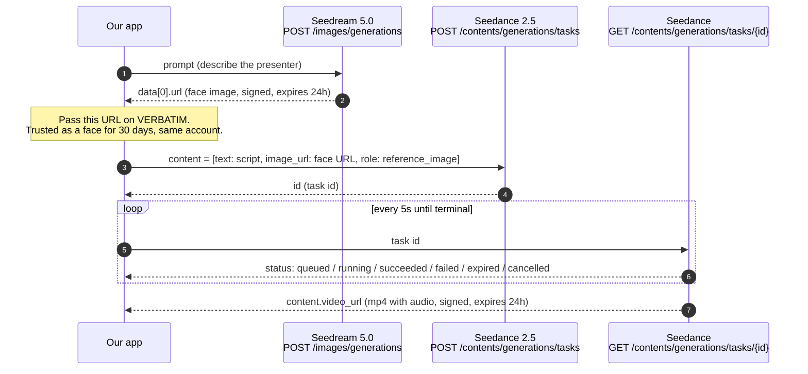
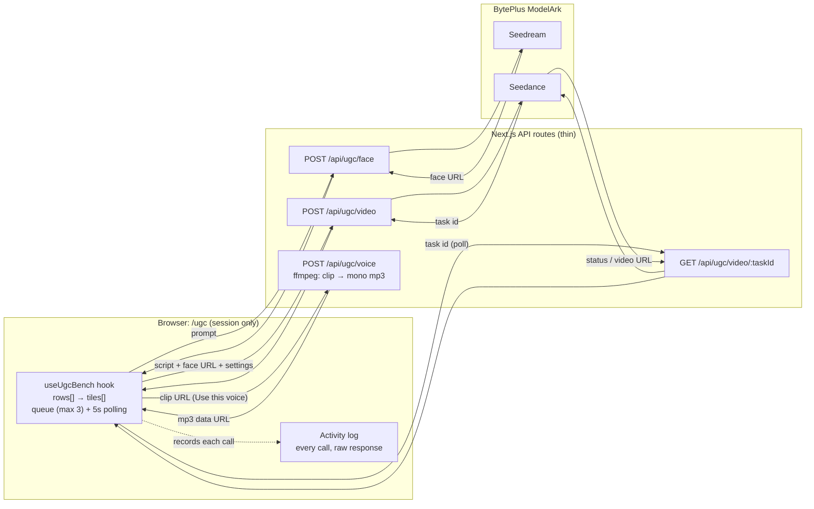

# Seedream → Seedance: handoff for productisation

**Date:** 2026-09-22 · **Branch:** `worktree-video-gen-experiments` · **Audience:** the developer
taking human-presenter UGC video into the product.
**Read with:** [2026-09-18 spike findings](2026-09-18-seedance-human-reference-findings.md) ·
[UGC bench design](2026-09-21-ugc-bench-design.md)

## 0. Status — read this first (updated 2026-09-30)

**Where the work stands, and where to pick it up.**

| Thread | State |
|---|---|
| Seedream → Seedance chain | **Verified**, three times (spike 2026-09-18, bench, probes 2026-09-24) |
| `/ugc` bench, Seedance tab | Built, on `origin/staging`. Voice anchor added 2026-09-22 |
| `/ugc` bench, Gemini Omni tab | Built 2026-09-23, **probed live** (§3.5). Photo upload allowed there |
| **The 24-hour trusted-URL problem** | **GONE — see §0.1.** A GCS copy works; no vendor-URL machinery at all |
| Canvas integration | **Not started.** Design settled (§0.2); split into six specs (§0.3), to be written one at a time |
| Voice | Consistency falls out of the avatar. Three mechanisms; re-voicing SHIPPED, anchor still unexercised (§0.2) |
| Avatar + Composite nodes | **Designed 2026-09-29** (§0.2). Two new node types; avatar is client-level |
| System-prompt audit | **Done. §0.4** has the walk from the Script, the proposed edits, and what NOT to change |
| OmniHuman 1.5 (BytePlus Vision AI) | **Paused** at an account permission wall (§7) |
| ElevenLabs | **SHIPPED** D282–D284 to staging 2026-09-27 — re-voicing works on any clip (§0.2) |

**§0.2** the design · **§0.3** the six specs · **§0.4** the prompt changes, line by line.
§0.1 is the probe evidence. §3 is the API reference; §4 the vendor rules, two of them disproved.
§1, §2 and §5 are the bench, kept as history.

## 0.1 What the probes proved (2026-09-24)

Three probes were run against the live API. They cost about **$2.57** in total and between
them they **deleted a whole section of the planned build**. Probe scripts were throwaway and
are not in the repo.

**Artefacts** (clips, reference faces and comparison sheets) are on the machine that ran them,
at `~/Desktop/ugc-probes-2026-09-24/` — **not in the repo**, since they are several MB of mp4.
Move them somewhere shared if they should outlive that machine. Every vendor URL from these
runs has expired; the local copies are the only surviving record.

### Finding 1 — a byte-identical copy on OUR OWN GCS keeps working ✅

**This is the important one.** §4 point 2 said to assume a re-hosted copy loses trusted status.
That assumption is **wrong**.

A fresh Seedream face was downloaded, uploaded byte-identically to
`storage.googleapis.com/creativeos-assets/…`, and sent to Seedance as the *only*
`reference_image`. The task was **accepted (HTTP 200) and succeeded in 135 s**, and the face in
the output is unmistakably the same man as the reference.

**The likely reason is that provenance was never the gate.** Line up everything known:

| Reference | Result |
|---|---|
| A real person's uploaded photo | **Rejected** (spike 2026-09-18) |
| Seedream face at the vendor URL | Accepted (spike, and §0.1 finding 2) |
| Seedream face at our own GCS URL | **Accepted** (2026-09-24) |

That fits a **real-likeness detector**, not a URL allowlist. The vendor's "trusted outputs"
policy appears to govern *permission to depict a real person*; an AI-generated face never trips
it, wherever it is hosted.

**Consequences — this is what a reader should act on:**
- **No vendor-URL machinery.** No second URL on the version row, no `vendorGeneratedAt`, no freshness
  branch at video-generate time, no expiry UI.
- **The face is stored in GCS and passed as a GCS URL, exactly like every other canvas image.**
  There is no special case in the image pipeline at all.
- **The 24-hour clock does not apply to us.** A reel can be built over days or weeks.
- The `seedance-images.ts` re-encode "landmine" (§4) **is not a landmine.** Re-encoding a
  reference does not cost anything we depend on.
- The last-frame refresh chain and the `asset://` route **do not need investigating.** They
  existed only to work around this problem.

**Caveat to carry, not to build on:** this behaviour is undocumented and inferred from three
data points. The vendor could tighten it. Recommendation: **store the vendor URL in
`paramsUsed` anyway** (a free string, alongside the `tokensUsed` / dimensions already there) as
insurance, and build **none** of the freshness machinery on top of it. If BytePlus ever starts
enforcing provenance, that field is what lets us react.

Artefacts: `trust-face.jpg`, `trust-probe.mp4`, `trust-compare.png`.
A probe object was left in the live bucket at `probe/ugc-trust/1790189477012-face.jpg` —
**delete it when convenient.**

### Finding 2 — mixed trusted + untrusted references are fine ✅

One Seedance task carrying **two** `reference_image` parts: the face as the verbatim vendor URL,
and a product still downloaded and re-sent as a base64 data URL (a copy). Accepted, succeeded in
141 s, and the clip shows the man holding the correct shoe and turning it to camera.

So a UGC shot can combine **a generated presenter and the client's own product photography**,
and the product image needs no special handling. (Given finding 1, neither does the face — but
this probe is what proved the *combination* is not rejected wholesale.)

**One real defect observed.** The product image was generated with an explicit "no text, no
logo", and by the third second **Seedance had invented lettering on the shoe's side panel.**
Any UGC prompt record must therefore keep the product-preservation language from `SPINE`
(`src/prompts/video-prompt-shared.ts`) even though it drops the first-frame framing. See §0.4.

Artefact: `ugc-mixed-refs-probe.mp4`.

### Finding 3 — Seedream `seed` is NOT deterministic ❌

Tested because a reproducible face would have solved the (then-live) expiry problem. It does not.

`seed` is **accepted without error** — no rejection, nothing echoed back — but two calls with the
same seed and identical prompt returned **two different men**: different face shape, hairline,
jaw and beard density. A no-seed control pair also differed, which rules out the API merely
caching identical prompts, so this is genuine non-determinism rather than a measurement artefact.

**A presenter's face cannot be recreated once lost.** Finding 1 makes that harmless (nothing is
ever lost), but it matters for any future feature that assumes a face can be regenerated.

Worth knowing: what *does* stay consistent across runs is the **casting** — a specific enough
prompt reliably returns the same type of person, just not the same individual.

Artefacts: `seed-A-seed.jpg`, `seed-B-seed.jpg`, `seed-D1-noseed.jpg`, `seed-D2-noseed.jpg`,
`seed-sheet.png`.

### Finding 4 — generation is slower than recorded ⏱

Both 5 s / 720p clips took **135 s and 141 s**, against the 80–100 s in §3.3. The two-reference
clip was the slower one. **Budget the Trigger.dev timeout against ~150 s, not ~100 s.**

### Decisions taken by the operator, 2026-09-24

**1 — One presenter per reel.** A reel stars one person; the per-shot choice is only *whether
this shot is AI-presenter UGC*, not *who*. Given finding 1 this costs nothing to maintain — one
Seedream Image Gen node is wired into each shot's Video Gen node, and there is no clock to race.

**2 — A consistent voice is in scope** (2026-09-24). The voice anchor — extract the
audio of the first clip the operator likes, send it back as `reference_audio` on every later
generation — is part of the feature, not a later nicety. The whole loop already exists in the
bench, so it is a **port**, not a design. It is Seedance-only: Omni accepts no audio input.

**3 — ElevenLabs is explicitly later.** Nothing in `src/` references them today. Their TTS
would be a sensible controlled-voice source and their lip-sync is app-only; either way it is a
separate piece of work and not part of this one.

These still need ADR numbers (the log had reached D147 at last count).

## 0.2 The design (settled 2026-09-29)

Everything below supersedes the 2026-09-24 sketch. **Live page, with the diagrams:**
https://claude.ai/artifact/5ZEEb4SWQp87e79aaPpayt

### Two kinds of UGC, and the engine follows from the kind

The operator never picks a video model. They pick **who the presenter is**, and the engine
follows, because each kind has exactly one engine that will accept its face.

| | Specific person | Generic person |
|---|---|---|
| The face | an uploaded photo of someone real | generated by Seedream |
| Engine | **Gemini Omni** — Seedance refuses real faces | **Seedance 2.5** — the only model that trusts a Seedream face |
| Longest call | 10 s | 30 s |
| Cost per 5 s | $0.50 | $1.16 |
| Lip-sync | preserved through re-voicing | inherent — one model pass |
| Voice | applied afterwards, always | native, or carried forward, or re-voiced |
| Consent | a real likeness — needs an owner | nobody real |

**Both Google gates are confirmed** (operator, 2026-09-28): Nano Banana accepts a real
photograph and generates a model sheet from it, and Omni animates that face. Neither is an
assumption any more. Note the bench's own caveat still stands — Google refuses real likenesses
*often*, so a refusal is a runtime outcome the UI must show, not a case that cannot happen.

### UGC is a genre crossing the existing packing axis

Not a lane. All four cells must work:

| | Single shot | Multishot |
|---|---|---|
| **Brand** | ships today | ships today |
| **UGC — specific** (Omni) | ✓ | ✓ — 3–10 s total |
| **UGC — generic** (Seedance) | ✓ | ✓ — 4–30 s total |

All four cells are in the design. **If the build is staged, start with UGC multishot** — those
records already carry the person-handling, while the single-shot Seedance record is the one
written from a contradictory premise (*"a still image (the first frame) is provided… do not
invent new objects, **people**, settings"*) and needs the most work.

Omni **is** multishot-capable — `MULTISHOT_MODELS` registers it at 3–10 s, Kling at 3–15 s and
Seedance at 4–30 s. Ten seconds is two or three beats, so a specific-presenter reel always takes
several calls; multishot still halves the seams at the same price, since cost is per second of
output either way.

**No new packing logic is needed.** `MULTISHOT_MODELS` holds each engine's floor and ceiling,
`checkLadder` enforces them, and `multishotPromptFor` routes on the capability id — so "a node
cannot end up with Omni's limits and another model's prompt". UGC needs the avatar to set the
target model, and all four cells inherit what already works.

### The Avatar (renamed from "presenter", 2026-09-28)

A **new node type**, holding a **client-level** record. Not a flag, not a File, not an Image Gen
node. It is the only thing on the canvas whose existence means "this is the person", which is
what lets the lane below know it is writing UGC — **there is no `shotKind` flag**.

What it holds:

| | Field | Generic | Specific |
|---|---|---|---|
| Identity | name, kind | generated | a real person |
| Face | base face | a Seedream prompt + its image | an uploaded photograph |
| | vendor URL | kept as insurance, unused | — |
| Likeness | model sheet | **identical** — several angles from Nano Banana, whichever face it starts with | |
| Voice | declaration | native · anchor · a named voice | a named voice only |
| | named voice | an ElevenLabs `voiceId` + settings — a stock voice, a Library voice, **or one cloned from a sample the client uploaded** | |
| | anchor clip | the extracted mp3 + its source clip | not possible — Omni takes no audio |
| | description | the voice in words | |
| Governance | client | the owner — client-level, not per canvas | |
| | consent | none needed | **required: who agreed, and when** |

**Nothing about the engine is stored on it.** Engine, length ceiling and available voice options
are all *derived* from the kind. Storing them would be a second copy to keep in agreement with
the first, which is what D236 exists to prevent — and it keeps a future face-capable model with
a longer ceiling a capability-table change rather than a migration of every avatar row.

**Four rules, all decided 2026-09-28:**

| Rule | What it buys | What it costs |
|---|---|---|
| Belongs to the **client**, not a canvas | Created once, picked into any canvas — a reference, never a copy | — |
| Always the **latest** — no versioning | Improve it once, every canvas improves | A January reel regenerated in April uses April's avatar, so a re-run shot may not match its neighbours. Regenerate the reel rather than add snapshots |
| Chosen **before grouping**, never after | No reel can be packed against one ceiling and then handed an avatar implying another | Changing the avatar means a new reel |
| **Cannot be deleted** | Nothing reaches into finished work — canvases keep no snapshot | A cast only grows; hiding becomes a question once the list is long |

### Wiring — the wire is the signal

| Edge | Means |
|---|---|
| `avatar → script` | *this reel stars this person* — sets engine, ceiling, prompt genre. One per reel, before grouping |
| `avatar → composite` | *this composite contains them* — the person is one of its references |
| avatar ⇢ video-gen | resolved, never drawn. `seededFrom.scriptNodeId` already lets shots and multishot groups look up their reel's avatar (D236's pattern) |

This is why the avatar had to be a node rather than a field on the Script: a field could declare
the reel, but could never be wired into one particular image — so the composite would have needed
a mode toggle after all.

**The product still wires per shot.** The avatar moved up to the reel because it is the only
thing there is exactly one of.

### The Composite node (new, 2026-09-28)

**Composites are not avatar data.** A picture of the avatar holding the product in a kitchen
belongs to *that shot* — the next one wants a different product and a different room. The avatar
keeps only what is true of the person wherever they appear: face, model sheet, voice.

So composites live on the canvas: a **Composite node** — image references in, **a prompt typed on
the node itself**, one image out. The existing Image Gen lane could do the generating, but it
needs a separate Prompt node wired in and every asset wired to both; for an asset step that is
more wiring than it is worth (operator decision, 2026-09-28).

**Its prompt inverts the house style.** A composite is a *reference*, and D281 says a reference's
lighting, framing and backdrop are never carried into a beat — so it must **not** be styled: no
lens spec, no lighting recipe, no grade. Keep subject, the transcribe-setting rule, multi-image
composition and brand rules.

### Voice — consistency falls out of the avatar

Not a per-clip problem. The avatar declares one voice and every generation in the reel realises
that declaration, so nothing can drift between shots. Three mechanisms honour it:

| | Lip-sync | Consistency | Engines | Cost |
|---|---|---|---|---|
| **Native, unsteered** | inherent | none — a new voice per clip | Seedance | included |
| **Native + anchor** (`reference_audio`) | inherent | approximate | Seedance | free |
| **Re-voice** (ElevenLabs, D282, shipped) | preserved, drift-guarded | exact | **any, Omni included** | ~$0.01 / 5 s |

**Re-voicing works on any clip with an audio track, so it is available to both kinds of UGC.**
The branch decides only what *else* is on offer. Count the steps after the picture exists: native
has none, which is why lip-sync is inherent rather than preserved and holds up better the longer
the clip runs.

**D282–D284 shipped while this was being designed** (staging, 2026-09-27): `voice-change/revoice.ts`
fetches the video, extracts the audio with ffmpeg, calls `eleven_multilingual_sts_v2`, **aborts if
the durations drift more than 0.25 s**, replaces the track and appends a new version. Failures are
classified so a 4xx that is not a 429 never retries — a broken voice request cannot burn the paid
video generation. The choice persists as `VideoGenNodeData.voiceChange`.

Today that is a per-node action taken *after* a clip exists. The unification is the **job, not the
UI**: if the avatar declares a voice, `video-generate` should chain into voicing and the node
should show one status stream — which is what makes the mechanisms indistinguishable from outside.
That needs a partial-success state (drift aborts keep the original: "clip is good, voice didn't
take"), one cost line, and one preview surface.

### The build

**Two new node types:** Avatar (client-level record, picker, focus view) and Composite.

**Prompt records** (§0.4 has the walk from the Script and the proposed text):

| # | Record | Notes |
|---|---|---|
| 4 | UGC motion — single/multishot × omni/seedance | behind one shared `UGC_SPINE`, as `SPINE` is shared today. Veo and Kling never appear in a UGC row, so it is four, not eight |
| 1 | base face | Seedream, generic branch only |
| 1 | model sheet | Nano Banana, both branches — must not alter the face it was given |
| 1 | composite | Nano Banana, per shot — must not alter the face **and** must not style it |
| 1 | UGC composer | `shot-compose-ugc` — **single-shot lane only**; the Multishot node has no composer |

**Two data catalogs**, also single-shot only: UGC shot roles + default, UGC shot controls
(handheld, phone, ring light).

**Two pre-existing fixes this forces open:** `VO_PERFORMANCE_RULES` into the four single-shot
records; the image-prompt writer branching by model (OpenAI currently receives a prompt headed
"for Nano Banana").

### Still open

- **Untested:** how re-voicing treats Seedance's music and effects — speech-to-speech receives the
  whole mixed track, and this decides whether re-voicing is usable on the generic branch or only
  on the specific one, where there is no native audio to lose.
- **Untested:** Hinglish. Seedance 2.5 lists nine languages and Hindi is not among them.
  Re-voicing changes the voice, not the words.
- **Parked:** wiring an avatar to a Composite node but not to the Script.
- **Owed:** ADR numbers; the stray probe object at `probe/ugc-trust/1790189477012-face.jpg`;
  OmniHuman account access (§7).


## 0.3 The build — six specs, written one at a time (plan set 2026-09-29)

The design in §0.2 is settled. It is **too large for one spec**: recent design docs in this repo
run 94–333 lines each and cover one implementable feature, and this covers two node types, a
client-level record, eight prompt records and two catalogs.

**The page is the guide over all of them** —
https://claude.ai/artifact/5ZEEb4SWQp87e79aaPpayt. Each spec should open with a link to it
rather than restating the architecture.

| # | Spec | Covers | Depends on | Ships alone |
|---|---|---|---|---|
| **A** | Seedream image provider | Synchronous, so no Trigger task — it fits the existing image-generate route. Extend `ImageProvider` (`image-gen/types.ts`, today `"openai" | "gemini"`); add `providers/seedream.ts` implementing `MediaGenModelSpec.generate`; register in `registry.ts` + `client-models.ts`; per-image cost branch in `cost.ts` (~$0.035/image, not token-based). Reuse `BYTEPLUS_API_KEY`. Follow `docs/superpowers/guides/image-gen-model-management.md`. **Model id is load-bearing:** only `seedream-5-0-260128` produces faces Seedance trusts — keep it in one constant, and take ids from `GET /api/v3/models`, never the docs (§3.1) | — | Yes |
| **B1** | **Avatar — identity** | `avatars` table (client-scoped) + the four rules; Avatar node type, picker, focus view; base face (A) or upload; model sheet via Nano Banana; `avatar → script`; engine/ceiling/voice-options **derived** from kind, never stored; resolution through `seededFrom.scriptNodeId`; the blocking rules | A | Yes |
| **B2** | **Avatar — voice** | the declaration field; picking an account or Library voice (both already shipped); **uploading a client's own voice and cloning it**; consent for BOTH likenesses, face and voice, in one record; how re-voicing consumes the declaration | B1 | Yes |
| **C** | Composite node | node type; avatar + File inputs; **prompt typed on the node**; the composite prompt record, which must not style the image | B1 | Yes |
| **D** | UGC prompt records | `UGC_SPINE` + 4 motion records (single/multishot × omni/seedance), the composer record, shot roles, shot controls, and three shared-block edits. **§0.4 has the proposed text, line by line** | B1 | Yes |
| **E** | Voice unification — **later** | chain voicing into `video-generate` from the declaration so the node shows one status stream; partial-success state for drift aborts; one cost line; one preview surface | B2 | Yes |

**Suggested order: A → B1 → B2 → D → C.** A is small and de-risks the Seedream integration
before any avatar concepts exist in code. B1 unblocks everything else. D and C are independent of
each other.

### Why B is two documents

Splitting at **identity vs voice** rather than by layer keeps each independently reviewable — B1
is "who is this person and how does the canvas know", B2 is "how do they sound". It also lands
the consent work in **one** place covering both likenesses, rather than a face checkbox in B1 and
a voice checkbox in B2 that nobody reconciles.

### Verify before writing, do not assume

- **B2 — the ElevenLabs cloning API.** What exists today is `/v1/voices/add/{publicOwnerId}/{voiceId}`
  (`voice-catalog.ts`), which **saves a Library voice to the account**. That is not cloning.
  Creating a voice from an uploaded sample is a different call, and its endpoint, file limits and
  consent requirements must come from ElevenLabs' own docs. This repo has been burned once by
  sourcing vendor limits secondhand (see `reference-kling-docs`).
- **Everything downstream of cloning already works.** The picker surfaces cloned voices and lists
  them first (`CUSTOM_VOICE_CATEGORIES`), and re-voicing applies any account voice. B2's new
  surface is only the creation step.
- **A — model ids from `GET /api/v3/models`,** never from the docs (§3.1).

### Do not carry over from the bench

- The `--flags` prompt builder — the vendor's *legacy* method (§3.2). The product provider
  already uses body parameters.
- Browser-side orchestration, polling and session-only state.
- Its own ModelArk client: the product provider already retries transient poll failures and
  translates the real-person rejection.

### Owed regardless of which spec goes first

- **ADR numbers.** The log has reached **D284**, so the next free is **D285**. Decisions needing
  entries: two UGC kinds with the engine derived from the kind; the Avatar node and its four
  rules; no `shotKind` flag (the wire is the signal); the Composite node; composites are not
  avatar data; voice consistency falls out of the avatar.
- **A stray probe object** at `probe/ugc-trust/1790189477012-face.jpg` in the live bucket.
- **OmniHuman** account access (§7) — unrelated to these specs, still blocked.


## 0.4 The prompt changes, inspected line by line (2026-09-30)

**Genre and packing are independent —
brand and UGC each have a single-shot and a multishot form, and all four cells are real.** The
build may still start with UGC multishot, but the design covers four.

### First, a correction: the person-handling in the shared blocks is NOT UGC bleed

An earlier pass suspected the multishot prompts had picked up UGC flavour that should be
"restored" for brand. **The history says otherwise**, and reverting it would reintroduce a fixed
bug:

| Line in `multishot-prompt-generate.ts` | What | Arrived in |
|---|---|---|
| 48–50 | the people-wearing-product examples | `d01c9861` — *one plain action per beat* (D263) |
| 56 | identity-only; *"face, build, hair, wardrobe"*; identity sheet | `d6d68939` — **D281** |
| 70 | PERSON / PRODUCT / GARMENT / SURFACE / BRAND MARK | `04630bfe` — *the writer names a reference* |
| 179 | *"'a young woman' → 'a young woman in a loose linen shirt'"* | `d01c9861` (D263) |

D281's own stated reason is a **brand** failure: *"A three-angle character turnaround on a grey
seamless was read as the location, and the plan arrived on a light studio background."* A
character turnaround is a brand asset. The multishot lane was built for **people wearing
products** from the start.

**So the difference between brand-multishot and UGC-multishot is not whether a person may appear.
It is premise:**

| | Brand multishot | UGC multishot |
|---|---|---|
| Who | a model, named fresh per beat | **one specific avatar**, the same person throughout |
| What they do | wear or use the product in a scene | **talk to camera** about it |
| Preservation | the product survives the beat | the product **and the person** survive across beats |

### The walk from the Script — what changes where

| Stage | File | Brand | UGC |
|---|---|---|---|
| Script parse | `script-parse.ts` | — | **no change.** It transcribes; `ai_production_type` is free text, a default hint at most, never routing |
| Grouping | *(no prompt)* | — | — |
| Composer *(Shot node only)* | `shot-compose.ts` | unchanged | new record — today it is *"a shot composer for premium, slow, tactile D2C beauty reels"* |
| | `shot-roles.ts` | unchanged | new role set + default — `lifestyle` *forbids* body-contact as the subject; `DEFAULT_SHOT_ROLE` is `hero` |
| | `shot-controls.ts` | unchanged | new options — 24–100 mm + softbox today; UGC wants handheld, phone, ring light |
| Image prompt | `prompt-generate.ts` | **fix: branch by model** — OpenAI receives a prompt headed "for Nano Banana" today | per-shot stills are unused in UGC; base face, model sheet and composite each have their own record |
| Motion, single | `video-prompt-{veo,kling,omni,seedance}` | unchanged | **2 new:** `-ugc-seedance`, `-ugc-omni` |
| Motion, multishot | `multishot-prompt-{omni,kling,seedance}` | unchanged | **2 new:** `-ugc-seedance`, `-ugc-omni` |
| Shared | `SPINE` | unchanged | **new `UGC_SPINE`** — `SPINE` is first-frame and preservation-first |
| Shared | `VO_PERFORMANCE_RULES` | **fix: wire into the 4 single-shot records** | inherits the fix |
| Shared | `MULTISHOT_SHARED_CRAFT` | **add person-preservation** | inherits it |

Two of those are **brand-side fixes UGC merely exposes** — the image-prompt branching and the
`VO_PERFORMANCE_RULES` wiring — and are worth doing on their own.

### What the multishot lane already carries

The reason the UGC delta is narrow. All present today:

| Element | Where |
|---|---|
| On-screen speaker direction — *"keep that person's face visible and readable toward the camera while they speak; one simple action; nothing covers the mouth; no fast head turns"* | `video-prompt-shared.ts:121`, imported by all three multishot records |
| *"A reference is identity only… carry **face, build, hair, wardrobe**"* | `multishot-prompt-generate.ts:56` |
| *"a sheet showing one subject from several angles is an **identity sheet**, never a location"* | same paragraph |
| PERSON alongside PRODUCT / GARMENT / SURFACE / BRAND MARK | `multishot-prompt-generate.ts:70` |
| *"'a young woman' → 'a young woman in a loose linen shirt'"* | `multishot-prompt-generate.ts:179` |
| Worked examples are people wearing product | `multishot-prompt-generate.ts:48–50` |
| Native dialogue markers; words appended by `renderVoiceover` | `multishot-prompt-seedance.ts:73` |

**The multishot lane has no composer and no controls** — `multishot-node.tsx:36` says
*"switcher, and no Composer"*, and `MultishotNodeData` has no `controls` field
(*"camera move and motion energy describe ONE continuous take"*). So the composer record,
the shot roles and the shot controls only apply to the **single-shot** UGC form.

**What is missing:** preservation is product-only; nothing says one specific person recurs
across beats; and the premise is untested for talk-to-camera.

### The three concrete edits

**1 — extend `PRESERVATION` to people.** `MULTISHOT_SHARED_CRAFT`, after the existing product
sentence. Shared, so brand gets it too:

```
A referenced PERSON must survive the same way: the same face, build, hair and wardrobe in
every beat they appear in, named the same way each time. Left unsaid, the model returns a
different person two beats later.
```

**2 — a new `UGC_SPINE`, composed only by the UGC records.** Two rules, deliberately:

```
UGC — ONE PERSON, TO CAMERA
They are the subject, not set dressing. The product is in their hands or worn — held up,
turned to the lens, put on — never staged beside them.

Unless the shot text says otherwise, the register is a phone at arm's length: handheld,
eye-level, close enough to read the face. No crane, no dolly, no studio lighting.
```

Person-constancy lives in edit 1, not here, so one instruction is not duplicated across two
blocks the same record composes. Keep it short: D263 **removed** a five-rule physics section and
four editing-grammar rules from this block because *"each asked the writer to narrate one more
motion per beat… the operator reported the result as overcomplicated motion."*

**3 — pair the worked examples.** A brand fix, independent of UGC. Both exemplars in
`referenceIdentificationBlock` are people wearing product, and the file says *"the example is
what the writer imitates"* — so a macro product reel imitates a person walking. Replace one:

```
    A hand sets the tan CHUPPS Sliders down on a terrazzo step.
    A college student crosses a campus courtyard in the black CHUPPS V-Straps.
```

### Deliberately not changing

| | Why |
|---|---|
| the identity-only rule (D281) | added for a brand bug; reverting reintroduces it |
| *"add no setting the shot text does not name"* | D262's rule. UGC does not get to invent settings either |
| `VO_PERFORMANCE_RULES` itself | already correct for talk-to-camera; UGC inherits it unchanged |
| dialogue in the writer | D267 removed it; `renderVoiceover` appends the words afterwards |

### Validate before committing any of it

Run a real UGC shot list through the **existing** multishot Seedance writer and read the plan —
one LLM call, no video. If it already produces good talk-to-camera beats, edit 2 may shrink to
one rule or none. Edits 1 and 3 stand on their own merits either way.

`src/lib/ugc/starter.ts` has the bench's own UGC scripts to test with. Three things the bench
does that the product deliberately does not: it writes dialogue inline (D267), it says *"the
creator in the reference image"* (`referenceIdentificationBlock` forbids that phrasing), and it
asks for *"no background music"* so a clip can be reused as a voice anchor.

The prompt inheritance graph — which shared block reaches which record — is an appendix on the
page: https://claude.ai/artifact/5ZEEb4SWQp87e79aaPpayt


## 1. What this is

We wanted to know whether we can generate UGC-style video with a **human presenter** on
BytePlus ModelArk, given that Seedance rejects uploaded photos of real people. Two pieces of
work answer that. This document explains what they show about the APIs, and what has to
change to make it a product feature.

| Piece | What it is | Status |
|---|---|---|
| **Spike** (2026-09-18) | One-off probe: Seedream face → Seedance video | Answered: **yes, it works** |
| **UGC bench** `/ugc` (2026-09-21) | Test page: several faces × several scripts, run one at a time or all at once | Built, session only, not in the product |
| **Product Seedance provider** | `src/lib/video-gen/providers/seedance.ts`, already in the canvas video-gen node | **Already shipped** before this work |

So **Seedance is not new to the product.** What's new is **Seedream** (the image model), plus
the **trust chain** that lets a Seedream face pass Seedance's real-face check. The bench is a
reference implementation of that chain. It is not code to copy into the product as-is.

## 2. The chain in one picture


```mermaid
sequenceDiagram
    autonumber
    participant U as Our app
    participant SD as Seedream 5.0<br/>POST /images/generations
    participant SC as Seedance 2.5<br/>POST /contents/generations/tasks
    participant P as Seedance<br/>GET /contents/generations/tasks/{id}

    U->>SD: prompt (describe the presenter)
    SD-->>U: data[0].url (face image, signed, expires 24h)
    Note over U: Pass this URL on VERBATIM.<br/>Trusted as a face for 30 days, same account.
    U->>SC: content = [text: script, image_url: face URL, role: reference_image]
    SC-->>U: id (task id)
    loop every 5s until terminal
        U->>P: task id
        P-->>U: status: queued / running / succeeded / failed / expired / cancelled
    end
    P-->>U: content.video_url (mp4 with audio, signed, expires 24h)
```

Everything talks to one base URL, `https://ark.ap-southeast.bytepluses.com/api/v3`, with
`Authorization: Bearer <ModelArk API key>`.

## 3. The API contracts, as we actually use them

Only fields we have **seen or sent** are listed. Anything else is in the vendor reference
([create task](https://docs.byteplus.com/en/docs/ModelArk/1520757)).

### 3.1 Seedream — make the face (synchronous, ~7–60 s)

```http
POST /images/generations
{ "model": "seedream-5-0-260128", "prompt": "<presenter description>",
  "size": "2K", "response_format": "url", "watermark": false }
```
- **Success:** `data[0].url`, a signed image URL on `*.volces.com` that **expires in 24 h**.
- **Failure:** `error: { code, message }`, e.g. a moderation rejection. HTTP may still be
  200-range, so check `error`, not only the status.
- **The model id matters.** `seedream-5-0-260128` is the **only** Seedream model whose face
  output Seedance trusts. `dola-seedream-5-0-pro-260628` (pro) is **not** trusted. Take ids
  from `GET /api/v3/models`, not from the docs; the docs name a "5.0 lite" id that doesn't exist.

Bench code: `generateImage()` in `src/lib/ugc/client.ts`.

### 3.2 Seedance — create the video task (asynchronous)

```http
POST /contents/generations/tasks
{ "model": "dreamina-seedance-2-5-260628",
  "content": [
    { "type": "text", "text": "<scene, action and dialogue>" },
    { "type": "image_url", "image_url": { "url": "<Seedream URL>" }, "role": "reference_image" }
  ],
  "resolution": "720p", "ratio": "9:16", "duration": 5 }
```
- **Success:** `id`, the task id (e.g. `cgt-20260922003419-sg3kx`).
- **Settings go in the request body.** The vendor calls body parameters the
  *conventional (recommended)* method, with strict validation that errors on bad values.
  Appending `--resolution 720p --duration 5 …` to the prompt is the *legacy* method, where
  invalid values are silently ignored. **The bench uses the legacy method**
  (`src/lib/ugc/prompt.ts`), because the spike wrongly concluded it was the only one. The
  product provider already uses body parameters, and that is the one to follow.
- **Frames and references are mutually exclusive.** A request uses either `first_frame` /
  `last_frame` images or `reference_image` images, never both. The product enforces this in
  `buildSeedanceContent()` and in the client rules in `client-models.ts`.
- **Audio.** `generate_audio` defaults to `true`, so Seedance invents voice, effects and
  music from the prompt. Put dialogue in **double quotes**; the vendor recommends it for
  better speech.
- **Language.** Seedance 2.5 prompts support English plus Spanish, Indonesian, Portuguese,
  Japanese, Malay, Thai, Arabic, Vietnamese and Korean. **Hindi is not listed**, so
  Hinglish dialogue (like the CHUPPS brief) is unsupported territory. The bench run is how
  we find out what it actually does.

Bench code: `createVideoTask()` in `src/lib/ugc/client.ts`, and `src/app/api/ugc/video/route.ts`.

### 3.3 Seedance — poll the task

```http
GET /contents/generations/tasks/{id}
```
- `status` moves through non-terminal states to one of `succeeded | failed | expired | cancelled`.
- **On success:** `content.video_url`, an mp4 (h264 + AAC in the spike) that **expires in
  24 h** and allows at most **100 downloads**.
- **On failure:** `error: { code, message }`, surfaced verbatim. The product translates one
  well-known code, `InputImageSensitiveContentDetected.PrivacyInformation` (a real-person
  reference was rejected), in `seedance.ts`.
- A spike clip took about 80–100 s end to end. **Corrected 2026-09-24:** two 5 s / 720p clips
  took **135 s and 141 s** (§0.1, finding 4). Budget timeouts against ~150 s. The task itself
  expires after 48 h by default (`execution_expires_after`).

Bench code: `getVideoTask()` in `src/lib/ugc/client.ts`, and `src/app/api/ugc/video/[taskId]/route.ts`.

### 3.4 Voice consistency: `reference_audio` (added to the bench 2026-09-22)

Seedance invents a new voice for every clip. To keep one voice per presenter, the bench
extracts the audio of a clip the user liked and sends it back with every later generation:

```json
{ "type": "audio_url", "audio_url": { "url": "data:audio/mp3;base64,…" }, "role": "reference_audio" }
```
- **Limits (2.5):** wav or mp3, each clip 2–30 s, at most 10 clips totalling 30 s, ≤ 15 MB.
  The URL can be public, base64, or `asset://`. 2.0 needs an image or video alongside it;
  2.5 accepts audio alone.
- **It references timbre, not words.** The model speaks the prompt's new dialogue in that
  voice. The prompt should bind inputs by order (`@Image 1` = face, `@Audio 1` = voice) and
  say *voice timbre only*, or the anchor clip's music and sound effects come along too.
- **Vendor-stated weakness:** the generated voice can "differ significantly" from the
  reference. The mitigation is to describe the voice in words as well, and keep each line's
  tone close to the reference.
- **Cost:** audio isn't in the token formula (`(input video s + output video s) × W × H ×
  24 / 1024`), so a voice reference is essentially free. A reference *video*, by contrast,
  adds its duration to the billed tokens (at the lower "with video" rate, subject to a minimum).
- **An mp4 can't be `reference_audio`.** The bench extracts the audio server-side with
  ffmpeg (`src/lib/ugc/voice.ts`). A video can instead go in as `reference_video` (voice
  plus everything else; set `omni_reference_task_type: "reference"`), but that costs more.
- **Voice source.** The bench only uses its own Seedance output, so there's no question of
  rights in the voice. Real recorded voices are neither explicitly allowed nor explicitly
  blocked for `reference_audio`, and we haven't tested one. Cloning a real person's voice
  should go through the vendor's authorised real-person asset route.

### 3.5 The second engine: Gemini Omni 1.1 Flash (probed 2026-09-23)

The bench's second tab runs the same faces and scripts through Google. What the live probe
established, against `POST https://generativelanguage.googleapis.com/v1beta/interactions`:

- **It accepts a Seedream face as a plain reference.** There is no trusted-output concept
  outside BytePlus, so no 24 h race and no "original URL only" rule.
- **It is synchronous.** One call returned a finished 5 s clip in **26 s** — no task id, no
  polling. Seedance takes 80–100 s through a poll loop.
- **Output:** h264 + AAC, at the requested 9:16 (360×640 at the 360p tier).
- **Request shape is unforgiving** and is already encoded in the product provider
  (`src/lib/video-gen/providers/gemini-omni.ts`, D217): images first and text LAST,
  `store: true` required by `delivery: "uri"`, `video_config` takes `task` and nothing else.
- **Its file URI needs the API key to download**, so anything user-facing needs a proxy or a
  server-side copy. The bench proxies it (`/api/ugc/omni/file`).
- **No audio input at all.** Google's docs: *"Uploading audio references is unsupported in the
  current version of the API"* and *"Voice editing is not supported"*. Its soundtrack cannot be
  disabled either. This matches the product's own D208.
- **Uploaded photos are allowed** by the API shape (the bench offers it on this tab only), but
  Google's safety filter refuses likenesses of real people, as it does for Veo.

**Cost and speed, verified rates** (`src/lib/video-gen/cost.ts`, and ModelArk's pricing page):

| Engine | 720p per second | A 5 s clip | Time | Voice control |
|---|---|---|---|---|
| Veo 3.1 Lite | $0.05 | $0.25 | — | none |
| **Gemini Omni 1.1 Flash** | $0.10 (360p: $0.03) | **$0.50** (360p: $0.15) | **~26 s** | none |
| **Seedance 2.5** | $0.231 | **$1.16** | ~90 s | `reference_audio` |
| Veo 3.1 Quality | $0.40 | $2.00 | — | none |

Seedance bills `(input video s + output video s) × W × H × 24 / 1024` tokens at $10.70/M
(480p/720p, no video input) — so **audio references are free**, while a *video* reference adds
its own duration to the bill at the lower "with video" rate, subject to a minimum.

**The trade is simple: Omni is ~2–8× cheaper and ~3× faster; Seedance is the only one with any
voice control.**

## 4. The rules that shape any product design

These come from the vendor's "trusted outputs" policy
([docs](https://docs.byteplus.com/en/docs/ModelArk/2608626)) and from the spike.

1. **Seedance rejects uploaded real faces** (2.0 and 2.5 series). The accepted sources are:
   Seedream 5.0 text-to-image output, Seedance 2.x video output, and those videos' last
   frames, for 30 days, from the same account, on ModelArk. Preset digital characters
   (`asset://<id>`) and identity-verified real people are separate routes, and we haven't
   tested either.
2. ~~**Only the original, unmodified output is trusted**~~ and ~~**there are two clocks**~~ —
   both **DISPROVED / MOOT** (§0.1, finding 1). A byte-identical copy from our own GCS is
   accepted, so the 24 h URL expiry does not constrain us and the `seedance-images.ts`
   re-encode warning no longer applies. The vendor still documents the rule; we simply are
   not subject to it, because nothing we send is a real person's likeness.
4. **Output URLs are not storage.** Anything worth keeping must be copied to our bucket
   within 24 h. The product already does this for video in `completeGeneration()`.

**For the product:** a Seedream face flows exactly like every other canvas image — stored in
GCS, passed as a GCS URL. No special case. Keep the vendor URL in `paramsUsed` as cheap
insurance and build nothing on it.

## 5. How data flows in the bench

The bench is deliberately small: it runs in the browser, keeps state only in memory, and has
no database and no Trigger.dev. That's why it works on localhost, where the product's async
video path doesn't complete.


```mermaid
flowchart LR
    subgraph Browser["Browser: /ugc (session only)"]
      H["useUgcBench hook<br/>rows[] → tiles[]<br/>queue (max 3) + 5s polling"]
      L["Activity log<br/>every call, raw response"]
    end
    subgraph Next["Next.js API routes (thin)"]
      F["POST /api/ugc/face"]
      V["POST /api/ugc/video"]
      G["GET /api/ugc/video/:taskId"]
      W["POST /api/ugc/voice<br/>ffmpeg: clip → mono mp3"]
    end
    subgraph Ark["BytePlus ModelArk"]
      SD["Seedream"]
      SC["Seedance"]
    end
    H -- "prompt" --> F --> SD
    SD -- "face URL" --> F --> H
    H -- "script + face URL + settings" --> V --> SC
    SC -- "task id" --> V --> H
    H -- "task id (poll)" --> G --> SC
    SC -- "status / video URL" --> G --> H
    H -- "clip URL (Use this voice)" --> W -- "mp3 data URL" --> H
    H -. "records each call" .-> L
```

**State model** (`src/lib/ugc/board.ts`):
- A `FaceRow` holds `facePrompt`, `faceStatus` (`empty` / `generating` / `ready` / `rejected`)
  and `faceUrl` (the vendor URL, passed on verbatim), plus an optional `voice` (`RowVoice`:
  the mp3 data URL, its length, and which clip it came from) and a `voiceNote` description.
- Each row has its own `ScriptTile`s. A tile holds `script`, `status` (`draft` / `queued` /
  `generating` / `done` / `rejected`), `videoUrl`, `error`, `ranScript` (the exact text the
  video was made from) and `ranWithVoice` (so runs with and without the voice can be told apart).
- *New face* never overwrites: `duplicateRow()` copies the prompt and scripts into a new row,
  so faces can be compared.

**Code map**

| Layer | File | Responsibility |
|---|---|---|
| Vendor client | `src/lib/ugc/client.ts` | ModelArk calls (incl. the optional `reference_audio` part); returns errors instead of throwing; logs rejections server-side as `[ugc] …` |
| Constants | `src/lib/ugc/constants.ts` | Model ids, settings options, queue and poll limits |
| Prompt | `src/lib/ugc/prompt.ts` | Legacy `--flags` builder (see §3.2; swap for body parameters) |
| Board model | `src/lib/ugc/board.ts` (+ tests) | Pure row/tile helpers: `duplicateRow`, `runnableTiles` |
| Starter data | `src/lib/ugc/starter.ts` | Board pre-filled from the CHUPPS brief |
| Voice | `src/lib/ugc/voice.ts` (+ tests) | ffmpeg extraction: any audio/video → mono mp3, ≤30s, with its duration |
| Browser fetch | `src/lib/ugc/request.ts` (+ tests) | Records every call for the activity log; detects an expired login; shortens data URLs so the log stays pasteable |
| State | `src/hooks/use-ugc-bench.ts` | Rows, 3-wide queue, polling, log |
| Routes | `src/app/api/ugc/{face,video,video/[taskId],voice}/route.ts` | Thin wrappers around the client; `voice` downloads a clip (BytePlus hosts only) and extracts its audio |
| UI | `src/components/ugc/*`, `src/app/ugc/page.tsx` | Settings bar, face column, script tiles, voice strip (under the tiles — the voice is a Seedance input), activity log |
| Build config | `next.config.ts` | `serverExternalPackages` + `outputFileTracingIncludes` so the ffmpeg binary ships with the voice route |

## 6. Known and unknown

**Verified:**
- The Seedream → Seedance `reference_image` chain works end to end: 720×1280, about 5 s,
  h264 + AAC, identity preserved (spike).
- Seedream through the bench client returns an image (2026-09-21).
- Gemini Omni accepts a Seedream face as a reference and returned a 5 s 9:16 h264+AAC clip in
  26 s, synchronously (2026-09-23, §3.5).
- The BytePlus Vision AI signature V4 implementation is correct; the account is what is denied
  (2026-09-23, §7).
- A Seedance task created through the bench started and was polled (2026-09-22; the result
  wasn't seen because the dev server was stopped).

**Moved to verified on 2026-09-24 (§0.1):**
- ~~Whether a byte-identical re-hosted copy keeps trusted status.~~ **It does** — finding 1.
- ~~Whether a trusted output can be referenced after its URL expires.~~ **Moot** — we never need
  to; we host our own copy.
- **New:** a trusted vendor URL and an untrusted copy can travel in the **same** `content`
  array — finding 2.
- **New:** Seedream `seed` is accepted but **not deterministic** — finding 3.
- **New:** Seedance **invents branding** on a product that was specified as unbranded — finding 2.

**Not verified. Check before relying on it:**
- How Hinglish dialogue comes out.
- **Whether Seedance accepts the bench's `reference_audio` at all**, and how well it holds a
  voice across clips. The voice anchor shipped 2026-09-22 but no generation has used it yet.
- Whether a real recorded voice (rather than Seedance's own output) is accepted as
  `reference_audio`; the face ban is stated for images and videos only.
- Whether the ffmpeg binary traces correctly into the Vercel function (no production build run).
- Cost per clip. The only data point is 108,900 completion tokens for a 5 s 720p clip.
- The preset digital character route (`asset://`).

**Account prerequisite (vendor):** Seedance 2.x must be activated on the account, which
needs a balance above USD 30, an AI Savings Plan, or a Seedance resource pack.

**Out of scope, and why:** OmniHuman, BytePlus's photo + audio talking-head model, runs on a
different service (`cv.byteplusapi.com`) with AccessKey/SecretKey HMAC signing, not the
ModelArk key. It was dropped from this round on cost.

## 7. Paused threads (2026-09-23)

**OmniHuman 1.5 — blocked on account permission, not on code.**
It is BytePlus *Vision AI* (`cv.byteplusapi.com`), not ModelArk, and every call must be signed
with an Access Key pair instead of the ModelArk bearer key. The signer is written and tested
(`src/lib/ugc/omnihuman/sign.ts`, BytePlus signature V4, `Service=cv`, `Region=ap-singapore-1`).

A free probe — querying a made-up task id, so no generation and no cost — established exactly
where it stops:
- a deliberately wrong secret returns `SignatureDoesNotMatch` at the gateway, so **the signing
  is correct**;
- the real credentials return `code 50400 "Access Denied"` from the service, for **all three**
  service keys (`realman_avatar_picture_omni15_cv`, the 1.0 quick-mode key, and the
  create-role key).

So the account cannot reach the OmniHuman service. The fix is in the console: activate
OmniHuman under Vision AI (some avatar products need an application rather than a click), and
if the key belongs to an IAM user, grant that user permission for the `cv` service. Re-run the
probe; "task not found" means it is open. Its pricing is also still unknown.

One unknown remains even after that: OmniHuman wants `image_url` and `audio_url` as **URLs**. A
Seedream face is already public; audio is not, so the bench would need storage — the product
would not, since it has GCS.

**ElevenLabs — voice only.** Their TTS is a proper API and is the sensible source for a
controlled, consistent voice (audio tags, stability, speed, IPA pronunciation, dictionaries).
Their **Avatars / lip-sync is app-only** — *"API access: Not available at launch"* — and their
video catalogue (which includes Seedance, Veo, Omni and OmniHuman 1.5) exposes only some
generation models by `model_id`, with Creatify Aurora the one lip-sync model that has an API.
So ElevenLabs is useful to this app as a voice vendor, and useful to a person as a zero-code
way to preview OmniHuman quality before we integrate it.

**Lip-sync as a separate step** (video + audio -> re-synced video) is a real product category
if we ever want ElevenLabs voices on Omni footage: Sync.so, Hedra, HeyGen, Creatify Aurora,
OmniHuman. Unpriced and unevaluated.
